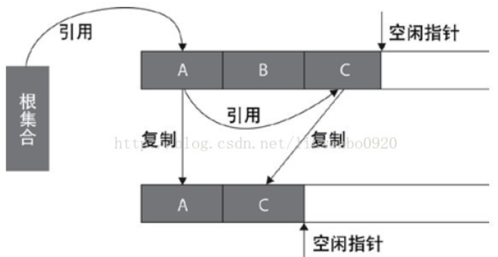

## mmap

>必读资料：
>
>[Lec17 Virtual memory for applications (Frans)](https://mit-public-courses-cn-translatio.gitbook.io/mit6-s081/lec17-virtual-memory-for-applications-frans)
>
>[Lecture Notes - Xiao Fan's Personal Page](https://fanxiao.tech/posts/2021-03-02-mit-6s081-notes/#141-mmap)

### 1. Virtual memory for user applications

`kernel` 可以通过虚拟内存来获得很多特性，比如 `copy-on-write`、`lazy allocation` 等，`user program` 也可以通过虚拟内存获得一些特性。

比如：

- `Concurrent garbage collector`
- `Generation garbage collector`
- `Concurrent check-pointing`
- `Data-compression paging`
- `Persistent stores`

**user-level VM primitive**

- **`trap`：**以 `user mode` 进入 `page fault trap` 并进行处理

- **`prot`：**降低页的访问权限
  - 例如 `mprotect(addr, len, PROT_READ)`：让被映射的地址 `addr` 只能有读权限

- **`unprot`：**提高页的访问权限

- **`dirty`：**返回一个自上一个调用以来已经被使用了的 `page`

- **`map2`：**将同一个 `physical page map` 到 2 个不同的 `virtual address`，设置不同的访问权限

### 2. mmap

将一个文件或者其他对象映射到进程的地址空间，实现文件磁盘地址和进程虚拟地址空间中一段虚拟地址的一一对应关系


为什么要建立文件磁盘地址和进程虚拟地址空间的映射？因为常规的文件系统操作是用户态发起 `read syscall`，然后在 `buffer cache` 中查找是否有相应的数据，如果没有就从磁盘中拷贝数据到 `buffer cache` 中，因为 `buffer cache` 处在内核态，因此需要将 `buffer cache` 通过 `copyout` 到用户进程的虚拟内存中，这就需要 2 次拷贝操作，而在 `mmap` 中只需要直接将文件数据拷贝到对应的用户空间虚拟内存即可

#### 2.1 文件映射

使用文件内容初始化物理内存

`addr = mmap(NULL, len, PROT_READ | PROT_WRITE, MAP_PRIVATE, fd, offset)` 

`NULL` 表示让 `kernel` 自己查找需要映射到的文件磁盘地址

#### 2.2 匿名映射

不需要打开文件，初始化一个全为 0 的内存空间

私有匿名映射用于 `malloc` 给进程分配虚拟的地址空间，当各个进程读的时候共享物理内存，写的时候 `copy on write`

`mmap(NULL, len, PROT_READ|PROT_WRITE, MAP_PRIVATE|MAP_ANONYMOUS, -1, 0)`

共享匿名映射在进行 `fork` 时不会采用写时 `copy on write`，父子进程完全共享同样的物理内存页，实现父子进程的 `IPC`

### 3. Virtual memory implementation

#### 3.1 VMA

VMA (`Virtual Memory Area`) 由一连串的虚拟地址组成，每个 `VMA` 都有相同的权限，指向相同的对象（文件、匿名内存等）

#### 3.2 User-level traps

比如，当 `PTE` 被标记为 `invalid` 时发生缺页异常，`CPU` 从用户态陷入内核态

内核将查看产生错误的 `VMA`，判断接下来的动作。比如一个用户进程设置了一个 `sig_action` (`handler for signal`)，则内核将产生一个 `signal`，将这个 `signal` 传播给用户态，回到用户态调用 `sig_action`，然后 `sig_action` 将调用 `mprotect` 来修改 `PTE`

最后 `sig_action` 将返回 `kernel`，`kernel` 继续返回到被中断的进程。

### 4. Use case: Garbage collector

为了将程序分配的内存在程序退出之后能够自动清理掉，需要垃圾收集器，其作用是从一个根集合 `root` 出发，递归地寻找所有被引用的对象，剩下的所有没有被引用到的对象就是垃圾内存，需要被清除

复制算法是将 `Heap` 内存空间分为 2 块区域，一块是 `from` 区域一块是 `to` 区域，将 `from` 区域中的所有能够被 `root` 查找到的对象全部复制到 `to` 区域中，然后将 `from` 区域的所有内存清除掉。这个算法的缺点在于 `GC` 线程运行的过程中需要暂停所有的用户线程



`Baker` 实时垃圾收集算法：`to` 区域包括 `new` 区域、`scanned` 区域和 `unscanned` 区域。在最开始先将 `root` 复制到 `to` 区域，当用户线程调用 `new` 来分配新的对象时，`from` 区域中被 `root` 及其它对象指向的对象会被增量地复制到 `to` 区域中。几个规则：

- 用户线程只能看到 `to-space` 的指针，也就是说每个用户线程取得的对象指向的对象只能在 `to-space` 中，如果检查发现在 `from-space` 中，就要将这个被指向的对象拷贝到 `to-space`，并且更新指针，然后才能返回给用户线程
- 每次调用 `new`，被分配的对象放在 `new` 区域中，并且 `new` 区域中所有的对象的指针都只能指向 `to` 区域
- `scanned` 区域中的对象只能拥有指向 `to` 区域的指针，`unscanned` 区域中的对象可以拥有指向 `to` 或 `from` 区域的指针

为了避免检查每个从内存中取回的对象的指针使其满足第一个规则，`GC` 给每个 `unscanned` 区域中的对象都加了 `no access`，使得每次试图访问这个 `unscanned` 对象时都会陷入缺页保护异常，然后 `GC` 扫描这个对象，将其指向的对象拷贝到 `to` 区域中，然后再恢复访问权限。这个机制也提供了 `concurrency`，因为可以防止 `GC thread` 和用户线程同时修改 `unscanned page`，因为 `unscanned page` 已经被加上了 `none access` 保护，用户线程是无法访问的。但是由于 **`map2`** 的存在，可以将相同的物理地址再映射一个给 `GC thread`，其访问权限是 `R|W`，因此用户线程不能访问的 `unscanned page gc` 线程是可以访问的

### 5. Lab: mmap

**实验要求：**

实现 `mmap` 和 `munmap` 来实现将文件直接映射到用户虚拟内存中。`mmap` 和 `munmap` 的原型函数分别是

```c++
void *mmap(void *addr, int length, int prot, int flags, int fd, int off);
int munmap(void *addr, int length);
```

将上述声明添加到 `user/user.h` 中。本实验中 `addr` 和 `off` 一直都是 0，因此可以不在 `sys_mmap` 传入这两个参数。`length` 是需要映射的字节数，可能和文件大小不相等，`prot` 表示映射到的内存的权限为 `PROT_READ` 还是 `PROT_WRITE`。`flag` 可以是 `MAP_SHARED` 或 `MAP_PRIVATE`，如果是前者就需要将内存中修改的相应部分写回文件中。`fd` 是需要映射的已打开的文件描述符。

本实验中，两个映射了同一个 `MAP_SHARED` 文件的进程可以不共享物理页（由于进程的内存隔离，要实现这个比较麻烦）

`munmap(addr, length)` 需要将从 `addr` 开始的 `length` 长度的 `mmap` 全部取消映射，这里的假设是只能从 `VMA` 的头部或尾部取消映射，不能对中间部分取消映射。

#### 5.1 代码实现

向 `Makefile` 中添加 `$U_mmaptest\`

```diff
	$U/_zombie\
+	$U/_mmaptest\
```

向 `kernel/syscall.c` 中添加

```diff
+ extern uint64 sys_mmap(void);
+ extern uint64 sys_munmap(void);

...

+ [SYS_mmap]    sys_mmap,
+ [SYS_munmap]  sys_munmap,
```

向 `kernel/syscall.h` 中添加

```diff
+ #define SYS_mmap   22
+ #define SYS_munmap 23
```

向 `user/usys.pl` 添加

```diff
+ entry("mmap");
+ entry("munmap");
```

修改 `kernel/fcntl.h`

```diff
- #ifdef LAB_MMAP
#define PROT_NONE       0x0
#define PROT_READ       0x1
#define PROT_WRITE      0x2
#define PROT_EXEC       0x4

#define MAP_SHARED      0x01
#define MAP_PRIVATE     0x02
- #endif
```

在 `kernel/param.h` 中添加

```diff
#define MAXPATH      128   // maximum file path name
+ #define MAXVMA       16
```

在 `kernel/proc.h` 中添加对 `vma` 结构体的定义，每个进程中最多可以有 16 个 `VMA`

```diff
+ struct vma {
+   int valid;
+   int valid_len;
+   uint64 addr;
+   int length;
+   int prot;
+   int flags;
+   int offset;
+   struct file *f;
+ };

...

  char name[16];               // Process name (debugging)
+ struct vma pvma[MAXVMA];
```

在 `kernel/sysfile.c` 中添加注册 `sys_mmap`，在 `mmap` 中先不要分配物理内存，只是完成对 `vma` 结构体的写入。找到新的空闲内存地址 `p->sz` 作为 `vma` 返回的地址并 `p->sz+=len`，让后面需要使用这个返回的内存地址时陷入缺页异常，在 `trap` 中再分配物理内存完成 `lazy allocation`

```c++
uint64
sys_mmap(void)
{
  struct file *f;
  int length, prot, flags, fd;
  if(argint(1, &length) < 0 || argint(2, &prot) < 0 || argint(3, &flags) < 0 || argfd(4, &fd, &f) < 0)
    return -1;

  if(!f->writable && (prot & PROT_WRITE) && (flags & MAP_SHARED))
    return -1;

  struct proc *p = myproc();
  struct vma *pvma = p->pvma;
  for(int i = 0; i < MAXVMA; i++) {
    if(pvma[i].valid == 0) {
      pvma[i].valid = 1;
      pvma[i].valid_len = pvma[i].length = PGROUNDUP(length);
      pvma[i].addr = p->sz;
      pvma[i].prot = prot;
      pvma[i].flags = flags;
      pvma[i].offset = 0;
      pvma[i].f = filedup(f);
      p->sz += pvma[i].length;
      return pvma[i].addr;
    }
  }

  return -1;
}
```

在 `kernel/trap.c` 中添加 `lazy allocation`

```diff
+ } else if(r_scause() == 13 || r_scause() == 15) {
+   uint64 va = r_stval();
+   if(va >= p->sz || va < p->trapframe->sp)
+     goto bad;
+
+   struct vma *pvma = p->pvma;
+   va = PGROUNDDOWN(va);
+   for(int i = 0; i < MAXVMA; i++) {
+     if(pvma[i].valid && va >= pvma[i].addr + pvma[i].offset 
+           && va < pvma[i].addr + pvma[i].offset + pvma[i].valid_len) {
+       char *mem = kalloc();
+       if(mem == 0)
+         goto bad;
+       
+       memset(mem, 0, PGSIZE);
+       uint flag = (pvma[i].prot << 1) | PTE_U;
+       if(mappages(p->pagetable, va, PGSIZE, (uint64)mem, flag) != 0) {
+         kfree(mem);
+         goto bad;
+       }
+
+       int off = va - pvma[i].addr;
+       ilock(pvma[i].f->ip);
+       readi(pvma[i].f->ip, 1, va, off, PGSIZE);
+       iunlock(pvma[i].f->ip);
+       break;
+     }
+   }
+
  } else {
+ bad:
```

需要判断 `page fault` 的地址是合理的，如果 `fault` 的地址低于了 **当前进程的栈底 (`p->trapframe->sp`) 或者高于等于当前进程的堆顶 (`p->sz`)** 就说明是不合理的，需要进入 `bad`。然后判断当前 `fault` 的地址是在哪一个 `VMA` 的合法范围中，找到这个 `VMA` 后分配一页物理页，并用 `mappages` 将这一页物理页映射到 `fault` 的用户内存中，然后用 `readi` 打开需要映射的文件，将对应的文件内容用 `readi` 放入这一页内存中去

在 `kernel/sysfile.c` 实现 `munmap`

```c++
uint64
sys_munmap(void)
{
  uint64 addr;
  int length;
  if(argaddr(0, &addr) < 0 || argint(1, &length) < 0)
    return -1;

  struct proc *p = myproc();
  struct vma *pvma = p->pvma;
  int close = 0;

  // find the corresponding vma
  for(int i = 0; i < MAXVMA; i++) {
    if(pvma[i].valid && addr >= pvma[i].addr + pvma[i].offset 
          && addr < pvma[i].addr + pvma[i].offset + pvma[i].length) {
      addr = PGROUNDDOWN(addr);
      if(addr == pvma[i].addr + pvma[i].offset) {
        // starting at begin of the valid address of vma
        if(length >= pvma[i].valid_len) {
          // whole vma is unmmaped
          pvma[i].valid = 0;
          length = pvma[i].valid_len;
          close = 1;
          p->sz -= pvma[i].length;
        } else {
          pvma[i].offset += length;
          pvma[i].valid_len -= length;
        }
      } else {  // starting at middle, should unmap until the end

        // lab requirement: An munmap call might cover 
        // only a portion of an mmap-ed region, but you 
        // can assume that it will either unmap at the 
        // start, or at the end, or the whole region 
        // (but not punch a hole in the middle of a region).
        length = pvma[i].addr + pvma[i].offset + pvma[i].valid_len - addr;
        pvma[i].valid_len -= length;
      }

      if(pvma[i].flags & MAP_SHARED) {
        // write the page back to the file
        if(mmap_filewrite(pvma[i].f, addr, length, addr - pvma[i].addr) == -1)
          return -1;
      }

      uvmunmap(p->pagetable, addr, PGROUNDUP(length) / PGSIZE, 0);
      if(close) fileclose(pvma[i].f);
      return 0;
    }
  }

  return -1;
}
```

首先需要找到对应的 `vma`，然后根据 `unmap` 的大小和起点的不同进行讨论。如果是从 `vma` 有效部分的起点开始，当整个 `vma` 都被 `unmap` 掉时，需要标记这个打开的文件被关闭（但是现在还不能关闭，因为后面可能需要写回硬盘中的文件），将当前的 `vma` 设置为 `invalid`，减小`p->sz`。如果只是部分 `vma` 被 `unmap`，则修改 `vma` 的 `off` 和 `valid_len`，如果是从中间部分开始被 `unmap` 一直到结尾，则不需要修改 `off`，只需要修改 `valid_len` 和需要被 `uvmunmap` 的 `length`。然后判断是否是 `MAP_SHARED`，如果是就用 `mmap_filewrite` 写回原文件，这里是对 `filewrite` 函数进行了修改，使其能够从某个 `offset` 开始写

```c++
int
mmap_filewrite(struct file *f, uint64 addr, int n, uint off)
{
  int r, ret = 0;

  if(f->writable == 0)
    return -1;

  if(f->type == FD_PIPE){
    ret = pipewrite(f->pipe, addr, n);
  } else if(f->type == FD_DEVICE){
    if(f->major < 0 || f->major >= NDEV || !devsw[f->major].write)
      return -1;
    ret = devsw[f->major].write(1, addr, n);
  } else if(f->type == FD_INODE){
    // write a few blocks at a time to avoid exceeding
    // the maximum log transaction size, including
    // i-node, indirect block, allocation blocks,
    // and 2 blocks of slop for non-aligned writes.
    // this really belongs lower down, since writei()
    // might be writing a device like the console.
    int max = ((MAXOPBLOCKS-1-1-2) / 2) * BSIZE;
    int i = 0;
    while(i < n){
      int n1 = n - i;
      if(n1 > max)
        n1 = max;

      begin_op();
      ilock(f->ip);
      if ((r = writei(f->ip, 1, addr + i, off, n1)) > 0)
        off += r;
      iunlock(f->ip);
      end_op();

      if(r != n1){
        // error from writei
        break;
      }
      i += r;
    }
    // ret = (i == n ? n : -1);
  } else {
    panic("mmap_filewrite");
  }

  return ret;
}
```

最后 `uvmunmap` 掉这个 `vma` 中对应的虚拟内存（这里释不释放物理内存都可以通过测试），如果需要关闭文件就调用 `fileclose`

最后，由于 `p->sz` 以内的内存不是都有对应的映射，因此可能会造成 `uvmunmap` 和 `uvmcopy` 出现 `panic`。直接将对应的 `panic` 注释掉并 `continue` 就可以

`uvmcopy()`

```diff
    if((pte = walk(old, i, 0)) == 0)
+      continue;
+      // panic("uvmcopy: pte should exist");
    if((*pte & PTE_V) == 0)
+      continue;
+      // panic("uvmcopy: page not present");
```

`uvmunmap()`

```diff
    if((pte = walk(pagetable, a, 0)) == 0)
+      continue;
+      // panic("uvmunmap: walk");
    if((*pte & PTE_V) == 0)
+      continue;
+      // panic("uvmunmap: not mapped");
```

修改 `kernel/proc.c`，使得在 `fork()` 时将父进程的 `pvma` 复制给子进程

```diff
    release(&np->lock);
    return -1;
  }
+
+  for(int i = 0; i < MAXVMA; i++) {
+    struct vma *pvma = &p->pvma[i];
+    struct vma *cvma = &np->pvma[i];
+    if(pvma->valid) {
+      memmove(cvma, pvma, sizeof(struct vma));
+      filedup(cvma->f);
+    }
+  }
+
  np->sz = p->sz;
```

同时修改 `kernel/proc.c` 中 `exit()` 退出时删除 `vma`

```diff
  }

+  struct vma *pvma = p->pvma;
+  for(int i = 0; i < MAXVMA; i++) {
+    if(pvma->valid) {
+      uvmunmap(p->pagetable, pvma[i].addr, pvma[i].length / PGSIZE, 0);
+      memset(&pvma[i], 0, sizeof(struct vma));
+    }
+  }

  begin_op();
  iput(p->cwd);
  end_op();
```


