## Net

>必读资料：
>
>[Lec18 OS organization (Robert)](https://mit-public-courses-cn-translatio.gitbook.io/mit6-s081/lec18-os-organization-robert)
>
>[Lec19 Virtual Machines (Robert)](https://mit-public-courses-cn-translatio.gitbook.io/mit6-s081/lec19-virtual-machines-robert)
>
>[Lec20 Kernels and HLL (Frans)](https://mit-public-courses-cn-translatio.gitbook.io/mit6-s081/lec20-kernels-and-hll-frans)
>
>[Lec21 Networking (Robert)](https://mit-public-courses-cn-translatio.gitbook.io/mit6-s081/lec21-networking-robert)
>
>[MIT 6.S081 Lecture Notes](https://fanxiao.tech/posts/2021-03-02-mit-6s081-notes/#171-network-architecture-and-protocols)

### 1.  Network Architecture and Protocols

#### 1.1 Ethernet (以太网)

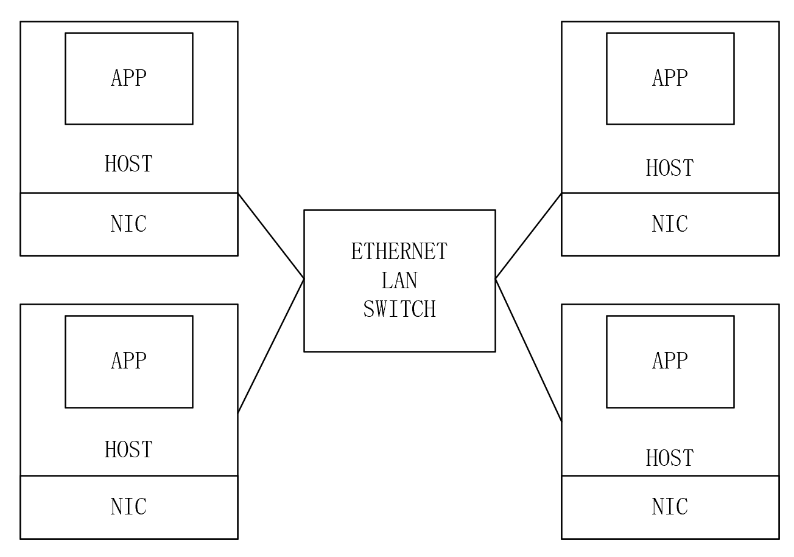

局域网 (`Local Area Network`) 下各个主机都是通过 `Ethernet` 进行连接

`Ethernet frame` 结构：`start flag` + 48 位目标 `eth` 地址 + 48 位源 `eth` 地址 + 16 位 `ether type` （`payload` 中的数据协议类型）+ `payload` + `end flag`

```c++
// an Ethernet packet header (start of the packet).
struct eth {
  uint8  dhost[ETHADDR_LEN];
  uint8  shost[ETHADDR_LEN];
  uint16 type;
} __attribute__((packed));
```

`eth` 地址由 `NIC` 的制造商决定

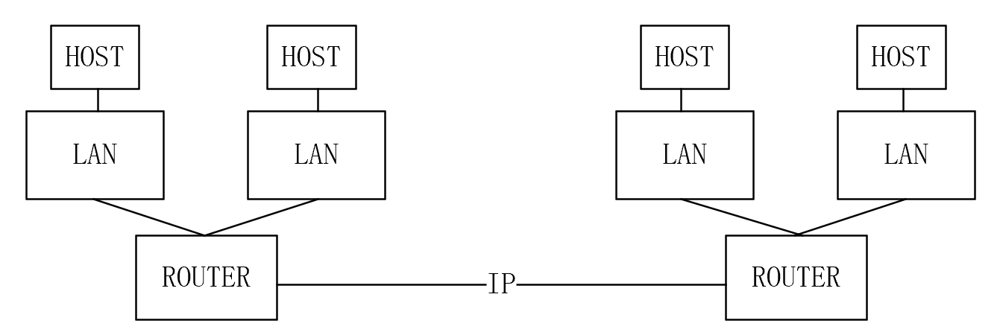

`Internet` 下各个 `LAN` 通过 `router` 之间的 `TCP/IP` 协议进行连接

#### 1.2 ARP

`Ethernet` 协议足以将 `packet` 在 `LAN` 中传送，但是如果需要将 `packet` 传送给远程 `Host`，需要 `IP` 地址。`ARP` 协议是将 `IP` 地址翻译为 `eth` 地址的协议，嵌套在 `ethernet packet` 中 (即 `ether header` 后面就是 `ARP header`，`ARP header` 是 `ether header` 的 `payload`)，`ARP header` 请求一个 `IP` 地址对应的 `eth` 地址，这个 `ARP header` 会被所有 `LAN` 内的 `host` 接收，对应的 `Host` 将返回 `IP` 地址

```c++
// an ARP packet (comes after an Ethernet header).
struct arp {
  uint16 hrd; // format of hardware address
  uint16 pro; // format of protocol address
  uint8  hln; // length of hardware address
  uint8  pln; // length of protocol address
  uint16 op;  // operation

  char   sha[ETHADDR_LEN]; // sender hardware address
  uint32 sip;              // sender IP address
  char   tha[ETHADDR_LEN]; // target hardware address
  uint32 tip;              // target IP address
} __attribute__((packed));

#define ARP_HRD_ETHER 1 // Ethernet

enum {
  ARP_OP_REQUEST = 1, // requests hw addr given protocol addr
  ARP_OP_REPLY = 2,   // replies a hw addr given protocol addr
};
```

#### 1.3 IP

`IP packet` 的 `ethernet type=0x0800`，`IP header` 中包括了 32 位的 `IP` 地址，高位的 `IP` 地址是 `network number` 来帮助 `router` 将 `packet` 进行转发，`protocol number` 让接收者知道这个 `IP packet` 的更高级协议是什么。在 `packet` 从一个 `router` 转发到另一个 `router` 的过程中，`ether header` 会被除去，但是 `IP header` 一直是保留着的

```c++
// an IP packet header (comes after an Ethernet header).
struct ip {
  uint8  ip_vhl; // version << 4 | header length >> 2
  uint8  ip_tos; // type of service
  uint16 ip_len; // total length
  uint16 ip_id;  // identification
  uint16 ip_off; // fragment offset field
  uint8  ip_ttl; // time to live
  uint8  ip_p;   // protocol
  uint16 ip_sum; // checksum
  uint32 ip_src, ip_dst;
};
```

#### 1.4 UDP

`UDP` 是传输层协议，根据 `sockets API` 规定了当一个 `packet` 到达正确 `host` 时需要被发送到的端口号，操作系统将把这个端口号上获取的 `packets` 作为一个 `file descriptor` 以供进程读取。端口号 53 是 `DNS server` 指定的端口号

```c++
// a UDP packet header (comes after an IP header).
struct udp {
  uint16 sport; // source port
  uint16 dport; // destination port
  uint16 ulen;  // length, including udp header, not including IP header
  uint16 sum;   // checksum
};
```

---

### 2. Kernel network stack

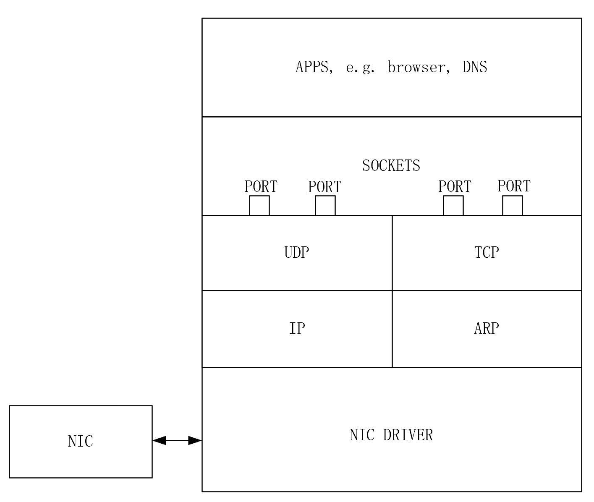

在 `network stack` 中的 `packet` 存放在缓存中，比如 `mbuf`，每一层将解析、校验 `header` 或添加 `header` 实现 `nesting`

---

### 3. ARP 工作原理 (重要)

> - [ARP 协议在同网段及跨网段下的工作原理](https://zhuanlan.zhihu.com/p/148644458)
>
> - [同一网段的概念以及计算](https://blog.csdn.net/qq_44931814/article/details/105642057)
>
> **同一网段指的是 `IP` 地址和 子网掩码 (mask) 相与得到相同的网络地址**

**前言：**`ARP` 协议是在 **链路层通讯** 中，已知目标 `IP` 地址，但是，仅有 `IP` 地址是不够的，因为 `IP` 数据报必须封装成帧才能通过数据链路进行发送，而数据帧必须要有目的 `MAC` 地址，每一个网络设备在数据封装前都需要获取下一跳的 `MAC` 地址。**`IP` 地址由网络层提供，`MAC` 地址通过 `ARP` 协议来获取**。`ARP` 协议是 `TCP/IP` 协议簇的重要组成部分，它能够通过目的 `IP` 地址获取目标设置的 `MAC` 地址，从而实现数据链路层的可达性。

#### 3.1 ARP 在同个网段下的工作原理

首先，**每台主机都会在自己的 `ARP` 缓冲区中建立一个 `ARP` 列表，以表示 `IP` 地址和 `MAC` 地址的对应关系。**当源主机需要将一个数据包要发送到目的主机时，会首先检查自己 `ARP` 列表中是否存在该 `IP` 地址对应的 `MAC` 地址

- **如果有，就直接将数据包发送到这个 `MAC` 地址**
- **如果没有，就向本地网段发起一个 `ARP` 请求的广播包，查询此目的主机对应的 `MAC` 地址**

此 `ARP` 请求数据包里包括源主机的 `IP` 地址、硬件地址、以及目的主机的 `IP` 地址。网络中所有的主机收到这个 `ARP` 请求后，会检查数据包中的目的 `IP` 是否和自己的 `IP` 地址一致。

- **如果不相同就忽略此数据包**
- **如果相同，该主机首先将发送端的 `MAC` 地址和 `IP` 地址添加到自己的 `ARP` 列表中。如果 `ARP` 表中已经存在该 `IP` 的信息，则将其覆盖，然后给源主机发送一个 `ARP` 响应数据包，告诉对方自己是它需要查找的 `MAC` 地址**

源主机收到这个 `ARP` 响应数据包后，将得到的目的主机的 `IP` 地址和 `MAC` 地址添加到自己的 `ARP` 列表中，并利用此信息开始数据的传输。如果源主机一直没有收到 `ARP` 响应数据包，表示 `ARP` 查询失败。

**例如：**

A 的地址为：IP：192.168.10.1	MAC: AA-AA-AA-AA-AA-AA
B 的地址为：IP：192.168.10.2	MAC: BB-BB-BB-BB-BB-BB

根据上面的所讲的原理，我们简单说明这个过程：A 要和 B 通讯，A 就需要知道 B 的以太网地址，于是 A 发送一个 ARP 请求广播（谁是 192.168.10.2 ，请告诉 192.168.10.1），当 B 收到该广播，就检查自己，结果发现和自己的一致，然后就向 A 发送一个 ARP 单播应答（192.168.10.2 在 BB-BB-BB-BB-BB-BB）。

#### 3.2 局域网中跨网段主机间通讯

> **不是所有的局域网中的主机都处于相同的子网（网段）。**局域网可以被划分为多个子网，每个子网可以有不同的IP地址范围和子网掩码。子网划分允许在同一个局域网内实现更多的IP地址管理和隔离。

不同网段的主机通信时，主机会封装网关（通常是路由器）的 `MAC` 地址，然后主机将数据发送给路由器，后续路由进行路由转发，通过 `ARP` 解析目标地址的 `MAC` 地址，然后将数据包送达目的地。具体过程分析如下：

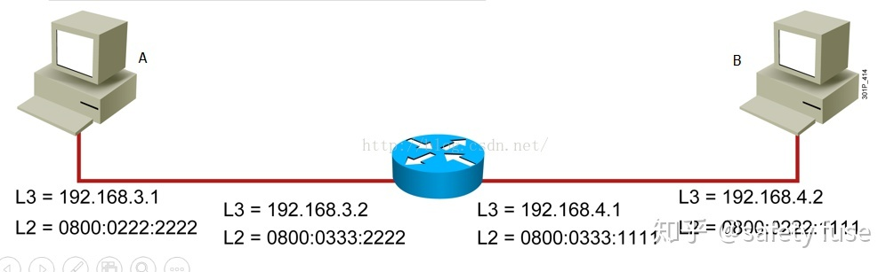

如上图，主机 A、B 通过路由器连接，属于两个不同的网段子网掩码 24（255.255.255.0）

- 主机 A 有数据发往主机 B，数据封装 `IP` 之后发现没有主机 B 的 `MAC` 地址；然后查询 `ARP`，`ARP` 回应：“我在 192.168.3.0/24 网段，目标地址在 192.168.4.0/24，不属于同一网段，需要使用默认网关”；`ARP` 发现默认网关是 192.168.3.2，但是没有网关 `MAC` 地址，需要先进行查询

- 主机将数据包先放到缓存中，然后发送 `ARP` 查询报文：封装自己的 `MAC` 地址为源 `MAC`，目标 `MAC` 地址写 **全 F (广播地址，会发给局域网的同一子网中所有的主机，也就是 ARP 请求广播包)** 的广播地址，请求网关 192.168.3.2 的 `MAC` 地址。然后以广播方式发送出去
- 路由器收到广播数据包，首先将原 192.168.3.1 添加到自己的 `MAC` 地址表中，对应 `MAC` 地址为 0800.0222.2222 (主机 A 的 `MAC` 地址)。路由发现是请求自己的 `MAC` 地址，然后路由回复一个 `ARP` 应答：封装自己的 `IP` 地址为源 `IP` 自己的 `MAC` 地址为源 `MAC` ，主机 A 的 `IP` 为目的 `IP` 主机 A 的 `MAC` 为目的 `MAC` ，发送一个单播应答“我是192.168.3.2。我的 `MAC` 地址为 0800.0333.2222”

- 主机收到应答后，将网关 `MAC` 地址对应 192.168.4.2（跨网关通信，其他网段 `IP` 地址的 `MAC` 地址均为网关 `MAC` ），然后将缓存中的数据包，封装网关 `MAC` 地址进行发送

- 路由收到数据包，检查目的 `IP` 地址，发现不是给自己的，决定要进行路由，然后查询路由表，需要发往 192.168.4.0 网段中的 192.168.4.2 地址。路由准备从相应接口上发出去，然后查询 `MAC` 地址表，发现没有主机 B 的映射。路由器发送 `ARP` 请求查询主机 B 的 `MAC` 地址（原理同 2、3 步，主机 B 收到请求后首先会添加网关的 `MAC` 地址，然后单播回复 `ARP` 请求）

- 路由器收到主机 B 的 `MAC` 地址后，将其添加到路由 `MAC` 地址表中，然后将缓存中的数据二层帧头去掉，封装自己的 `MAC` 地址为源 `MAC` ，主机 B 的 `MAC` 地址为目的 `MAC` （源和目的 `IP` 地址不变），加上二层帧头及校验，发送给主机 B

- 主机 B 收到数据之后，进行处理，发送过程结束

- 如果主机 B 收到数据后进行回复，主机 B 会进行地址判断，不在同一网段，然后决定将数据发送给网关，主机 B 查询 `MAC` 地址表获得网关 `MAC` 地址，将数据封装后发送（`ARP` 地址解析的过程不再需要了， `MAC` 地址表条目有一定的有效时间），网关收到数据后直接查询 `MAC` 表，将二层帧 `MAC` 地址更改为 A 的 `MAC` 发送出去。如此，主机 A 收到主机 B 的回复

**综上在跨网段通信过程中有以下过程：**

- 判断地址是否同一网段
- 查询目的 `IP` 地址的 `MAC`（发送 `ARP` 请求）

**此外需注意点**

- **`ARP` 请求以广播发送、以单播回应**
- **路由器隔离广播。每一个网段都是独立的广播域**
- **跨越网段通信需要使用网关的 `MAC` 地址**

#### 3.3 xv6 中通信流程图

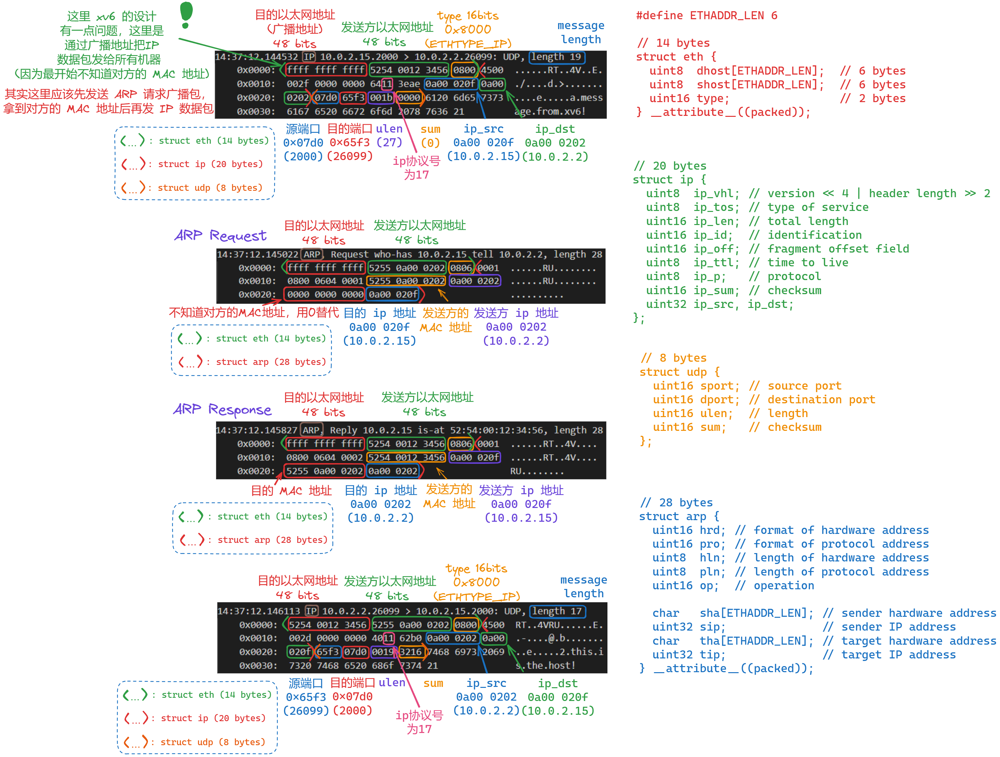

#### 3.4 xv6 通信过程介绍

> 本节只对 **数据包传输的内容** 和 **ARP 通信过程** 进行讲解。相关函数在第 4 部分讲解

这里解释一下 `user/nettests.c` 中的 `ping` 方法

**`xv6` 的 `IP` 为 `10.0.2.15`，会从 2000 端口发送数据到 `10.0.2.2:26099` 处 (`server.py` 程序负责)**

**这里我们把 `IP` 为 `10.0.2.15` 的主机称为 `A`，把 `10.0.2.2` 的主机称为 `B`**

首先通过 `connect` 建立连接

- 然后通过 `write` 发送数据包。这里涉及到了一次数据包的传输，如图

  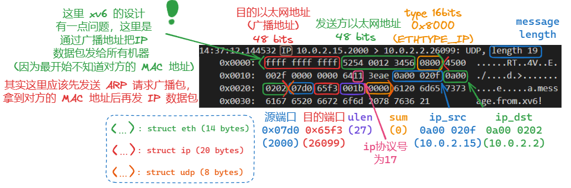

  - 最初，主机 A 想向主机 B 发送一个数据包，但是 A 并不知道 B 的 `MAC` 地址，所以主机 A 向 **广播地址** 发送了这个数据包，所以同一网段下的所有主机都会收到这个数据包

    > **注：** 其实这是 `xv6` 的设计原因，正常情况应该是**主机 A 发送一个 `ARP` 广播包来拿到主机 B 的 `MAC` 地址**

- 主机 B 收到数据包发现这个是发送给自己的，所以就会进行回复 (相应回复的代码在 `server.py` 中)。但是主机 B 并不知道主机 A 的 `MAC` 地址，所以就向发送了一个 **`ARP` 广播包**，`ARP header` 中包含了自己的 `MAC` 地址和 `IP` 地址，同时包含了主机 A 的 `IP` 地址，但是由于不知道主机 A 的 `MAC` 地址，就用 `0` 替代了。如下图

  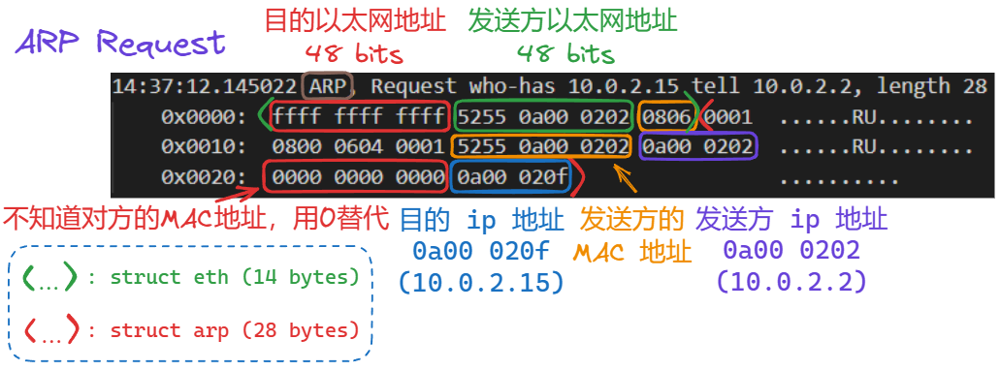

- 之后主机 A 收到了主机 B 的 `ARP` 广播包，所以要进行 `ARP` 回复，将自己的 MAC 地址发给对方

  >  这一步其实主机 A 已经知道了主机 B 的 `MAC` 地址 (因为在 B 发的数据包中 `arp header` 记录了 B 的 `MAC` 地址），但为什么主机 A 在响应 `ARP` 时还是要发到 **广播地址 ？**

  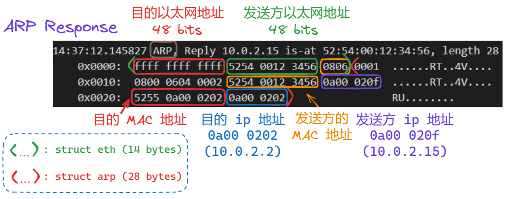

- 然后主机 B 收到主机 A 的 `ARP` 响应后拿到了主机 A 的 `MAC` 地址，之后主机 B 给主机 A 发送 `IP` 响应包

  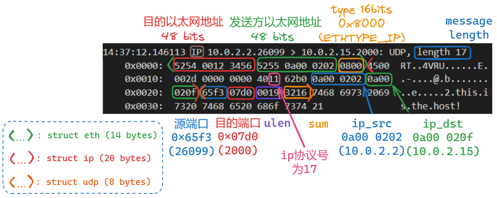

- 流程结束

---

### 4. Lab11: net

**背景：**

在一个局域网中，`xv6` 操作系统 （`guest`） 的 `ip` 地址为 `10.0.2.15`，运行 `qemu (host)` 的计算机的 `ip` 地址为 `10.0.2.2`，通过 `E1000` 向 `qemu` 发送 `packet`，然后 `qemu` 将接收到的 `packet` 发送给合适的 `application`

**`E1000` 网卡基本结构：**

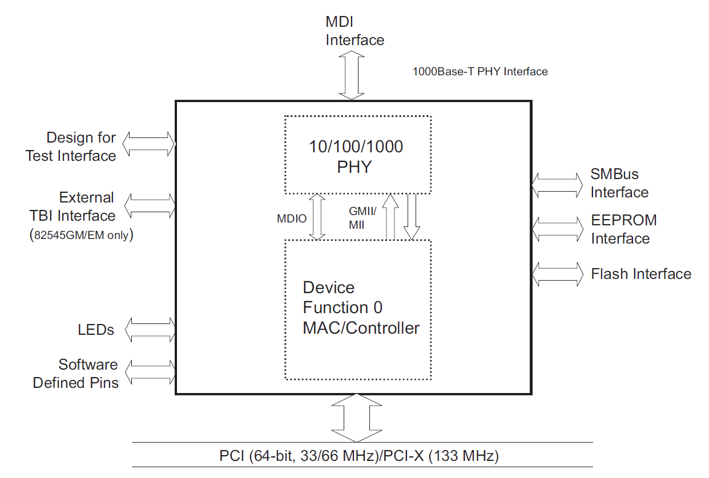

以太网网卡包括 `OSI` 模型的 2 个层：物理层和数据链路层。物理层由 `PHY` 芯片控制，定义了数据传送与接收所需要的光电信号、时钟基准等。数据链路层由 `MAC` 芯片控制，提供寻址机构、数据帧的构建、向网络层提供标准数据接口等功能。

**从 `PCI` 总线到 `MAC` 芯片的分解图：**

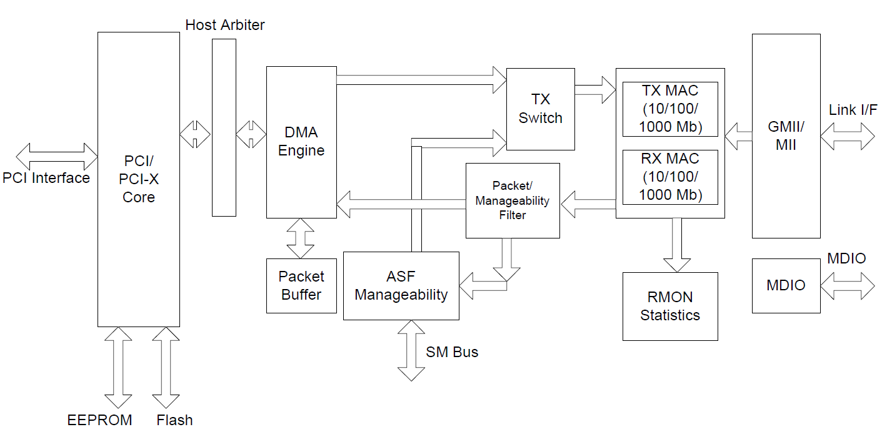

DMA (`Direct Memory Access`) 是可以不通过 `CPU` 直接访问内存的机制，在进行 `DMA` 传输时 `DMA Engine` 控制 `PCI` 总线，将内存中的数据和 `FIFO data buffer` (64KB) 中的数据互传。

---

#### 4.1 Ring 结构


`RAM` 中的 `tx/rx buffer` 是一个环形结构，有 `head` 和 `tail` 2 个指针，其中 `head` 的位置由网卡控制，在进行发送时，每发送完成一个 `packet` 网卡就会自动将 `head` 向前移动一个 `mbuf`，而需要将某个 `packet` 发送时，软件将 `tail` 向前移动一个 `mbuf`；在进行接收时，每接收到一个 `packet` 网卡自动将 `head` 向前移动一个 `mbuf`，软件读取 `tail` 所指向的 `mbuf`，并向前移动。移动到最后一个 `mbuf` 后从头开始，形成一个 `wrap-up` 的结构。

`descriptor` 结构是在网卡的寄存器中的，用于描述每一个 `RAM` 中的 `mbuf`

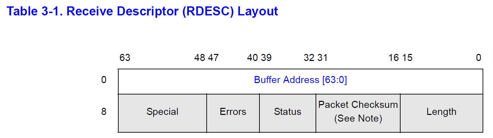

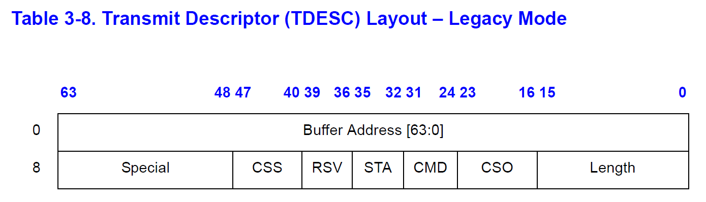

#### 4.2 网卡工作流程

- 内核首先在主存中分配内存缓冲区 `(rx_mbufs, tx_mbufs)` 和环形缓冲区 `(rx_ring, tx_ring)`，并由 `cpu` 将 `rx_ring` 的详细信息写入以太网控制器
- 随后 `NIC (Network Interface Card)` 通过 `DMA` 获取到下一个可以写入的缓冲区的地址，当 `packet` 从硬件收到的时候外设通过 `DMA` 的方式写入对应的内存地址中
- 当写入内存地址后，**硬件将会向 `cpu` 发送中断**，操作系统检测到中断后会调用网卡的异常处理函数
- 异常处理函数可以通过由以太网控制寄存器映射到操作系统上的内存地址访问寄存器获取到下一个收到但未处理的 `packet` 的描述符，根据该描述符可以找到对应的缓冲区地址进行读取并传输给上层协议。

---

#### 4.3 网卡初始化工作

> 这部分主要讲解 `kernerl/e1000.c` 中的 `e1000_init()` 方法还有 `m_bufalloc` 方法

`e1000_init()` 中主要就是设置各种寄存器的值，以及值得关注的 `tx_ring`、`tx_mbufs`、`rx_ring`、`rx_mbufs`

```c++
void
e1000_init(uint32 *xregs)
{
  ...
      
  // [E1000 14.5] Transmit initialization
  memset(tx_ring, 0, sizeof(tx_ring));
  for (i = 0; i < TX_RING_SIZE; i++) {
    tx_ring[i].status = E1000_TXD_STAT_DD;
    tx_mbufs[i] = 0;
  }
  ...
  
  // [E1000 14.4] Receive initialization
  memset(rx_ring, 0, sizeof(rx_ring));
  for (i = 0; i < RX_RING_SIZE; i++) {
    rx_mbufs[i] = mbufalloc(0);		// 注意这里调用 mbufalloc(0)，说明 headroom 为 0
    if (!rx_mbufs[i])
      panic("e1000");
    rx_ring[i].addr = (uint64) rx_mbufs[i]->head;
  }
  
  ...
}
```

**对于发送端初始化 (`Transmit initialization`)**

-  将 `tx_ring[i].status` 设置为 `E1000_TXD_STAT_DD`，之后在 `e1000_transmit()` 中判断 `status` 是否为 `E1000_TXD_STAT_DD`，如果是，则说明 `tx_ring[i]` 这个位置可以存放准备发送的数据（先清空再存放）

- `tx_mbufs[i]` 设置为 0，在 `e1000_transmit()` 会设置 `tx_mbufs[i]` 指向要发送的内容 (`struct mbuf` 变量)

- 在调用 `e1000_transmit()` 方法时我们需要传入一个 `struct mbuf` 变量，这个变量中将各层的 `header` 和发送的内容封装到了内部

  ```c++
  struct mbuf {
    struct mbuf  *next; // the next mbuf in the chain
    char         *head; // the current start position of the buffer
    unsigned int len;   // the length of the buffer
    char         buf[MBUF_SIZE]; // the backing store
  };
  ```

  - 而这个变量是在 `net_tx_arp()` 或 `sockwrite()` 中通过 `mbufalloc(MBUF_DEFAULT_HEADROOM)` 得到的，这里 `MBUF_DEFAULT_HEADROOM` 为 128，而 `mbuf.head` 指向了 `m_buf.buf + 128` 的位置，这就是 `mbufalloc()` 方法传入的参数的作用
  - `head` 指向 `buf + 128` 的位置，相当于在 `buf` 前面留出了 128 字节，这 128 字节主要就是用于封装各层的 `header` 用的

- 下图画出了使用不同协议时 `struct mbuf` 封装好 (即将各层的 `header` 封装了进去后) 的内部结构

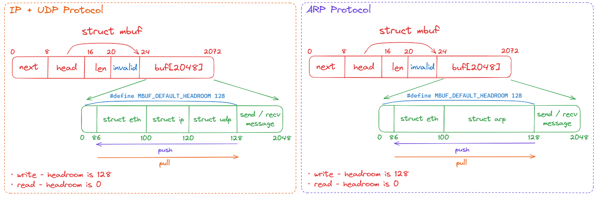

**对于接收端初始化 (`Receive initialization`)**

- `rx_mbufs[i] = mbufalloc(0);` 这里传入的参数为 0，而得到的 `mbuf` 的 `head` 指向的就是 `buf` 字段的起点 (`rx_mbufs` 会指向这个新创建的 `mbuf`，供网卡将内容拷贝到这里)。网卡接收的内容其实内部已经是封装好的 `mbuf` 之后需要去掉各层的 `header`（解码），之后网卡会把内容拷贝到 `rx_mbufs` 中。所以这里传入 0 就行，不需要预留空间
- `rx_ring[i].addr = (uint64) rx_mbufs[i]->head;` 这句话的作用其实就是想让 `addr` 字段指向 `struct mbuf` 中的 `buf` 的起点（此时 `head` 指向的就是 `buf` 的起点）。而之后在解码的过程中会改变 `head` 字段指向的位置 (`head` 字段代表当前解码到哪一层的 `header` 了)，所以如果还想要拿到 `buf` 的起点，就需要让 `addr` 指向它

**注意：**所谓 **解码** 就是 **去掉数据包各层的 `header`**，通过 `mbufpull`、`mbufpush`、`mbufput` 方法

---

#### 4.4 connect 流程

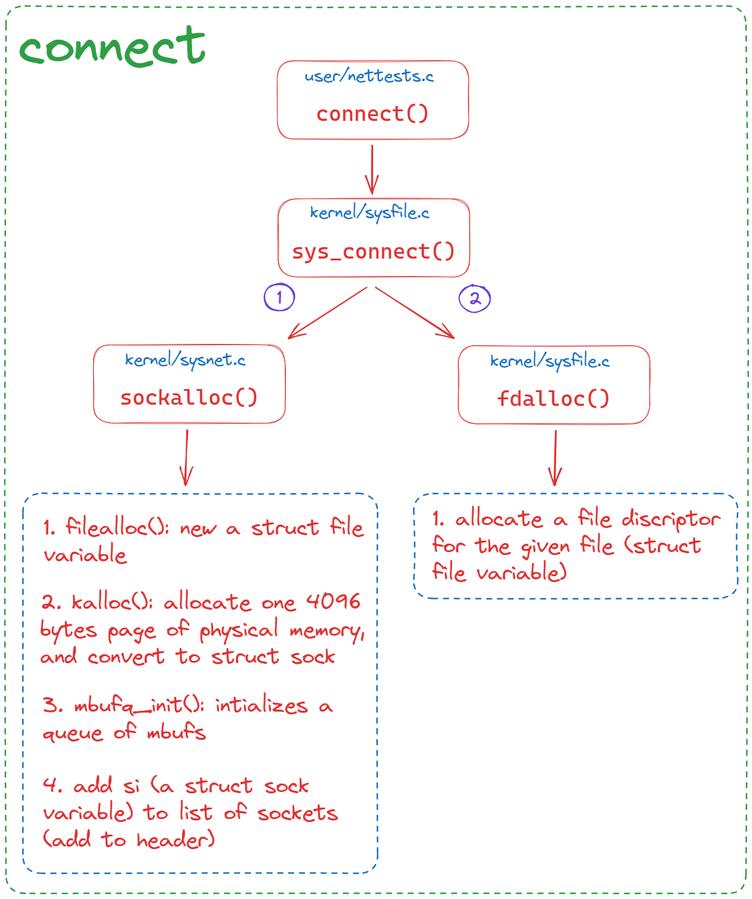

`connect` 主要做了以下几件事：

- 通过 `filealloc()` 创建一个 `struct file` 变量
- 通过 `kalloc()` 从物理内存中配置一页 (4096 bytes) 大小的内存，并转换为 `struct sock *` 类型
- 通过 `mbufq_init()` 为 `mbufs` 初始化一个队列
- 将 `si` 添加到 `sockets` 列表的头部
- 通过 `fdalloc()` 和 `struct file` 变量申请一个 `fd`

---

#### 4.5 write 流程

**流程图：**

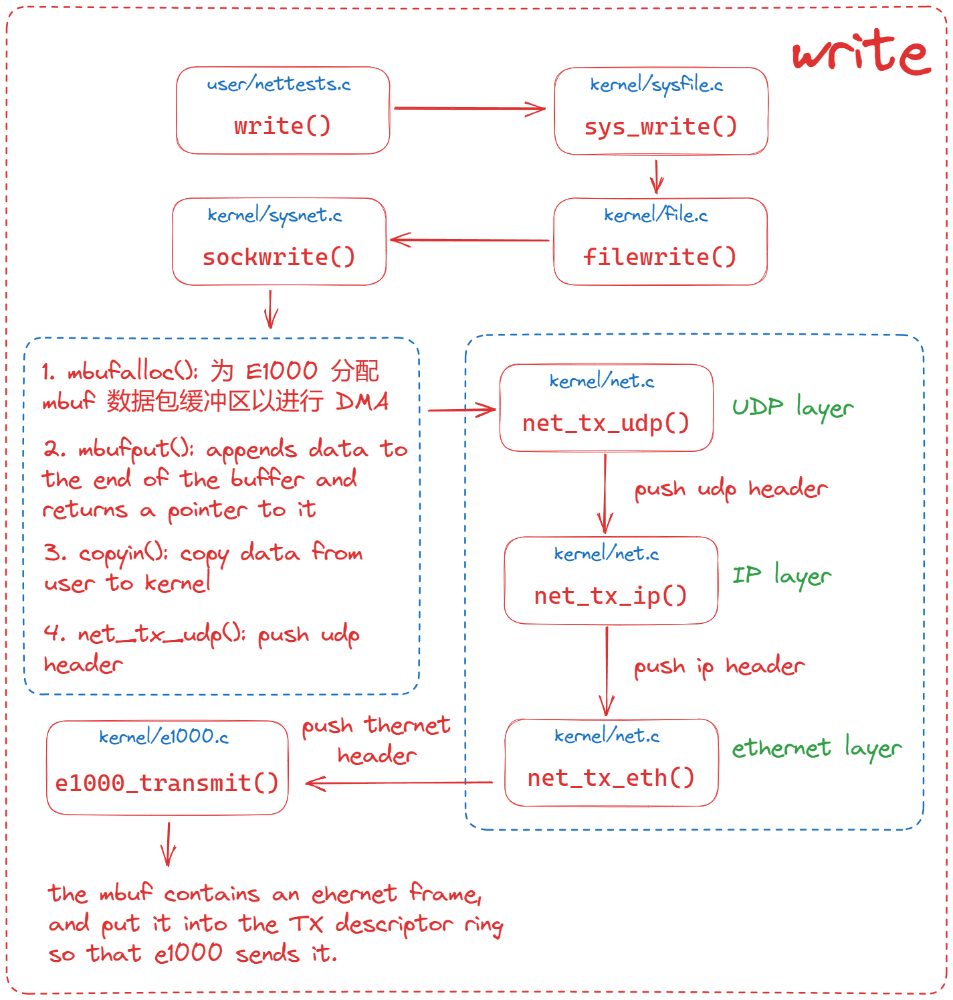

**发送数据的流程：**

操作系统想要发送数据时，将数据放入环形缓冲区数组 `tx_ring` 中 (放入的详细过程见上图)，之后 `CPU` 通知 `DMA Engine` 进行 `DMA` 传输，`MAC` 将数据包拆分为最小 64KB，最大 1518KB 的数据帧，每一帧包含了目标 `MAC` 地址、自己的 `MAC` 地址和数据包中的协议类型以及 `CRC` 校验码。

目标 `MAC` 地址通过 `ARP` 协议获取。`PHY` 接受 `MAC` 传送的数据，将并行数据转化为串行数据后进行编码，在转变为模拟信号将数据进行传输。

---

#### 4.6 read 流程

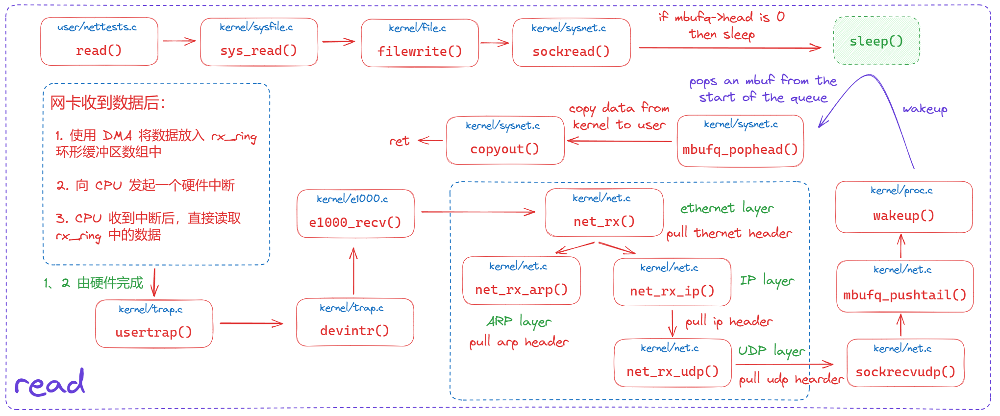

**接收数据的流程：**

当网卡接收到了一个新的数据包，会检查环形缓冲数组 `rx_ring`，如果有空余位置就会放到 `rx_ring` 所指向的 `mbuf` 中 (也就是 `rx_ring[rx_idx].addr`，其中 `rx_idx` 为空闲位置的下标，`addr` 和 `struct mbuf` 的 `head` 指向的都是 `struct mbuf` 的 `buf` 字段)。之后网卡向 `CPU` 发起中断，在终端中对把放在 `rx_ring` 的数据取出，然后去除`thernet header`， 然后去除 `ip header` 或 `arp header`，如果是 `IP` 数据包则还会去除 `UDP header`，最后得到数据包的内容就是 `read` 所读到的内容

---

#### 4.7 详细流程图

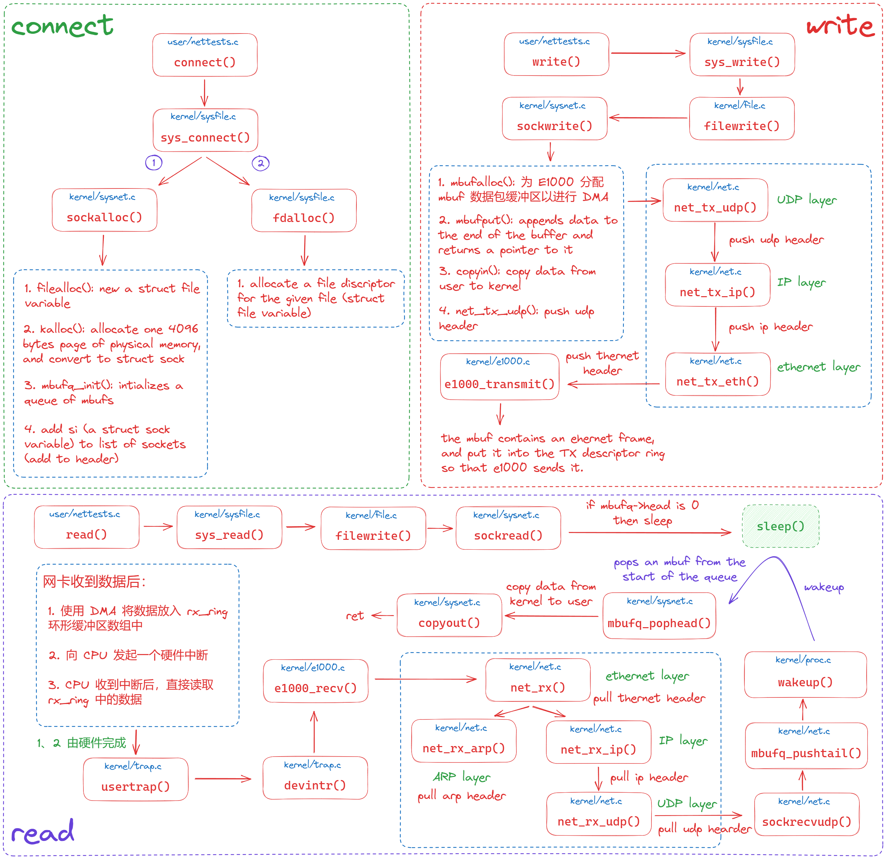

#### 4.8 代码实现

不过多介绍了，实验要求就是实现 `e1000_transmit()`  和 `e1000_recv()`

```c++
int
e1000_transmit(struct mbuf *m)
{
  //
  // the mbuf contains an ethernet frame; program it into
  // the TX descriptor ring so that the e1000 sends it. Stash
  // a pointer so that it can be freed after sending.
  //
  acquire(&e1000_lock);
  int idx = regs[E1000_TDT];
  if((tx_ring[idx].status & E1000_TXD_STAT_DD) == 0) {
    release(&e1000_lock);
    return -1;
  }

  if(tx_mbufs[idx] != 0)
    mbuffree(tx_mbufs[idx]);
  
  tx_mbufs[idx] = m;
  tx_ring[idx].addr = (uint64)m->head;
  tx_ring[idx].length = m->len;
  tx_ring[idx].cmd = E1000_RXD_STAT_DD | E1000_RXD_STAT_EOP;
  regs[E1000_TDT] = (idx + 1) % TX_RING_SIZE;

  if(tx_mbufs[idx] == 0) {
    release(&e1000_lock);
    return -1;
  }

  release(&e1000_lock);
  return 0;
}

static void
e1000_recv(void)
{
  //
  // Check for packets that have arrived from the e1000
  // Create and deliver an mbuf for each packet (using net_rx()).
  //
  while(1) {
    int idx = (regs[E1000_RDT] + 1) % RX_RING_SIZE;
    if((rx_ring[idx].status & E1000_RXD_STAT_DD) == 0)
      break;
    
    rx_mbufs[idx]->len = rx_ring[idx].length;
    net_rx(rx_mbufs[idx]);
    rx_mbufs[idx] = mbufalloc(0);

    rx_ring[idx].addr = (uint64)rx_mbufs[idx]->head;
    rx_ring[idx].status = 0;
    regs[E1000_RDT] = idx;
  }
  
}
```


