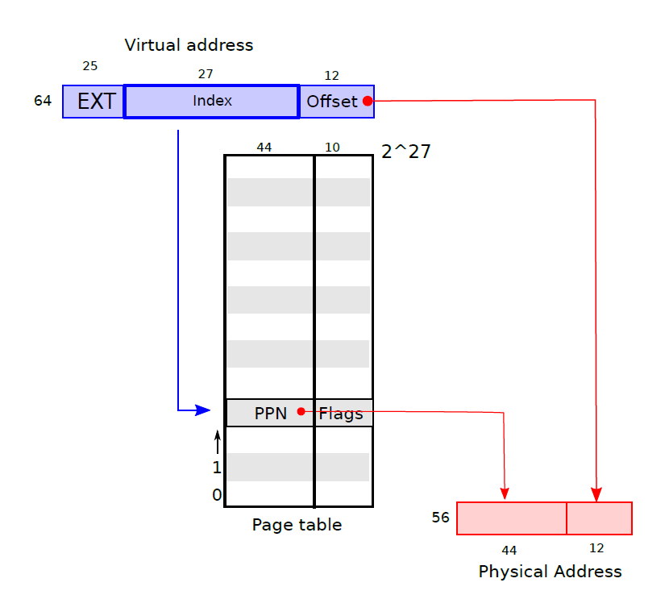
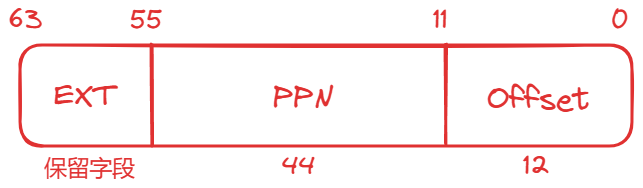
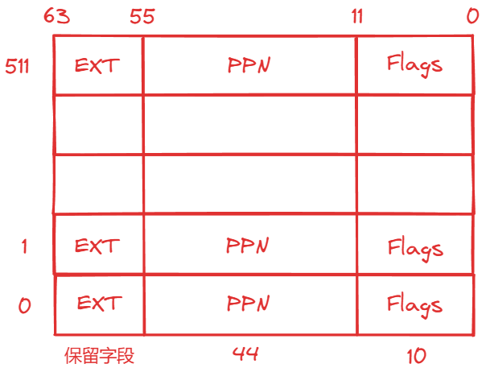
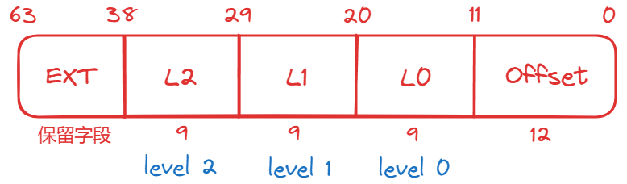

## Page Tables

> 必读资料：
>
> - [Lec04 Page tables (Frans)](https://mit-public-courses-cn-translatio.gitbook.io/mit6-s081/lec04-page-tables-frans)
> - [Lecture Notes - Xiao Fan's Personal Page (fanxiao.tech)](https://fanxiao.tech/posts/2021-03-02-mit-6s081-notes/#31-paging-hardware)

### 1. Paging Hardware

`xv6` 运行于 `Sv39 RISC-V`，即在 64 位地址中只有最下面的39位被使用作为虚拟地址，其中底 12 位是页内偏移，高 27 位是页表索引，即 4096 字节 (212212) 作为一个 `page`，一个进程的虚拟内存可以有 227227 个 `page`，对应到页表中就是 227227 个 `page table entry` (PTE)。每个 `PTE` 有一个 44 位的 `physical page number` (PPN) 用来映射到物理地址上和 10 位 `flag`，总共需要 54 位，也就是一个 `PTE` 需要 8 字节存储。即每个物理地址的高 44 位是页表中存储的PPN，低 12 位是页内偏移，一个物理地址总共由 56 位构成。



在实际中，页表并不是作为一个包含了 227227 个 `PTE` 的大列表存储在物理内存中的，而是采用了三级树状的形式进行存储，这样可以让页表分散存储。每个页表就是一页。第一级页表是一个 4096 字节的页，包含了 512 个 `PTE`（因为每个 `PTE` 需要 8 字节），每个 `PTE` 存储了下级页表的页物理地址，第二级列表由 512 个页构成，第三级列表由 512*512 个页构成。因为每个进程虚拟地址的高 27 位用来确定 `PTE`，对应到 3 级页表就是最高的 9 位确定一级页表 `PTE` 的位置，中间 9 位确定二级页表 `PTE` 的位置，最低 9 位确定三级页表 `PTE` 的位置。如下图所示。第一级根页表的物理页地址存储在 `satp` 寄存器中，每个 `CPU` 拥有自己独立的 `satp`


`PTE flag` 可以告诉硬件这些相应的虚拟地址怎样被使用，比如 `PTE_V` 表明这个 `PTE` 是否存在，`PTE_R`、`PTE_W`、`PTE_X` 控制这个页是否允许被读取、写入和执行，`PTE_U` 控制 `user mode` 是否有权访问这个页，如果 `PTE_U=0`，则只有 `supervisor mode` 有权访问这个页。

### 2. Kernel address space

每个进程有一个页表，用于描述进程的用户地址空间，还有一个内核地址空间（所有进程共享这一个描述内核地址空间的页表）。为了让内核使用物理内存和硬件资源，内核需要按照一定的规则排布内核地址空间，以能够确定哪个虚拟地址对应自己需要的硬件资源地址。用户地址空间不需要也不能够知道这个规则，因为用户空间不允许直接访问这些硬件资源

`QEMU` 会模拟一个从 `0x80000000` 开始的 `RAM`，一直到 `0x86400000`。`QEMU` 会将设备接口以控制寄存器的形式暴露给内核，这些控制寄存器在 `0x80000000` 以下。`kernel` 对这些设备接口控制寄存器的访问是直接和这些设备而不是 `RAM` 进行交互的


左边和右边分别是 `kernel virtual address` 和 `physical address` 的映射关系。在虚拟地址和物理地址中，`kernel` 都位于 `KERNBASE=0x80000000` 的位置，这叫做直接映射。

用户空间的地址分配在 `free memory` 中

有一些不是直接映射的内核虚拟地址：

- **`trampoline page`**（和 `user pagetable` 在同一个虚拟地址，以便在 `user space` 和 `kernel space` 之间跳转时切换进程仍然能够使用相同的映射，真实的物理地址位于 `kernel text` 中的 `trampoline.S`）
- **`kernel stack page`**：每个进程有一个自己的内核栈 `kstack`，每个 `kstack` 下面有一个没有被映射的 `guard page`，`guard page` 的作用是防止 `kstack` 溢出影响其他 `kstack`。当进程运行在内核态时使用内核栈，运行在用户态时使用用户栈

**注意**：还有一个内核线程，这个线程只运行在内核态

### 3. Code: creating an address space

`xv6` 中和页表相关的代码在 `kernel/vm.c` 中。最主要的结构体是 `pagetable_t`，这是一个指向页表的指针。`kvm` 开头的函数都是和 `kernel virtual address` 相关的，`uvm` 开头的函数都是和 `user virtual address` 相关的，其他的函数可以用于这两者

几个比较重要的函数：

- **`walk`：**给定一个虚拟地址和一个页表，返回一个 `PTE` 指针
- **`mappages`：**给定一个页表、一个虚拟地址和物理地址，创建一个 `PTE` 以实现相应的映射
- **`kvminit`：**用于创建 `kernel` 的页表，使用 `kvmmap` 来设置映射
- **`kvminithart`：**将 `kernel` 的页表的物理地址写入 `CPU` 的寄存器 `satp` 中，然后 `CPU` 就可以用这个 `kernel` 页表来翻译地址了
- **`procinit` (`kernel/proc.c`)：**为每一个进程分配 (`kalloc`) `kstack`。`KSTACK` 会为每个进程生成一个虚拟地址（同时也预留了 `guard pages`)，`kvmmap` 将这些虚拟地址对应的 `PTE` 映射到物理地址中，然后调用 `kvminithart` 来重新把 `kernel` 页表加载到 `satp` 中去。

每个RISC-V **CPU** 会把 `PTE` 缓存到 **`Translation Look-aside Buffer (TLB)`** 中，当 xv6 更改了页表时，必须通知 `CPU` 来取消掉当前的 `TLB`，取消当前 `TLB` 的函数是 `sfence.vma()`，在 `kvminithart` 中被调用

### 4. Physical memory allocation for kernel

`xv6` 对 `kernel space` 和 `PHYSTOP` 之间的物理空间在运行时进行分配，分配以页 (4096 bytes) 为单位。分配和释放是通过对空闲页链表进行追踪完成的，分配空间就是将一个页从链表中移除，释放空间就是将一页增加到链表中

`kernel` 的物理空间的分配函数在 `kernel/kalloc.c` 中，每个页在链表中的元素是 `struct run`，每个 `run` 存储在空闲页本身中。这个空闲页的链表 `freelist` 由 `spin lock` 保护，包装在 `struct kmem` 中。

- **`kinit()`：**对分配函数进行初始化，将 `kernel` 结尾到 `PHYSTOP` 之间的所有空闲空间都添加到 `kmem` 链表中，这是通过调用 `freerange(end, PHYSTOP)` 实现的
- **`freerange()`：**对这个范围内所有页都调用一次 `kfree` 来将这个范围内的页添加到 `freelist` 链表中

### 5. User space memory

每个进程有自己的用户空间下的虚拟地址，这些虚拟地址由每个进程自己的页表维护，用户空间下的虚拟地址从 0 到 `MAXVA` (`1^38`)

当进程向 `xv6` 索要更多用户内存时，`xv6` 先用 `kalloc` 来分配物理页，然后向这个进程的页表增加指向这个新的物理页的 `PTE`，同时设置这些 `PTE` 的 `flag`


图 3.4 是一个进程在刚刚被 `exec` 调用时的用户空间下的内存地址，`stack` 只有一页，包含了 `exec` 调用的命令的参数从而使 `main(argc, argv)` 可以被执行。`stack` 下方是一个 `guard page` 来检测 `stack` 溢出，一旦溢出将会产生一个 `page fault exception`

`sbrk` 是一个可以让进程增加或者缩小用户空间内存的 `system call`。`sbrk` 调用了 `growproc` (`kernel/proc.c`) 来改变 `p->sz` 从而改变 **`heap`** 中的 `program break`，`growproc` 调用了 `uvmalloc` 和 `uvmdealloc`，前者调用了 `kalloc` 来分配物理内存并且通过 `mappages` 向用户页表添加 `PTE`，后者调用了 `kfree` 来释放物理内存

### 6. Code: exec

`exec` 是一个 `system call`，为以 `ELF` 格式定义的文件系统中的可执行文件创建用户空间。

`exec` 先检查头文件中是否有 `ELF_MAGIC` 来判断这个文件是否是一个 ELF 格式定义的二进制文件，用 `proc_pagetable` 来为当前进程创建一个还没有映射的页表，然后用 `uvmalloc` 来为每个 `ELF segment` 分配物理空间并在页表中建立映射，然后用 `loadseg` 来把 `ELF segment` 加载到物理空间当中。注意 `uvmalloc` 分配的物理内存空间可以比文件本身要大。

接下来 `exec` 分配 `user stack`，它仅仅分配一页给 `stack`，通过 `copyout` 将传入参数的 `string` 放在 `stack` 的顶端，在 `ustack` 的下方分配一个 `guard page`

如果 `exec` 检测到错误，将跳转到 `bad` 标签，释放新创建的 `pagetable` 并返回 -1。`exec` 必须确定新的执行能够成功才会释放进程旧的页表 (`proc_freepagetable(oldpagetable, oldsz)`)，否则如果 `system call` 不成功，就无法向旧的页表返回 -1

### 7. Real world

`xv6` 将 `kernel` 加载到 `0x8000000` 这一RAM物理地址中，但是实际上很多 `RAM` 的物理地址都是随机的，并不一定存在 `0x8000000` 这个地址

实际的处理器并不一定以 `4096 bytes` 为一页，而可能使用各种不同大小的页

### 8. Lab1: Print a page table

#### 8.1 虚拟地址结构

在 `xv6` 中物理地址的范围是 `0 ~ 2^56 - 1`，也就是说在 64 位的操作系统上只需要使用 56 位就足够对 `xv6` 进行寻址了，对于一个 64 位的物理地址来说，其组成分为

<div align="center">
    
</div>

`Page Directory` 虚表的结构为

<div align="center">
    
</div>

`xv6` 中采用的是三级页表的形式，对于一个 64 位的虚拟地址来说，只使用了低 39 位

<div align="center">
    
</div>

#### 8.2 虚拟地址寻址物理地址

- 假如现在有一个虚拟地址 `va`，我们就可以拿到 `page addr2` (`9 bits`)，而 `9 bits` 的寻址范围正好是 `0 ~ 511`，可以把 `Page Directory` 虚表看作成一个 **数组**，那么 `page addr2` 就可以看作为数组的 **下标**，根据 `page addr2` 就可以在 `Page Directory` 对应的值 `pte`  (一个 8 `bytes` 的数)

- 而 `pte` 只有低 54 位是有用的信息，低 10 位是 `flags` 标志，可以通过 `flags & PTE_V` 判断该 `pte` 是否是有效的；中间的 `44` 位其实是一个地址，表示的是下一个 `Page Directory` 虚表的地址 (下一个虚表也可以看作是一个数组，而这个地址可以看作是数组的起始地址)

- 之后我们在拿到 `page addr1` 的地址重复上面的过程，可以拿到第三层的虚表，然后再根据 `page addr0` 我们能拿到最后的 `pte`，这个 `pte` 的低 10 位和之前是同样的概念，而中间的 44 位就是上面物理地址的 `PPN` 部分，之后再加上虚拟地址的 `offset` 我们就能拿到一个完整的物理地址

- 以上就是根据虚拟地址找到对应物理地址的过程，这部分的代码在 `kernel/vm.c walk()` 中

```c++
#define PX(level, va) ((((uint64) (va)) >> (12+(9*(level)))) & 0x1FF)
#define PTE2PA(pte) (((pte) >> 10) << 12)
#define PA2PTE(pa) ((((uint64)pa) >> 12) << 10)

pte_t *
walk(pagetable_t pagetable, uint64 va, int alloc)
{
  if(va >= MAXVA)
    panic("walk");

  for(int level = 2; level > 0; level--) {
    // 通过 PX(level, va) 可以得到 level 2 / level 1 / level 0 的值
    // 而 level 2 其实就是 虚表(page directory) 的索引
    pte_t *pte = &pagetable[PX(level, va)];		// pte 就是 page addr level 指向的那块地址
    if(*pte & PTE_V) {	// 如果是有效的
      pagetable = (pagetable_t)PTE2PA(*pte);	// 拿到对应的 page table 的地址 (下一张虚表的地址)
    } else {
      if(!alloc || (pagetable = (pde_t*)kalloc()) == 0)
        return 0;
      memset(pagetable, 0, PGSIZE);
      *pte = PA2PTE(pagetable) | PTE_V;
    }
  }
  return &pagetable[PX(0, va)];		// 返回最后一层的 pte，之后需要再调用 PTE2PA 将 pte 转换为 physical addr
}
```

#### 8.3 代码实现

- 首先在 `kernel/exec.c` 末尾处添加

```diff
proc_freepagetable(oldpagetable, oldsz);

+ if(p->pid==1) vmprint(p->pagetable);

return argc;
```

- 之后在 `kernel/vm.c` 中添加

```diff
+ void
+ dfs_vmprint(pagetable_t pagetable, int deep)
+ {
+   for(int i = 0; i < 512; i++) {
+     pte_t pte = pagetable[i];
+     if((pte & PTE_V) && (pte & (PTE_R | PTE_W | PTE_X)) == 0) {
+       uint64 child = PTE2PA(pte);
+       for(int k = 0; k < deep; k++) {
+         printf("..");
+         if(k != deep - 1) printf(" ");
+       }
+       printf("%d: pte %p pa %p\n", i, pte, child);
+       dfs_vmprint((pagetable_t)child, deep + 1);
+     } else if(pte & PTE_V) {
+       uint64 child = PTE2PA(pte);
+       printf(".. .. ..%d: pte %p pa %p\n", i, pte, child);
+     }
+   }
+ }
+ 
+ void
+ vmprint(pagetable_t pagetable)
+ {
+   printf("page table %p\n", pagetable);
+   dfs_vmprint(pagetable, 1);
+ }
```

#### 8.4 实验结果

```diff
xv6 kernel is booting

hart 2 starting
hart 1 starting
+ page table 0x0000000087f63000
+ ..0: pte 0x0000000021fd7c01 pa 0x0000000087f5f000
+ .. ..0: pte 0x0000000021fd7801 pa 0x0000000087f5e000
+ .. .. ..0: pte 0x0000000021fd801f pa 0x0000000087f60000
+ .. .. ..1: pte 0x0000000021fd740f pa 0x0000000087f5d000
+ .. .. ..2: pte 0x0000000021fd701f pa 0x0000000087f5c000
+ ..255: pte 0x0000000021fd8801 pa 0x0000000087f62000
+ .. ..511: pte 0x0000000021fd8401 pa 0x0000000087f61000
+ .. .. ..510: pte 0x0000000021fed807 pa 0x0000000087fb6000
+ .. .. ..511: pte 0x0000000020001c0b pa 0x0000000080007000
init: starting sh
$ 
```

### 9. Lab2: A kernel page table per process

> `xv6` 有一个内核页表，每当它在内核中执行时就会使用该页表。 内核页表是到物理地址的直接映射，这样内核虚拟地址 `x` 就映射到物理地址 `x`。**` xv6` 还为每个进程的用户地址空间提供一个单独的页表 (`struct proc` 中 `pagetable` 字段)，仅包含该进程的用户内存的映射，从虚拟地址零开始。 由于内核页表不包含这些映射，因此用户地址在内核中无效。** 因此，当内核需要使用系统调用中传递的用户指针（例如传递给 `write()` 的缓冲区指针）时，内核必须首先将指针转换为物理地址。 本节和下一节的目标是允许内核直接取消引用用户指针。

要理解这里的 “为什么无效” 就需要查看一下 **内核页表的映射** 和 **用户进程页表的映射**

#### 9.1 内核页表


内核页表的映射在 `kernel/vm.c` 的 `kvminit()` 方法中，而映射的地方和上图相同

```c++
pagetable_t kernel_pagetable;		// 内核页表

voidkvminit() {
  kernel_pagetable = (pagetable_t)kalloc();
  memset(kernel_pagetable, 0, PGSIZE);

  // uart registers
  kvmmap(UART0, UART0, PGSIZE, PTE_R | PTE_W);

  // virtio mmio disk interface
  kvmmap(VIRTIO0, VIRTIO0, PGSIZE, PTE_R | PTE_W);

  // CLINT
  kvmmap(CLINT, CLINT, 0x10000, PTE_R | PTE_W);

  // PLIC
  kvmmap(PLIC, PLIC, 0x400000, PTE_R | PTE_W);

  // map kernel text executable and read-only.
  kvmmap(KERNBASE, KERNBASE, (uint64)etext - KERNBASE, PTE_R | PTE_X);

  // map kernel data and the physical RAM we'll make use of.
  kvmmap((uint64)etext, (uint64)etext, PHYSTOP - (uint64)etext, PTE_R | PTE_W);

  // map the trampoline for trap entry/exit to
  // the highest virtual address in the kernel.
  kvmmap(TRAMPOLINE, (uint64)trampoline, PGSIZE, PTE_R | PTE_X);
}
```

可以发现在内核表页中映射了很多字段，同时内核页表和用户进程页表相同的一点是都映射了 `TRAMPOLINE`，映射的是同一虚拟地址

除此之外，内核页表还映射了 `kernel stack`，在 `kernel/proc.c` 的 `procinit()` 方法中

```c++
void procinit(void) {
  ...
  for(p = proc; p < &proc[NPROC]; p++) {
      initlock(&p->lock, "proc");

      // Allocate a page for the process's kernel stack.
      // Map it high in memory, followed by an invalid guard page.
      char *pa = kalloc();
      if(pa == 0)
        panic("kalloc");
      uint64 va = KSTACK((int) (p - proc));
      kvmmap(va, (uint64)pa, PGSIZE, PTE_R | PTE_W);
      p->kstack = va;
  }
  kvminithart();	// 设置 satp 寄存器指向 内核页表
}
```

这里是为每个线程都映射了一个 `kernel stack`，当线程陷入内核态后会使用 **内核页表** 和 **`kernel stack` 内核栈**

#### 9.2 用户进程页表


用户进程页表的映射在 `kernel/proc.c` 的 `proc_pagetable()` 方法中

```c++
// Create a user page table for a given process, with no user memory, but with trampoline pages.
pagetable_t proc_pagetable(struct proc *p) {
  pagetable_t pagetable;

  // An empty page table.
  pagetable = uvmcreate();
  ...

  // map the trampoline code (for system call return) at the highest user virtual address.
  // only the supervisor uses it, on the way to/from user space, so not PTE_U.
  if(mappages(pagetable, TRAMPOLINE, PGSIZE, (uint64)trampoline, PTE_R | PTE_X) < 0) {
    ...
  }

  // map the trapframe just below TRAMPOLINE, for trampoline.S.
  if(mappages(pagetable, TRAPFRAME, PGSIZE, (uint64)(p->trapframe), PTE_R | PTE_W) < 0) {
    ...
  }

  return pagetable;
}
```

可以看到用户进程页表只映射了 `TRAMPOLINE` 和 `TRAPFRAME` 两个地方

#### 9.3 进程内核页表

> `xv6` 有一个内核页表，每当它在内核中执行时就会使用该页表。 内核页表是到物理地址的直接映射，这样内核虚拟地址 `x` 就映射到物理地址 `x`。**` xv6` 还为每个进程的用户地址空间提供一个单独的页表 (`struct proc` 中 `pagetable` 字段)，仅包含该进程的用户内存的映射，从虚拟地址零开始。 由于内核页表不包含这些映射，因此用户地址在内核中无效。** 因此，当内核需要使用系统调用中传递的用户指针（例如传递给 `write()` 的缓冲区指针）时，内核必须首先将指针转换为物理地址。 本节和下一节的目标是允许内核直接取消引用用户指针。

通过查看 **内核页表** 和 **用户进程页表** 的结构后，就可以很容易理解上面的话要表达的意思：

- **用户进程页表** 记录了进程在 **用户态** 时的相关信息，当进程从用户态切换到内核态时，会重新设置 `satp` 寄存器指向 **内核页表**。此时我们是拿不到进程在用户态的相关的信息的

这就是问题所在，所以为了在内核态拿到用户态的信息，就需要在 `struct proc` 结构体中再添加一个字段 `kernelpgt` 用于表示每个进程的内核态页表（**也就是当进程陷入到内核态时会使用 `kernelpgt` 而不是之前的内核页表**）

所以我们的任务就是使用 **`kernelpgt`** 去替代之前的 **内核页表**，所以 `kernelpgt` 就需要有 **内核页表** 之前映射的地方；之前只有一个内核页表，并且内核页表中映射了所有进程的 **kernel stack**，但现在每个进程都有属于自己的 **kernelpgt**，所以只需要把每个进程的 **kernel stack** 在属于该进程的 **kernelpgt** 上映射就可以了

#### 9.4 代码实现

在 `kernel/defs.h` 添加函数声明

```diff
void            vmprint(pagetable_t pagetable);
+ pagetable_t     pkvminit();
+ void            uvmmap(pagetable_t pagetable, uint64 va, uint64 pa, uint64 sz, int perm);
+ void            pkvmfree(pagetable_t pagetable);
+ pte_t*          walk(pagetable_t pagetable, uint64 va, int alloc);
```

在 `kernel/proc.h` 中给 `struct proc` 添加 `kernelpgt` 字段

```diff
  pagetable_t pagetable;       // User page table
+ pagetable_t kernelpgt;       // process's kernel page table
```

删除 `procinit` 中的部分代码。按上面我们说的，我们需要给每个进程的 `kernetlpgt` 映射对应的 `kernel stack`，所以就不用在 **内核页表** 上映射了

```diff
- char *pa = kalloc();
- if(pa == 0)
-   panic("kalloc");
- uint64 va = KSTACK((int) (p - proc));
- kvmmap(va, (uint64)pa, PGSIZE, PTE_R | PTE_W);
- p->kstack = va;
```

在 `allocproc` 中为每个进程创建 `kernelpgt`，并映射 `kernel stack`

```diff
    return 0;
  }

+ p->kernelpgt = pkvminit();
+ if(p->kernelpgt == 0) {
+   freeproc(p);
+   release(&p->lock);
+   return 0;
+ }
+
+ char *pa = kalloc();
+ if(pa == 0)
+   panic("kalloc");
+
+ uint64 va = KSTACK((int)(p - proc));
+ uvmmap(p->kernelpgt, va, (uint64)pa, PGSIZE, PTE_R | PTE_W);
+ p->kstack = va;
```

在 `freeproc` 中释放 `kernelpgt` 和 `kernel stack`

```diff
  p->trapframe = 0;

+ if(p->kstack) {
+   pte_t *pte = walk(p->kernelpgt, p->kstack, 0);
+   if(pte == 0)
+     panic("freeproc: walk");
+   kfree((void *)PTE2PA(*pte));
+ }
+ p->kstack = 0;

  if(p->pagetable)
    proc_freepagetable(p->pagetable, p->sz);

+ if(p->kernelpgt)
+   pkvmfree(p->kernelpgt);

```

在 `kernel/proc.c` 末尾实现 `pkvmfree`

```diff
+ void
+ pkvmfree(pagetable_t pagetable)
+ {
+   for(int i = 0; i < 512; i++) {
+     pte_t pte = pagetable[i];
+     if(pte & PTE_V) {
+       pagetable[i] = 0;
+       if((pte & (PTE_R | PTE_W | PTE_X)) == 0) {
+         uint64 child = PTE2PA(pte);
+         pkvmfree((pagetable_t)child);
+       }
+     }
+   }
+   kfree((void *)pagetable);
+ }
```

在 `scheduler` 中进行修改，在调用 `sched` 方法切换进程前将 `satp` 寄存器设置为进程的 `kernelpgt`，从 `sched` 返回到下一次调用 `sched` 之前是没有任何进程在运行的，在这个空档的时间内我们需要将 `stap` 寄存器设置为 **内核页表**

```diff
+ w_satp(MAKE_SATP(p->kernelpgt));
+ sfence_vma();

  swtch(&c->context, &p->context);

+ kvminithart();
```

在 `kernel/vm.c` 中实现 `pkvminit` 对 `kernelpgt` 的初始化，仿照 `kvminit` 即可

```diff
#include "fs.h"
+ #include "spinlock.h"
+ #include "proc.h"


+ pagetable_t
+ pkvminit()
+ {
+   pagetable_t kernelpgt = (pagetable_t)kalloc();
+   if(kernelpgt == 0)
+     return 0;
+ 
+   memset(kernelpgt, 0, PGSIZE);
+ 
+   // uart registers
+   uvmmap(kernelpgt, UART0, UART0, PGSIZE, PTE_R | PTE_W);
+ 
+   // virtio mmio disk interface
+   uvmmap(kernelpgt, VIRTIO0, VIRTIO0, PGSIZE, PTE_R | PTE_W);
+ 
+   // CLINT
+   uvmmap(kernelpgt, CLINT, CLINT, 0x10000, PTE_R | PTE_W);
+ 
+   // PLIC
+   uvmmap(kernelpgt, PLIC, PLIC, 0x400000, PTE_R | PTE_W);
+ 
+   // map kernel text executable and read-only.
+   uvmmap(kernelpgt, KERNBASE, KERNBASE, (uint64)etext-KERNBASE, PTE_R | PTE_X);
+ 
+   // map kernel data and the physical RAM we'll make use of.
+   uvmmap(kernelpgt, (uint64)etext, (uint64)etext, PHYSTOP-(uint64)etext, PTE_R | PTE_W);
+ 
+   // map the trampoline for trap entry/exit to
+   // the highest virtual address in the kernel.
+   uvmmap(kernelpgt, TRAMPOLINE, (uint64)trampoline, PGSIZE, PTE_R | PTE_X);
+ 
+   return kernelpgt;
+ }
```

仿照 `kvmmap` 实现 `uvmmap`

```diff
+ void
+ uvmmap(pagetable_t pagetable, uint64 va, uint64 pa, uint64 sz, int perm)
+ {
+   if(mappages(pagetable, va, sz, pa, perm) != 0)
+     panic("uvmmap");
+ }
```

修改 `kvmpa`，`kvmpa` 将虚拟地址翻译为物理地址，现在我们使用 `kernelpgt` 替代内核页表了，此处也要进行更改

```diff
uint64
kvmpa(uint64 va)
{
  uint64 off = va % PGSIZE;
  pte_t *pte;
  uint64 pa;
  
+ struct proc *p = myproc();
+
+ pte = walk(p->kernelpgt, va, 0);
  if(pte == 0)
    panic("kvmpa");
  if((*pte & PTE_V) == 0)
    panic("kvmpa");
  pa = PTE2PA(*pte);
  return pa+off;
}
```

### 10. Lab3: Simplify copyin/copyinstr

#### 10.1 实验要求

将每个进程的 `suer page table` 复制到进程的 `kernel page table (kernelpgt)` 上，从而让每个进程在 `copyin` (此时进程处于内核态) 的时候不需要再利用 `process user page table` (用户态页表) 来翻译传入的参数指针 (这里指的是虚拟地址)，而可以直接通过 `process kernel page table` 访问虚拟地址对于的物理内存

> 这里重点解释一下：
>
> - `copyin` 是处于内核态才会调用的，而 `process user page table` 是用户态的页表，内核态想要访问用户态的信息就需要先拿到 **虚拟地址** 和 **`process user page table`**，然后通过 `process user page table` 翻译虚拟地址才能访问到实际的物理内存。在这个过程中 **`process user page table`** 是必不可少的
> - 现在要做的就是摆脱对 `process user page table` 的依赖，我们要做的就是当 `process user page table` 发生改变的时候，及时的把 `process user page table` 复制到 `kernel page table (kernelpgt)` 中，由于进程陷入内核态时页表是 `kernelpgt`，这样我们就可以直接用 **虚拟地址** 访问 `kernelpgt` 来拿到用户态的信息了

#### 10.2 代码实现

先写一个将 `process user page table` 复制到 `kernelpgt` 的函数 `u2kvmcopy`，注意在复制的过程中需要先清除原先 `PTE` 中的 `PTE_U` 标志位，否则 `kernel` 无法访问

在 `kernel/vm.c` 末尾添加

```diff
+ // copy the user page table to kernel page table
+ void
+ u2kvmcopy(pagetable_t pagetable, pagetable_t kernelpgt, uint64 oldsz, uint64 newsz)
+ {
+   pte_t *from, *to;
+   uint64 va, pa;
+   uint flags;
+ 
+   if(newsz < oldsz)
+     return ;
+ 
+   oldsz = PGROUNDUP(oldsz);
+   for(va = oldsz; va < newsz; va += PGSIZE) {
+     if((from = walk(pagetable, va, 0)) == 0) 
+       panic("u2kvmcopy: walk failed");
+     
+     if((to = walk(kernelpgt, va, 1)) == 0)
+       panic("u2kvmcopy: walk failed");
+     
+     pa = PTE2PA(*from);
+     flags = (PTE_FLAGS(*from)) & (~PTE_U);
+     *to = PA2PTE(pa) | flags;
+   }
+ }
```

在 `kernel/defs.h` 中添加相关函数声明

```diff
pte_t*          walk(pagetable_t pagetable, uint64 va, int alloc);
+ void            u2kvmcopy(pagetable_t pagetable, pagetable_t kernelpgt, uint64 oldsz, uint64 newsz);

+ // vmcopyin.c
+ int             copyin_new(pagetable_t pagetable, char *dst, uint64 srcva, uint64 len);
+ int             copyinstr_new(pagetable_t pagetable, char *dst, uint64 srcva, uint64 max);
```

修改 `copyin` 和 `copyinstr`

```diff
int
copyin(pagetable_t pagetable, char *dst, uint64 srcva, uint64 len)
{
+ return copyin_new(pagetable, dst, srcva, len);
}

int
copyinstr(pagetable_t pagetable, char *dst, uint64 srcva, uint64 max)
{
+ return copyinstr_new(pagetable, dst, srcva, max);
}
```

之后要在 `process user page table` 改变的每个地方都要调用 `u2kvmcopy` 使得 `kernel page table (kernelpgt)` 跟上变化。这些地方出现在 `fork()`、`exec()` 和 `sbrk()` 需要调用的 `growproc()`。注意要防止 `user process` 过大导致 `virtual address` 超过 `PLIC`

修改 `fork()`

```diff
np->cwd = idup(p->cwd);

+ u2kvmcopy(np->pagetable, np->kernelpgt, 0, np->sz);

safestrcpy(np->name, p->name, sizeof(p->name));
```

修改 `exec()`

```diff
uint64 sz1;
if((sz1 = uvmalloc(pagetable, sz, ph.vaddr + ph.memsz)) == 0)
    goto bad;
+ if(sz1 >= PLIC)
+     goto bad;
sz = sz1;
```

```diff
stackbase = sp - PGSIZE;

+ u2kvmcopy(pagetable, p->kernelpt, 0, sz);
// Push argument strings, prepare rest of stack in ustack.
for(argc = 0; argv[argc]; argc++) {
```

修改 `growproc()`

```diff
  if(n > 0){
    if((sz = uvmalloc(p->pagetable, sz, sz + n)) == 0) {
      return -1;
    }
+	u2kvmcopy(p->pagetable, p->kernelpgt, sz - n, sz);
  } else if(n < 0){
```

在 `userinit` 中复制 `process kernel page (kernelpgt)`

```diff
  uvminit(p->pagetable, initcode, sizeof(initcode));
  p->sz = PGSIZE;

+ u2kvmcopy(p->pagetable, p->kernelpgt, 0, p->sz);
  // prepare for the very first "return" from kernel to user.
```


