## Traps

> 必读资料：
>
> - [Lec05 Calling conventions and stack frames RISC-V (TA)](https://mit-public-courses-cn-translatio.gitbook.io/mit6-s081/lec05-calling-conventions-and-stack-frames-risc-v)
> - [Lec06 Isolation & system call entry/exit (Robert)](https://mit-public-courses-cn-translatio.gitbook.io/mit6-s081/lec06-isolation-and-system-call-entry-exit-robert)
> - [Lecture Notes - Xiao Fan's Personal Page (fanxiao.tech)](https://fanxiao.tech/posts/2021-03-02-mit-6s081-notes/#50-trap)
> - [RISC-V 架构中的异常与中断详解](https://blog.csdn.net/zzy980511/article/details/130642258)

### 0. 基本概念

用户空间和内核空间的切换通常被称为 `trap`。3 种可能的情况使得 `CPU` 暂停对正常指令的执行：

- `syscall`，移交给 `kernel`
- `exception`，指令执行了非法操作
- 设备中断

以上情况合并称为 `trap`

`trap` 应该对于被打断的指令是透明的，也就是说被打断的指令不应该知道这个地方产生了 `trap`，产生 `trap` 之后现场应该得以恢复并继续执行被打断的指令

`xv6` 对 `trap` 的处理分为四个阶段：

- `RISC-V CPU` 的硬件的一些动作
- 汇编文件为了 `kernel C` 文件进行的一些准备
- 用 `C` 实现的 `trap handler`
- `system call / device-driver service routine`

通常对于 `user space` 的 `trap`、`kernel space` 的 `trap` 和计时器中断会有不同的 `trap handler`

在 `RISC-V` 标准中，将异常 (`exception`) 定义为当前 `CPU` 运行时遇到的与指令有关的不寻常情况，而使用中断 (`interrupt`) 定义为因为外部异步信号而引起的让控制流脱离当前 `CPU` 的事件。而陷阱 (`trap`) 表示的则是，由异常或者中断引起的控制权转移到陷阱处理程序的过程。其实 `xv6` 的定义和 `RISC-V` 的定义是相互兼容的，我们说在 `xv6` 中有三种方式会触发陷阱：系统调用、中断和程序异常，其实系统调用中的 `ecall` 指令和程序执行中的异常都属于 `RISC-V` 标准中定义的异常情况，而设备中断则属于下面我们将要介绍的全局中断。

中断也可以进一步细分为两种情况，一种是本地中断，一种是全局中断。本地中断包括软件中断和定时器中断，它们由 `CLINT` (`Core-Local Interruptor`, 核心本地中断器)来控制。另一种是外部设备引起的中断，也被称为全局中断，它们由 `PLIC` (`Platform-Level Interrupt Controller`, 平台级中断控制器)来控制。`PLIC`、`CLINT` 和 `RISC-V` 核心的连接逻辑示意图如下：
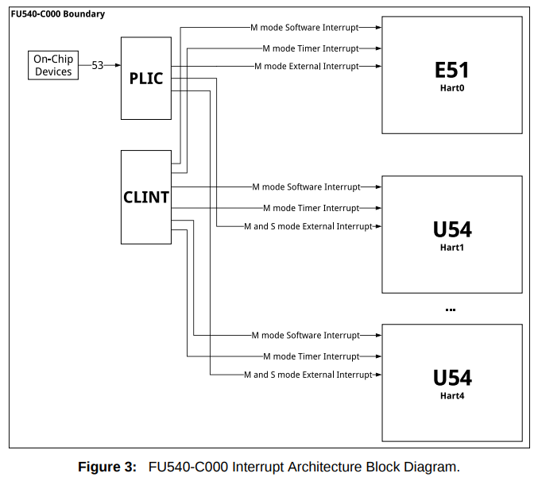

`xv6` 中有以下三种模式

- **`U-Mode`**，`user mode` 用户模式
- **`S-Mode`**，`supervisor mode` 监管者模式
- **`M-Mode`**，`machine mode` 机器模式

### 1. RISC-V trap machinery

`RISC-V CPU` 有一系列的控制寄存器可以通知 `kernel` 发生了 `trap`，也可以由 `kernel` 写入来告诉 `CPU` 怎样处理 `trap`

| 寄存器     | 描述                                                         |
| ---------- | ------------------------------------------------------------ |
| `STVEC`    | `trap handler` 的地址，由 `kernel` 写入                      |
| `SEPC`     | 保存 `trap` 发生时的现场 `program counter`，因为接下来 `pc` 要被取代为 `stvec`。`sret` 是从 `trap` 回到现场的指令，将 `sepc` 写回到 `pc` |
| `SCAUSE`   | 一个 `trap` 产生的原因代码，由 `CPU` 写入                    |
| `SSCRATCH` | 放在 `trap handler` 的最开始处                               |
| `SSTATUS`  | 控制设备中断是否被开启，如果 `sstatus` 中的 `SIE` 位被清除，则 `RISC-V` 将推迟设备中断。 `SPP` 位指示这个 `trap` 是在 `user space` 中产生的还是在 `kernel space` 产生的，并将控制 `sret` 回到什么模式 |

以上寄存器只在 `supervisor` 模式下发生的 `trap` 被使用

当发生除了计时器中断以外的其他类型的 `trap` 时，`RISC-V` 将执行以下步骤：

- 如果 `trap` 是一个设备产生的中断，而 `SIE` 又被清除的情况下，不做下方的任何动作
- 清除 `SIE` 来 `disable` 一切中断
- 把 `pc` 复制到 `sepc`
- 把当前的模式 (`user / supervisor`) 保存到 `SPP`
- 设置 `scause` 寄存器来指示产生 `trap` 的原因
- 将当前的模式设置为 `supervisor`
- 将 `stvec` 的值复制到 `pc`
- 开始执行 `pc` 指向的 `trap handler` 的代码

注意 `CPU` 并没有切换到 `kernel` 页表，也没有切换到 `kernel` 栈

#### 1.1 SSCRATCH 寄存器

`sscratch` 寄存器的设计是 `RISC-V` 中一个非常巧妙的机制，这个寄存器中存放着一个 (虚拟) 地址。当在执行用户代码时，这个地址指向的是一块保存当前程序上下文 (其实就是寄存器组内容，`context`) 的一块内存区域，在 `xv6` 中这块地址叫做 `trapframe` (陷阱帧)

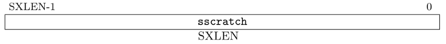

当执行陷阱的时候，`PC` 会被设置为 `stvec` 寄存器的值，进而陷入一段过渡程序，在这段程序的开头就会将 `sscratch` 寄存器和 `a0` 寄存器进行交换，这一方面将 `a0` 的值保存在了 `sscratch` 寄存器中，同时 `a0` 指向了 `trapframe` 的开始地址，这样进而就可以通过 `a0` 寄存器寻址将所有寄存器的值保存在 `trapframe` 里

```assembly
# trampoline.S
.globl uservec
uservec:         
		# swap a0 and sscratch
        # so that a0 is TRAPFRAME
        csrrw a0, sscratch, a0
		
		...
        jr t0
```

#### 1.2 SEPC 寄存器

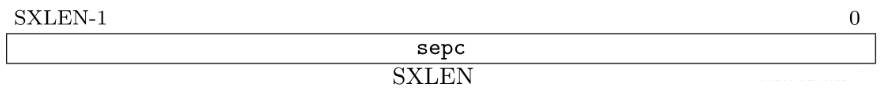

`sepc` 寄存器，一言以蔽之就是记录陷阱陷入到 `S-Mode` 时发生陷阱的指令的虚拟地址，它在执行陷阱时会记录下被中断的指令的虚拟地址，除了刚才说的陷阱场景之外，硬件不会主动改变 `sepc` 的值。但是 `spec` 寄存器可以被指令写入，我们曾经在分析 `xv6` 系统调用的过程中注意到，内核会将返回地址 +4 并赋给 `sepc`，这表明系统调用会返回 `ecall` 的下一条指令继续执行。

#### 1.3 SCAUSE 寄存器

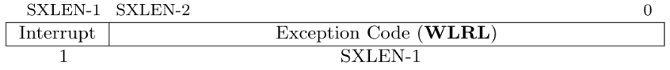

`scause` 寄存器在执行陷阱时由硬件自动记录下导致本次陷阱的原因，其中 `interrupt` 位表示本次陷阱的原因是否为中断 (我们上面说过，陷阱是动作，而中断和异常是导致陷阱的原因)。而 `Exception Code` 则表示细分的原因，对应关系如下表，可以看到 `scause` 还是有很多可扩展的异常号没有被使用的：

<div align="center">
    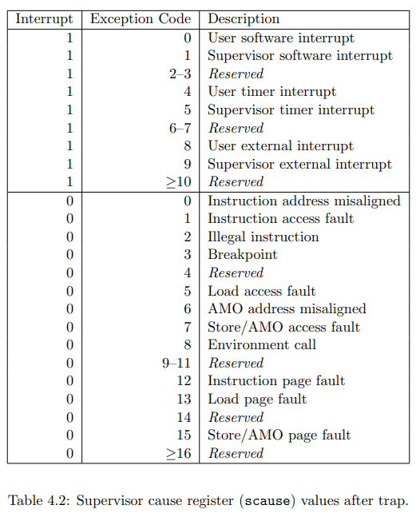
</div>

在 `xv6` 内核的具体实现中，我们会根据 `scause` 中记录的异常号实现对陷阱“分门别类”的处理。和 `sepc` 一样， `scause` 也支持使用指令写入，但是一般不这么做。

#### 1.4 STVAL 寄存器

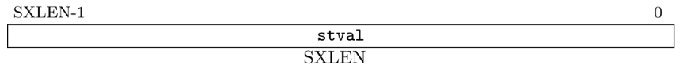

`stval` 寄存器的全称是 `Supervisor Trap Value Register`，这个寄存器专门用来存放与陷阱有关的其他信息，目的是帮助操作系统或其他软件更快确定和完成陷阱的处理。手册上相关的叙述显得有些晦涩，这里简单地做一个总结：

首先，`stval` 寄存器中存储的值可以是零值或者是非零值，对于大部分未经硬件平台定义的陷阱情况而言，`stval` 并不会存储与这些陷阱有关的信息，这时候 `stval` 就会存储零，本质上 `stval` 没有存储什么有效信息。存储非零值的情况又分为两种，一种是因为内存访问非法，一种则是因为指令本身非法，下面详细说说：

- **内存访问非法：**这种情况包括硬件断点 (`Hardware Breakpoints`)、地址未对齐 (`address misaligned`)、访问故障 (`access-fault`，可能是没有权限等)、缺页故障 (`page-fault`) 等情况。当这种情况发生时，`stval` 会存储出错位置的虚拟地址。比如缺页故障发生时，`stval` 就会记录到底是对哪个虚拟地址的访问导致了本次缺页故障，内核就可以根据此信息去加载页面进入内存

- **指令执行非法 (`illegal instruction`, 异常号为 2)：**当执行的指令非法时，`stval` 会将这条指令的一部分位记录下来

#### 1.5 STVEC 寄存器

`stvec` 寄存器的全称是 `supervisor trap vector base address register` (S 态陷阱向量基址寄存器，`stvec`)，它的示意图如下：

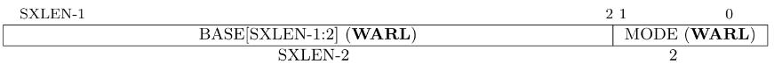

可以看到 `stvec` 寄存器分为两个域，分别是 `BASE` 域和 `MODE` 域，下面我们再分别来仔细研究一下这两个域

**MODE 域**

在 `RISC-V` 标准的定义中，`MODE` 域可能的取值有如下三种：

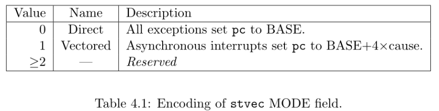

可以看到，`MODE` 域的取值影响了发生陷阱时要跳转到的地址。之前我们为了描述的方便，一般简单地说 `stvec` 中存放着中断处理程序的地址，发生陷阱时会直接跳转到。但其实 `stvec` 寄存器中不仅仅是中断处理程序的地址，还存放着 `MODE` 域的值。

当 `BASE` 域为 0 时，所有的陷阱全部跳转到 `BASE` 地址指向的程序入口

当 `BASE` 域为 1 时，同步中断 (指因为指令而引起的异常) 还是会跳转到 `BASE` 地址处，而非同步中断 (指由外部信号引起的中断) 则会跳转到 `BASE + 4 * cause` 的地方，这里手册上举了一个例子：如果我们将 `MODE` 设置为 `Vectored` 状态，同时触发了一个 `S-Mode` 定时器中断 (中断号为 5)，则程序会跳转到 `BASE + 4 * 5 = BASE + 0x14` 的位置

**BASE 域**

`BASE` 域存放着一个基地址，在 `Direct` 模式或者是 `Vectored` 模式下的同步陷阱情况下，它都指向中断处理程序的地址 (这里的地址可以是虚拟地址，也可以是物理地址，当然在 `xv6` 的语境下绝大部分都指的是虚拟地址)。

在 `Vectored` 模式的非同步陷阱的情况下，比如由外部中断引起的陷阱时，它是中断服务程序的基址，加上一个特定偏移量之后才可以对应到对应的中断处理程序。

另外，`BASE` 域有额外的限制因素，它必须是 4 字节对齐的 (`4-byte aligned`)。所以其实我们可以看到在 `xv6` 的代码实现中，无论是在 `trampoline.S` 还是 `kernelvec.S` 的汇编代码实现中，在代码的头部总有：
```assembly
.align 4
```

这就是为了让代码文件按照 4 字节对齐，从而满足了 `stvec` 寄存器的写入需求

#### 1.6 SIP 和 SIE 寄存器

`sip` 与 `sie` 这两个寄存器与中断的处理密切相关，在手册对应的部分不仅有关于这两个寄存器的说明。而且还有大量有关中断机制的细节描述，接下来的各个小段都是从 `RISC-V` 标准中阅读得到的总结，在此做一个详细记录。

`sip` 与 `sie` 都是处理器与中断有关的寄存器，它们合称 (`Supervisor Interrupt Registers，S-Mode` 中断寄存器)，`sip` 专门用来记载挂起的中断位，`sie` 专门用来记载使能的中断位，它们的示意图如下：

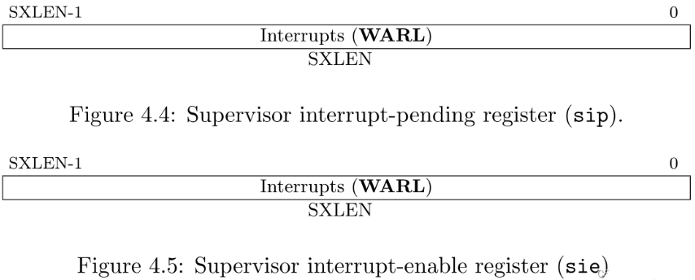

在 `RISCV-64` 标准中，这两个寄存器都是 64 位大小的。 标准中断只占据了这两个寄存器的低 16 位 (15:0)，更高的位都被保存下来以作为扩展用途。和 `medeleg` 和 `mideleg` 寄存器的用法差不多，**将中断号对应的位在这两个寄存器中置位** 即可，如下图所示：

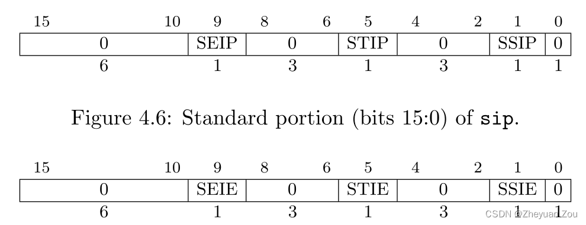

如果我们想触发一个 `S-Mode` 下的软件中断，因为它的异常编号是 1(见上表)，则只需要在 `sip` 中将第 1 位设置为 1 即可，`sie` 寄存器的使用方法也是一样的，它表示的是对应编号的中断是否使能。

> **详细内容见 [RISC-V 架构中的异常与中断详解](https://blog.csdn.net/zzy980511/article/details/130642258)**

### 2. Traps from user space

当 `user space` 中发生 `trap` 时，会将 `stvec` 的值复制到 `pc`，而此时 `stvec` 的值是 `trampoline.S` 中的 `uservec`，因此跳转到 `uservec`，先保存一些现场的寄存器，恢复 `kernel` 栈指针、`kernel page table` 到 `satp` 寄存器，再跳转到 `usertrap (kernel/trap.c) trap handler`，然后返回 `usertrapret (kernel/trap.c)`，跳回到 `kernel/trampoline.S`，最后用 `userret (kernel/trampoline.S)` 通过 `sret` 跳回到 `user space`

`RISC-V` 在 `trap` 中不会改变页表，因此 `user page table` 必须有对 `uservec` 的 `mapping`，`uservec` 是 `stvec` 指向的 `trap vector instruction`。`uservec` 要切换 `satp` 到 `kernel` 页表，同时 `kernel` 页表中也要有和 `user` 页表中对 `uservec` 相同的映射。`RISC-V` 将 `uservec` 保存在 `trampoline` 页中，并将 `TRAMPOLINE` 放在 `kernel` 页表和 `user` 页表的相同位置处（`MAXVA`）

> **kernel page table**
>
> - 在 `kernel/main.c` 中调用 `kvminit()`，将虚拟地址 `TRAMPOLINE` 映射到 物理地址(`(uint64)trampoline`)
>
> - `kernel page table` 的 `satp` 寄存器是在 `kvminithart()` 方法中设置的，具体调用链：
>
>   ```c++
>   main.c (kernel/main.c)
>         |
>         v
>   kvminithart (kernel/vm.c)
>         |
>         v
>   w_satp(MAKE_SATP(kernel_pagetable))
>   ```
>
> **user page table**
>
> - 在 `kernel/main.c` 中调用 `userinit()`，然后调用 `alloproc()`，然后调用 `proc_pagetable()`，将虚拟地址 `TRAMPOLINE` 映射到 物理地址(`(uint64)trampoline`)
>
> - `user page table` 的 `satp` 寄存器是在 `usertrapret()` 设置的，具体调用链：
>
>   ```c++
>   main.c (kernel/main.c)
>   	   |
>          v
>   alloproc (kernel/proc.c)
>   	   |  设置 p->context.ra = (uint64)forkret
>          v
>   forkret (kernel/proc.c)
>   	   |
>   	   v
>   usertrapret (kernel/trap.c)
>          |
>          v
>   uint64 satp = MAKE_SATP(p->pagetable)
>   ```
>
> 通过查看 `mappages()` 方法：
>
> ```c++
> int mappages(pagetable_t pagetable, uint64 va, uint64 size, uint64 pa, int perm) {
>   ...
>   for(;;){
>     if((pte = walk(pagetable, a, 1)) == 0)
>       return -1;
>     ...
>     *pte = PA2PTE(pa) | perm | PTE_V;	// pte 指向的地址的前8个字节存储了物理地址
>     ...
>   }
>   return 0;
> }
> ```
>
> 可以看出来对于**不同页表**，**相同的 虚拟地址 -> 物理地址 的映射**，通过同一个虚拟地址得到的物理地址**必然是相同的**

当 `uservec` 开始时所有的 32 个寄存器都是 `trap` 前代码的值，但是 `uservec` 需要对某些寄存器进行修改来设置 `satp`，可以用 `sscratch` 和 `a0` 的值进行交换，交换之前的 `sscratch` 中是指向 `user process` 的 `trapframe` 的地址，`trapframe` 中预留了保存所有 32 个寄存器的空间。`p->trapframe` 保存了每个进程的 `TRAPFRAME` 的物理空间从而让 `kernel` 页表也可以访问该进程的 `trapframe`

当交换完 `a0` 和 `sscratch` 之后，`uservec` 可以通过 `a0` 把所有当前寄存器的值保存到 `trapframe` 中。由于当前进程的 `trapframe` 已经保存了当前进程的 `kernel stack`、当前 `CPU` 的 `hartid`、`usertrap` 的地址、`kernel page table` 的地址等，`uservec` 需要获取这些值，然后切换到 `kernel pagetable`，调用 `usertrap`

`usertrap` 主要是判断 `trap` 产生的原因并进行处理，然后返回。因为当前已经在 `kernel` 里了，所以这时候如果再发生 `trap`，应该交给 `kernelvec` 处理，因此要把 `stvec` 切换为 `kernelvec`。如果 `trap` 是一个 `system call`，那么 `syscall` 将被调用，如果是设备中断，调用 `devintr`，否则就是一个 `exception`，`kernel` 将杀死这个出现错误的进程

回到 `user space` 的第一步是调用 `usertrapret()`，这个函数将把 `stvec` 指向 `uservec`，从而当回到 `user space` 再出现 `trap` 的时候可以跳转到 `uservec`，同时设置 `p->trapframe` 的一些值为下一次 `trap` 作准备，比如设置 `p->trapframe->kernel_sp = p->kstack + PGSIZE`。清除 `SPP` 为从而使得调用 `sret` 后能够回到 `user mode`。设置回到 `user space` 后的 `program counter` 为 `p->trapframe->epc`，最后调用跳转到 `TRAMPOLINE` 页上的 `userret` 回到 `trampoline.S`，加载 `user page table`。`userret` 被 `userrapret` 调用返回时 `a0` 寄存器中保存了`TRAPFRAME`，因此可以通过这个 `TRAPFRAME` 地址来恢复之前所有寄存器的值(包括 `a0`)，最后把 `TRAPFRAME` 保存在 `sscratch` 中，用 `sret` 回到 `user space`

### 3. Calling system calls

`user` 调用 `exec` 执行 `system call` 的过程：把给 `exec` 使用的参数放到 `a0` 和 `a1` 寄存器中，把 `system call` 的代码 (`SYS_exec`) 放到 `a7` 寄存器中，`ecall` 指令将陷入内核中（通过 `usys.pl` 中的 `entry`)。`ecall`的效果有三个，包括将 `CPU` 从 `user mode` 切换到 `supervisor mode`、将 `pc` 保存到 `epc` 以供后续恢复、将 `uservec` 设置为 `stvec`，并执行 `uservec`、`usertrap`，然后执行 `syscall`。`kernel trap code` 将把寄存器的值保存在当前进程的 `trapframe` 中。`syscall` 将把 `trapframe` 中的 `a7` 寄存器保存的值提取出来，索引到 `syscalls` 这个函数数列中查找对应的 `syscall` 种类，并进行调用，然后把返回值放置在 `p->trapframe->a0` 中，如果执行失败，就返回 -1。

`syscall` 的 `argument` 可以用 `argint`、`argaddr`、`argfd` 等函数从内存中取出

### 4. Traps from kernel space

当执行 `kernel code` 发生 `CPU trap` 的时候，`stvec` 是指向 `kernelvec` 的汇编代码的。`kernelvec` 将寄存器的值保存在被中断的 `kernel thread` 的栈里而不是 `trapframe` 里，这样当 `trap` 需要切换 `kernel thread` 时，再切回来之后还可以从原先的 `thread` 栈里找到之前的寄存器值。

保存完寄存器之后，跳转到 `kerneltrap` 这个 `trap handler`。`kerneltrap` 可以对设备中断和 `exception` 这两种 `trap` 进行处理。如果是设备中断，调用 `devintr` 进行处理，如果是 `exception` 就 `panic`，如果是因为计时器中断，就调用 `yield` 让其他 `kernel thread` 运行

最后返回到 `kernelvec` 中，`kernelvec` 将保存的寄存器值从堆栈中弹出，执行 `sret`，将 `sepc` 复制到 `pc` 来执行之前被打断的 `kernel code`

### 5. Q&A

**学生提问：**当我们在汇编代码中执行 `ecall` 指令，是什么触发了 `trampoline` 代码的执行，是 `CPU` 中的从 `user` 到 `supervisor` 的标志位切换吗？

**Robert教授：**在我们的例子中，`Shell` 在用户空间执行了 `ecall` 指令。`ecall`会完成几件事情：

1. `ecall` 指令会设置当前为 `supervisor mode`
2. 保存程序计数器到 `SEPC` 寄存器，并且将程序计数器设置成控制寄存器 `STVEC` 的内容。`STVEC` 是内核在进入到用户空间之前设置好的众多数据之一，内核会将其设置成 `trampoline page` 的起始位置所以，当 `ecall` 指令执行时，`ecall` 会将 `STVEC` 拷贝到程序计数器。
3. 之后程序继续执行，但是却会在当前程序计数器所指的地址，也就是 `trampoline page` 的起始地址执行。

---

**学生提问：**寄存器保存在了 `trapframe page`，但是这些寄存器用户程序也能访问，为什么我们要使用内存中一个新的区域（指的是 `trapframe page`），而不是使用程序的栈？

**Robert教授：**好的，这里或许有两个问题。第一个是，为什么我们要保存寄存器？为什么内核要保存寄存器的原因，是因为内核即将要运行会覆盖这些寄存器的 `C` 代码。如果我们想正确的恢复用户程序，我们需要将这些寄存器恢复成它们在 `ecall` 调用之前的数值，所以我们需要将所有的寄存器都保存在 `trapframe` 中，这样才能在之后恢复寄存器的值。

另一个问题是，为什么这些寄存器保存在 `trapframe`，而不是用户代码的栈中？这个问题的答案是，我们不确定用户程序是否有栈，必然有一些编程语言没有栈，对于这些编程语言的程序，`Stack Pointer` 不指向任何地址。当然，也有一些编程语言有栈，但是或许它的格式很奇怪，内核并不能理解。比如，编程语言以堆中以小块来分配栈，编程语言的运行时知道如何使用这些小块的内存来作为栈，但是内核并不知道。所以，如果我们想要运行任意编程语言实现的用户程序，内核就不能假设用户内存的哪部分可以访问，哪部分有效，哪部分存在。所以内核需要自己管理这些寄存器的保存，这就是为什么内核将这些内容保存在属于内核内存的 `trapframe` 中，而不是用户内存。

### 6. 具体细节

#### 6.1 trap functions

`trap` 的执行流程中可以分为以下几类：

- `ECALL `指令之前的状态
- `ECALL` 指令之后的状态
- `uservec` 函数
- `usertrap` 函数
- `usertrapret` 函数
- `userret` 函数

**各个函数的调用关系**

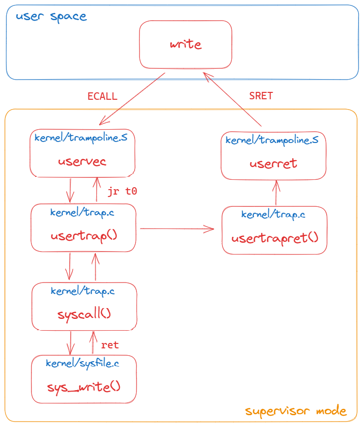

#### 6.2 ECALL and SRET

**EACALL**

**当我们通过 ECALL 走到 trampoline page 时，ECALL 实际只会改变三件事情：**

- `ECALL` 将代码从 `user mode` 改到 `supervisor mode`

- **`ECALL` 会跳转到 `STVEC` 寄存器指向的地址 (`STVEC` 指向的是   `trap handler` 的地址) **

- **)**

- `ECALL` 将程序计数器的值（`$pc`）保存在了 `SPEC` 寄存器，我们可以通过打印程序计数器看到这里的效果

  - 在执行 `ECALL` 之前程序计数器（`pc`） 的值是 `0xdfc`

    ```shell
    (gdb) p $pc
    $1 = (void (*)()) 0xdfc
    
    # 执行 ECALL
    (gdb) stepi
    0x0000003ffffff000 in ?? ()
    => 0x0000003ffffff000:  73 15 05 14     csrrw   a0,sscratch,a0
    
    (gdb) p $pc
    $1 = (void (*)()) 0x3ffffff000
    
    (gdb) x/6i 0x3ffffff000  
    => 0x3ffffff000:        csrrw   a0,sscratch,a0
       0x3ffffff004:        sd      ra,40(a0)
       0x3ffffff008:        sd      sp,48(a0)
       0x3ffffff00c:        sd      gp,56(a0)
       0x3ffffff010:        sd      tp,64(a0)
       0x3ffffff014:        sd      t0,72(a0)
       
    (gdb) p/x $stvec
    $2 = 0x3ffffff000
    ```

  - 尽管其他的寄存器还是还是用户寄存器，但是这里的程序计数器明显已经不是用户代码的程序计数器。这里的程序计数器是从 `STVEC` 寄存器拷贝过来的值。我们也可以打印 `SEPC（Supervisor Exception Program Counter）`寄存器，这是 `ECALL` 保存用户程序计数器的地方

    ```shell
    (gdb) p/x $sepc
    $3 = 0xdfc
    ```

  - 这个寄存器里面有熟悉的地址 `0xdfc`，这是 `ECALL` 指令在用户空间的地址。所以 `ECALL` 至少保存了程序计数器（`pc`）的值

**`ECALL` 帮我们做了一点点工作，但是实际上我们还需要自己做一些事情：**

- 需要保存 32 个用户寄存器的内容，这样当我们想要恢复用户代码执行时，我们需要先恢复这些寄存器的内容
- 需要从 `user page table` 转变为 `kernel page table`
- 需要创建或找到一个 `kernel stack`，并将 `Stack pointer(sp)` 寄存器的内容指向那个 `kernel stack`，这样才能给 `C` 代码提供栈

---

**SRET**

**当我们通过 SRET 返回到用户空间时，SRET 指令会做三件事情：**

- `SRET` 将代码从 `supervisor mode` 改到 `user mode`
- 重新打开中断

- `SEPC` 寄存器的值会被拷贝到 `PC` 寄存器
  - **`PC` 代表下一条指令执行的地址，所以之后会执行 `PC` 指向的代码**

---

#### 6.3 TRAMPOLINE and TRAPFRAME

> ```c++
> 			虚拟地址								物理地址
> TRAMPOLINE: 0x0000003ffffff000	--->	trampoline: 0x0000000080007000
> TRAPFRAME： 0x0000003fffffe000	--->	p->trapframe: 0x0000000087f76000
> ```

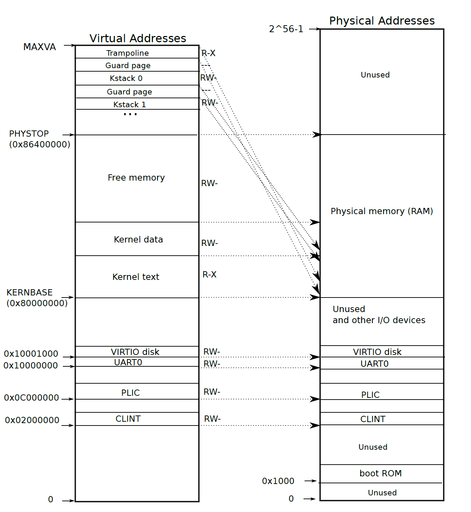

`kernel page table` 映射的相关代码在 `vm.c` 中的 `kvminit()`，然后通过 `vm.c` 中的 `kvminithart()` 将 `kernel page table` 赋值给 `SATP` 寄存器

通过 `kvmmap(TRAMPOLINE, (uint64)trampoline, PGSIZE, PTE_R | PTE_X)` 完成 **内核态** 的 `TRAMPOLINE` 映射

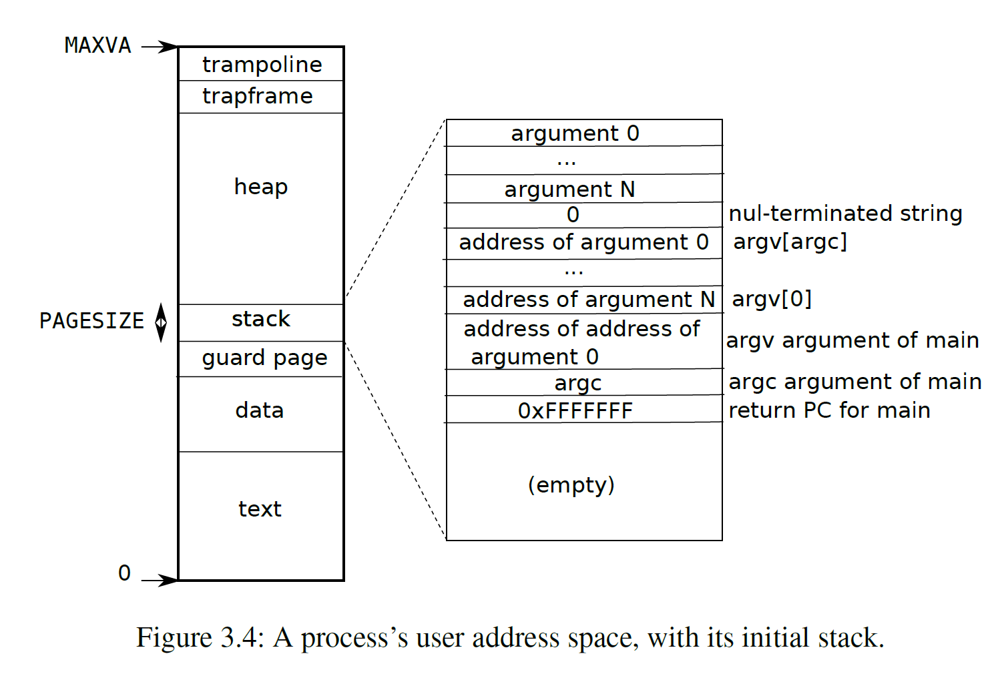

`user page table` 映射的相关代码在 `proc.c` 中的 `proc_pagetable()`。由于 `xv6` 启动时是出于 **内核态** 的，通过 `usertrapret()` 方法返回到 **用户态** 时会通过 `uint64 satp = MAKE_SATP(p->pagetable)` 获取 `user page table`，之后赋值给 `SATP` 寄存器

通过 `mappages(pagetable, TRAMPOLINE, PGSIZE, (uint64)trampoline, PTE_R | PTE_X)` 完成 **用户态** 的 `TRAMPOLINE` 映射

通过 `mappages(pagetable, TRAPFRAME, PGSIZE, (uint64)(p->trapframe), PTE_R | PTE_W)` 完成 **用户态** 的 `TRAPFRAME` 映射（**内核态不会映射 `TRAPFRAME`**）

**重点**

正因为 **用户态** 按照上面的规则对 `TRAMPOLINE` 和 `TRAPFRAME` 进行映射，当 **内核态** 想要返回通过 `userret` 返回内核态时，调用 `((void (*)(uint64,uint64))fn)(TRAPFRAME, satp)` 传入两个参数即可

- 对于第一个参数 `TRAPFRAME`，是一个虚拟地址
- 对于第二个参数 `satp` 指向的是 `user page table`

知道这两个参数，我们就可以通过 `satp` 拿到 `TRAPFRAME` 真实的物理地址，进而就可以拿到 **用户态** 下的 `struct trapframe`（里面存储了各个寄存器的信息）。所以 `userret` 得以正常执行，进而返回用户态

#### 6.4 trap process

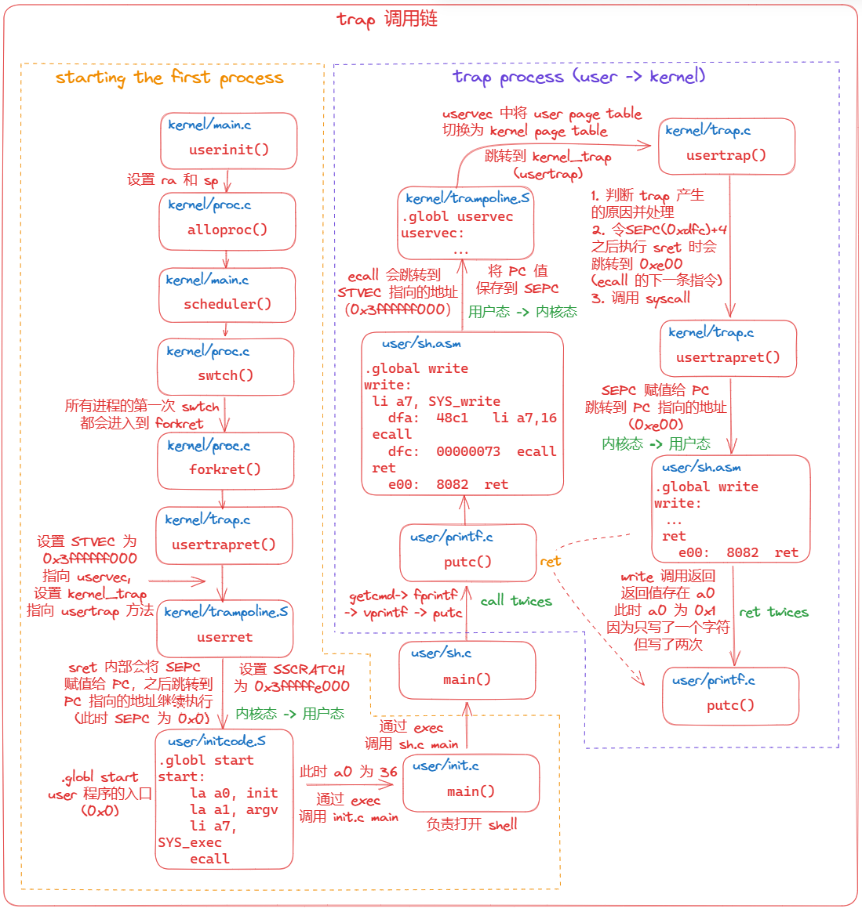

上图是 `trap process` 的大体过程，主要分为两部分 `starting first process` 和 `trap process`

**对于 `starting first process` 来说：**

- `starting first process` 是 `xv6` 的第一个用户进程，通过 `allocproc()` 创建，从内核态返回到用户态后会执行 `initcode.S / initcode.asm` 中的程序，最终会陷入 `sh.c` 中 `main` 方法的死循环，负责 `xv6` 的 `Shell` 功能，等待用户的输入然后处理
- **所有的进程第一次 `swtch()` 都会进入到 `forkret` 方法中，然后由 `userret` 从内核态返回到用户态**

- 在这个过程中有几个寄存器需要重点关注：`STVEC`、`SATP`、`SEPC`、`SSCRATCH`

  - **`STVEC`**，在 `usertrapret()` 方法中被设置为 `0x3ffffff000`，指向 `uservec` 方法

    - 当执行 `ECALL` 时，会跳转到 `STVEC` 指向的代码

  - **`SATP`**，指向的是 `kernel/user page table`

    - **执行 `make CPUS=1 qume` 后，按 `CTRL a + x` 然后输入 `info mem` 可以查看当前 `page table` 的详细情况**

  - **`SEPC`**，在 `userinit()` 方法中被清 0（即指向 `0x0`，也就是 `initcode.asm` 中的 `la a0, init` 语句）

    - 当从执行 `SRET` 从内核态返回到用户态时，`SRET` 内部会把 `SEPC` 赋值给 `PC`，然后继续执行 `PC` 指向的地址的代码

    ```assembly
    # initcode.S
    .globl start
    start:
            la a0, init
            la a1, argv
            li a7, SYS_exec
            ecall
            
    # initcode.asm (.asm 有更详细的信息，例如 地址)
    .globl start
    start:
            la a0, init
       0:	00000517          	auipc	a0,0x0		# 0x0
       4:	00050513          	mv	a0,a0			# 0x4
            la a1, argv
       8:	00000597          	auipc	a1,0x0		# ...
       c:	00058593          	mv	a1,a1
            li a7, SYS_exec
      10:	00700893          	li	a7,7
            ecall
      14:	00000073          	ecall
    
    0000000000000018 <exit>:
    ```

  - **`SSCRATCH`**，`usertrapret()` 方法的最后调用了 `userret` 并传入了两个参数 `TRAPFRAME` 和 `stap`，两者的值分别为 `0x0000003fffffe000` 和 `0x8000000000087f75`。 

    - `TRAPFRAME` 指向其实是 `proc.h` 中的 `struct trapframe` 结构体。同时 `TRAMPLINE 在 `user page table` 和 `kernel page table` 映射的位置（虚拟地址和物理地址都相同）是一样的。
    - 这里的 `satp` 是用户态的 `page table`（当前为内核态）

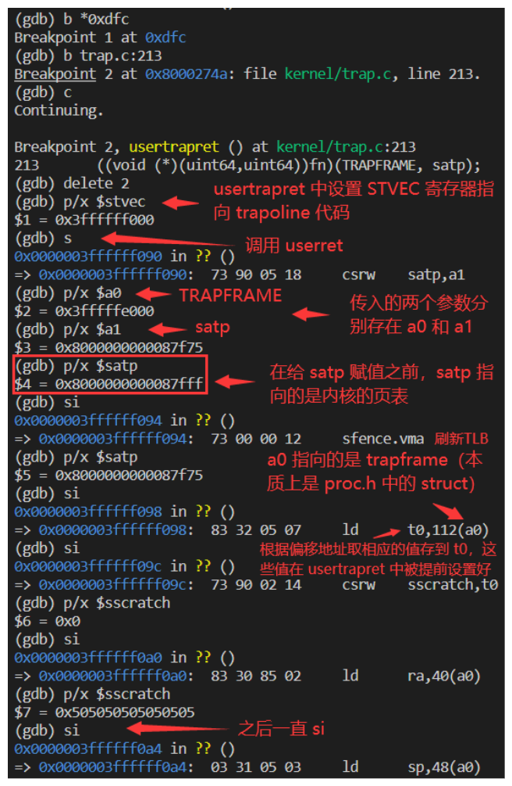

**对于 `trap process (user -> kernel)` 来说**

- 当我们进入 **内核态** 前，我们需要做一些相关的准备。
- 首先，保存 **用户态** 的各个寄存器到 `struct trapframe`，而此时 `SSCRATCH` 寄存器指向的就是 `struct trapframe` 的地址，相关代码在 `trampoline.S` 的 `uservec` 中（`sd` 指令）

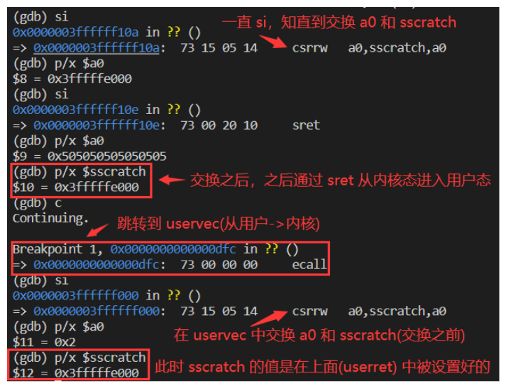

- 其次，更改 `SATP` 寄存器，让 `SATP` 寄存器指向 `kernel page table`，然后刷新 `TLB`，从 `trapframe->kernel_trap` 获取要跳转的地址（`usertrap`），然后跳转

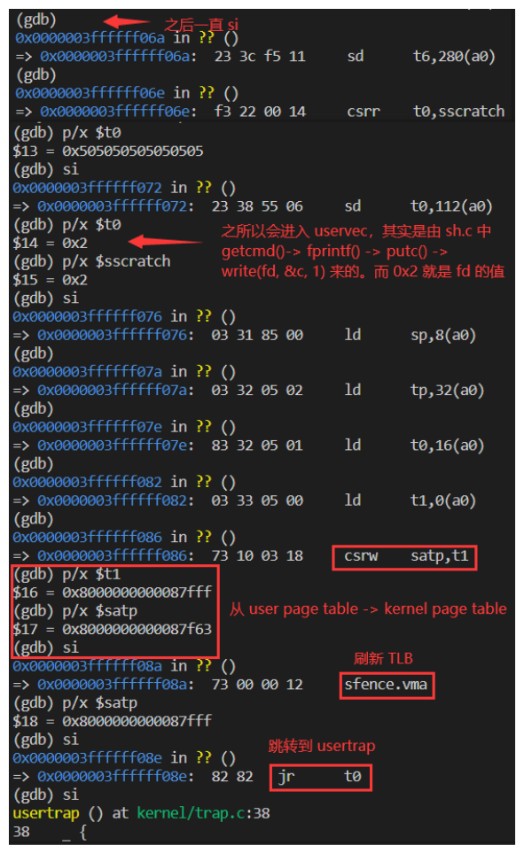

- 在 `sh.c` 的 `getcmd` 方法中调用了 `fprintf(2, "$ ")`，其背后调用了两次 `putc`，也就是调用了两次 `write(fd, &c, 1)`，所以会触发两次 `trap`
  - **`write(fd, &c, 1)` 中 `fd、&c、1` 分别对应了 `a0、a1、a2` 寄存器（这里的 `fd` 为 2）**

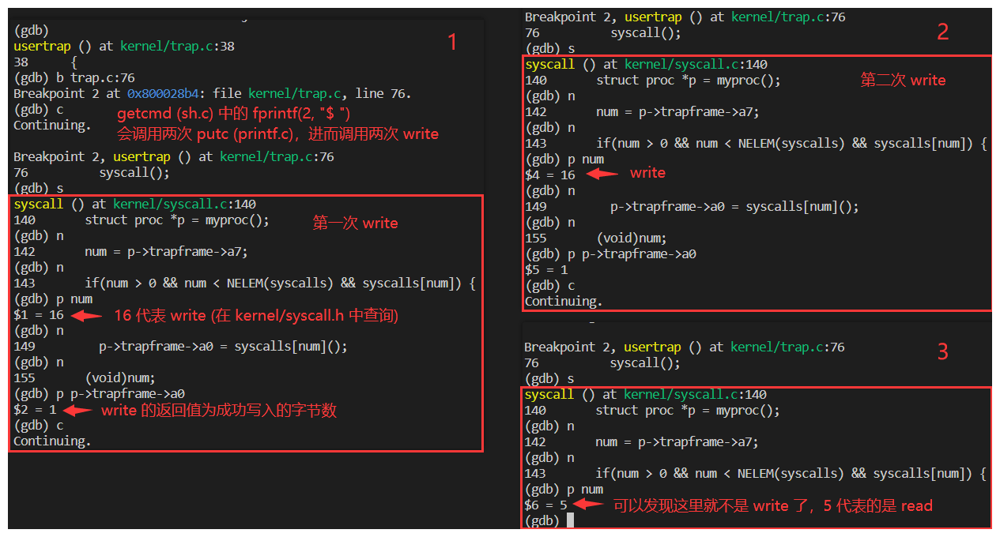

### 7. Lab1: RISC-V assembly

`answers-traps.txt`

```c++
1. a0-a7
2. a2
3. compiler optimized to store the return value of f as instant number
4. 0x616
5. 0x38
6. HE110 World   如果是大端，i 应为 0x726c6400   不需要修改 57616
7. a random number 
```

### 8. Lab2: Backtrace

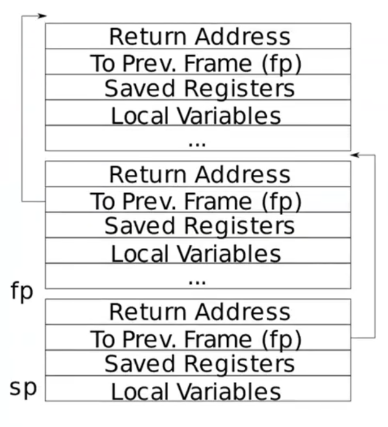

通过 `r_fp()` 可以获得当前执行函数的帧指针，也就是上图中 `fp`，而不是 `To Prev.Frame(fp)`

- 而 **返回地址 (Return Address)** 位于距 **堆栈帧的帧指针 (`fp`)** 的固定偏移量 (-8) 处

- **保存的帧指针 (To Prev.Frame (fp))** 位于 **堆栈帧的帧指针 (`fp`)** 的固定便宜量 (-16) 处

在 `defs.h` 中添加 `backtrace()` 的声明

```diff
void            printfinit(void);
+ void            backtrace(void);
```

在 `riscv.h` 中开头添加 `r_fp()` 方法

```diff
+ static inline uint64
+ r_fp()
+ {
+   uint64 x;
+   asm volatile("mv %0, s0" : "=r" (x) );
+   return x;
+ }
```

在 `sys_sleep()` 中添加对 `backtrace()` 的调用

```diff
  ticks0 = ticks;
+ backtrace();
```

在 `panic()` 添加对 `backtrace()` 的调用

```diff
  panicked = 1; // freeze uart output from other CPUs
+ backtrace();
```

在 `printf.c` 末尾添加 `backtrace()` 的实现

```diff
+ void
+ backtrace(void)
+ {
+   uint64 fp = r_fp();
+	// 获取栈底和栈顶
+   uint64 bottom = PGROUNDUP(fp);
+   uint64 top = PGROUNDDOWN(fp);
+   uint64 *ra = 0;
+ 
+   printf("backtrace:\n");
+ 
+   while(fp < bottom && fp > top) {
+     ra = (uint64 *)(fp - 8);
+     fp = *((uint64 *)(fp - 16));
+     printf("%p\n", *ra);
+   }
+ 
+   return ;
+ }
```

### 9. Lab3: Alarm

向 `xv6` 添加一项功能，该功能会在进程使用 `CPU` 时间时定期发出警报。 这对于想要限制其消耗的 `CPU` 时间的计算密集型进程，或者想要计算但也想要执行一些定期操作的进程可能很有用。 更一般地说，您将实现用户级中断/故障处理程序的原始形式

主要就是添加两个新的系统调用 `int sigalarm(ticks, handler)` 和 `int sigreturn(void)`，当用户程序调用 `sigalarm(ticks, handler)` 时记录下 `ticks`，每当定时器发出 `ticks` 次中断时，调用 `handler` 这个方法

首先在 `struct proc` 中添加几个新字段：`ticks、handler` 用于接收 `sigalarm` 传入的参数，`in_handler` 表示当前是否在调用 `handler` 函数，`interval` 表示当前触发了多少次定时器中断。同时参考 `struct trapframe` 结构体中的字段，我们在调用 `handler` 时需要保存当前的寄存器状态，主要是要保存 `caller` 寄存器

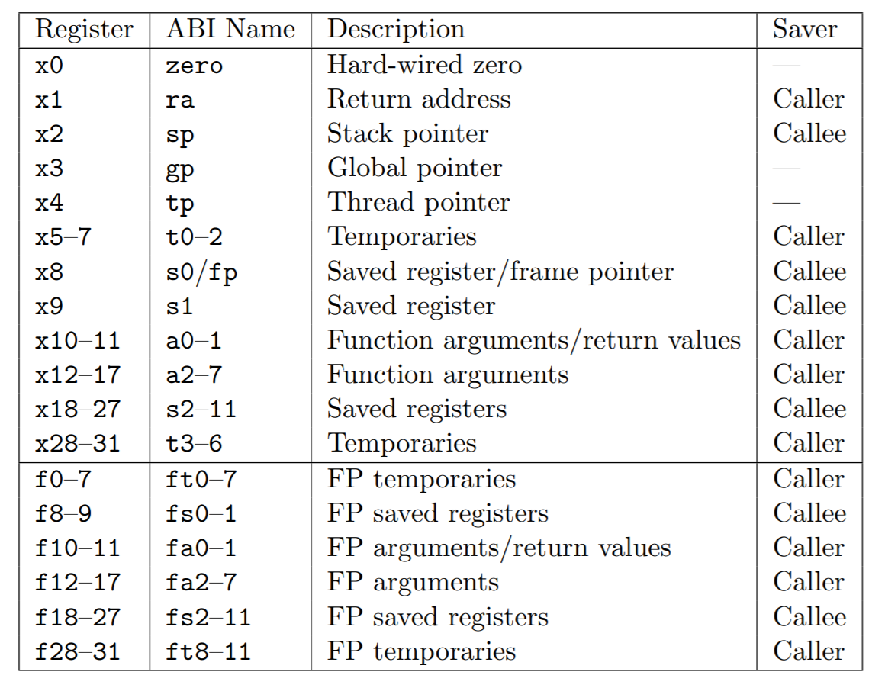

在 `kernel/proc.h` 的 `struct proc` 中添加

```diff
  char name[16];               // Process name (debugging)
  
+ int ticks;
+ int interval;
+ void (*handler)();
+ int in_handler;
+ uint64 saved_epc;    // saved user program counter
+ uint64 saved_ra;
+ uint64 saved_sp;
+ uint64 saved_gp;
+ uint64 saved_tp;
+ uint64 saved_t0;
+ uint64 saved_t1;
+ uint64 saved_t2;
+ uint64 saved_s0;
+ uint64 saved_s1;
+ uint64 saved_a0;
+ uint64 saved_a1;
+ uint64 saved_a2;
+ uint64 saved_a3;
+ uint64 saved_a4;
+ uint64 saved_a5;
+ uint64 saved_a6;
+ uint64 saved_a7;
+ uint64 saved_s2;
+ uint64 saved_s3;
+ uint64 saved_s4;
+ uint64 saved_s5;
+ uint64 saved_s6;
+ uint64 saved_s7;
+ uint64 saved_s8;
+ uint64 saved_s9;
+ uint64 saved_s10;
+ uint64 saved_s11;
+ uint64 saved_t3;
+ uint64 saved_t4;
+ uint64 saved_t5;
+ uint64 saved_t6;
};
```

 在 `kernel/syscall.c` 中添加两个新的系统调用

```diff
extern uint64 sys_uptime(void);
+ extern uint64 sys_sigalarm(void);
+ extern uint64 sys_sigreturn(void);
```

```diff
[SYS_close]   sys_close,
+ [SYS_sigalarm]   sys_sigalarm,
+ [SYS_sigreturn]  sys_sigreturn,
};
```

在 `kernel/syscall.h` 添加相关内容

```diff
#define SYS_close  21
+ #define SYS_sigalarm  22
+ #define SYS_sigreturn 23
```

在 `user/user.h` 添加系统调用声明

```diff
int uptime(void);
+ int sigalarm(int ticks, void (*handler)());
+ int sigreturn(void);
```

在 `user/usys.pl` 注册新的系统调用

```diff
entry("uptime");
+ entry("sigalarm");
+ entry("sigreturn");
```

在 `Makefile` 添加 `alarmtest`

```diff
	$U/_zombie\
+	$U/_alarmtest\
```

在 `allocproc()` 中添加对 `struct proc` 新增字段的初始化

```diff
    return 0;
  }

+ p->interval = 0;
+ p->ticks = 0;
+ p->handler = 0;
+ p->in_handler = 0;
```

在 `trap.c` 中的 `usertrap()` 中识别来自定时器的中断，达到 `ticks` 次后调用对应的 `handler`

```diff
} else if((which_dev = devintr()) != 0){
    // ok
+   if(which_dev == 2 && p->in_handler == 0) {
+     p->interval++;
+     if(p->interval == p->ticks && p->ticks != 0) {
+       p->interval = 0;
+       p->in_handler = 1;
+       p->saved_epc = p->trapframe->epc;
+       p->trapframe->epc = (uint64)p->handler;
+       p->saved_ra = p->trapframe->ra;
+       p->saved_sp = p->trapframe->sp;
+       p->saved_gp = p->trapframe->gp;
+       p->saved_tp = p->trapframe->tp;
+       p->saved_t0 = p->trapframe->t0;
+       p->saved_t1 = p->trapframe->t1;
+       p->saved_t2 = p->trapframe->t2;
+       p->saved_s0 = p->trapframe->s0;
+       p->saved_s1 = p->trapframe->s1;
+       p->saved_a0 = p->trapframe->a0;
+       p->saved_a1 = p->trapframe->a1;
+       p->saved_a2 = p->trapframe->a2;
+       p->saved_a3 = p->trapframe->a3;
+       p->saved_a4 = p->trapframe->a4;
+       p->saved_a5 = p->trapframe->a5;
+       p->saved_a6 = p->trapframe->a6;
+       p->saved_a7 = p->trapframe->a7;
+       p->saved_s2 = p->trapframe->s2;
+       p->saved_s3 = p->trapframe->s3;
+       p->saved_s4 = p->trapframe->s4;
+       p->saved_s5 = p->trapframe->s5;
+       p->saved_s6 = p->trapframe->s6;
+       p->saved_s7 = p->trapframe->s7;
+       p->saved_s8 = p->trapframe->s8;
+       p->saved_s9 = p->trapframe->s9;
+       p->saved_s10 = p->trapframe->s10;
+       p->saved_s11 = p->trapframe->s11;
+       p->saved_t3 = p->trapframe->t3;
+       p->saved_t4 = p->trapframe->t4;
+       p->saved_t5 = p->trapframe->t5;
+       p->saved_t6 = p->trapframe->t6;
+     }
+   }
  } else {
```

在 `kernel/sysfile.c` 末尾实现 `sys_sigalarm` 和 `sys_sigreturn` 系统调用

```diff
+ uint64
+ sys_sigalarm(void)
+ {
+   int ticks;
+   uint64 handler;
+ 
+   if((argint(0, &ticks) < 0) || (argaddr(1, &handler) < 0))
+     return -1;
+ 
+   struct proc *p = myproc();
+   p->ticks = ticks;
+   p->handler = (void(*)())handler;
+ 
+   return 0;
+ }
+ 
+ uint64
+ sys_sigreturn(void)
+ {
+   struct proc *p = myproc();
+   p->trapframe->epc = p->saved_epc;
+   p->trapframe->ra = p->saved_ra;
+   p->trapframe->sp = p->saved_sp;
+   p->trapframe->gp = p->saved_gp;
+   p->trapframe->tp = p->saved_tp;
+   p->trapframe->t0 = p->saved_t0;
+   p->trapframe->t1 = p->saved_t1;
+   p->trapframe->t2 = p->saved_t2;
+   p->trapframe->s0 = p->saved_s0;
+   p->trapframe->s1 = p->saved_s1;
+   p->trapframe->a0 = p->saved_a0;
+   p->trapframe->a1 = p->saved_a1;
+   p->trapframe->a2 = p->saved_a2;
+   p->trapframe->a3 = p->saved_a3;
+   p->trapframe->a4 = p->saved_a4;
+   p->trapframe->a5 = p->saved_a5;
+   p->trapframe->a6 = p->saved_a6;
+   p->trapframe->a7 = p->saved_a7;
+   p->trapframe->s2 = p->saved_s2;
+   p->trapframe->s3 = p->saved_s3;
+   p->trapframe->s4 = p->saved_s4;
+   p->trapframe->s5 = p->saved_s5;
+   p->trapframe->s6 = p->saved_s6;
+   p->trapframe->s7 = p->saved_s7;
+   p->trapframe->s8 = p->saved_s8;
+   p->trapframe->s9 = p->saved_s9;
+   p->trapframe->s10 = p->saved_s10;
+   p->trapframe->s11 = p->saved_s11;
+   p->trapframe->t3 = p->saved_t3;
+   p->trapframe->t4 = p->saved_t4;
+   p->trapframe->t5 = p->saved_t5;
+   p->trapframe->t6 = p->saved_t6;
+   p->in_handler = 0;
+ 
+   return 0;
+ }
```


