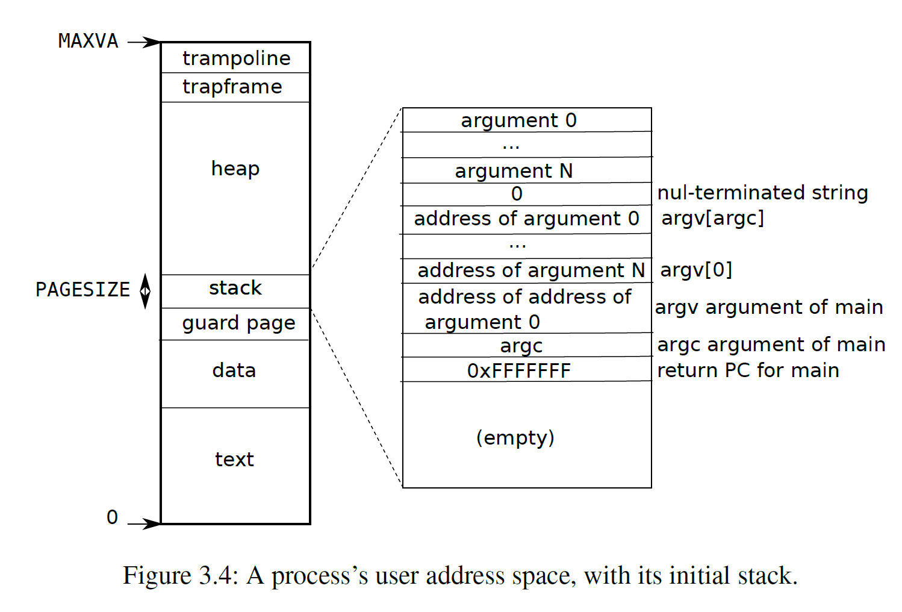

## lazy allocation

> 必读资料：
>
> - [Lec08 - 8.1 Page Fault Basics](https://mit-public-courses-cn-translatio.gitbook.io/mit6-s081/lec08-page-faults-frans/8.1-page-fault-basics)
> - [Lec08 - 8.2 Lazy page allocation](https://mit-public-courses-cn-translatio.gitbook.io/mit6-s081/lec08-page-faults-frans/8.2-lazy-page-allocation)
> - [Lec08 - 8.3 Zero Fill On Demand](https://mit-public-courses-cn-translatio.gitbook.io/mit6-s081/lec08-page-faults-frans/8.3-zero-fill-on-demand)
> - [Lecture Notes - Xiao Fan's Personal Page (fanxiao.tech)](https://fanxiao.tech/posts/2021-03-02-mit-6s081-notes/#61-lab-5-lazy-allocation)

### 1. Page Faults

当试图访问 `PTE_V` 为 0 的虚拟地址或 `user` 访问 `PTE_U` 为 0 或 `kernel` 访问 `PTE_U `为 1 以及其他违反 `PTE_W/PTE_R` 等 `flag` 的情况下会出现 `page faults`。`Page faults` 是一个 `exception` ，总共有 3 种 `page faults`：

- **`load page faults`**：当 `load instruction` 无法翻译虚拟地址时发生

- **`store page faults`**：当 `store instruction` 无法翻译虚拟地址时发生

- **`instruction page faults`**：当一个 `instruction` 的地址无法翻译时发生

**`page faults` 种类的代码存放在 `scause` 寄存器中，无法翻译的地址存放在 `stval` 寄存器中。**

在 `xv6` 中对于 `exception` 一律都会将这个进程 `kill` 掉，但是实际上可以结合 `page faults` 实现一些功能。

1. 可以实现 `copy-on-write fork`。在 `fork` 时，一般都是将父进程的所有 `user memory` 复制到子进程中，但是 `fork` 之后一般会直接进行 `exec`，这就会导致复制过来的 `user memory` 又被放弃掉。因此改进的思路是：子进程和父进程共享一个物理内存，但是 `mapping` 时将 `PTE_W` 置零，只有当子进程或者父进程的其中一个进程需要向这个地址写入时产生 `page fault`，此时才会进行 `copy`
2. 可以实现 `lazy allocation`。旧的 `sbrk()` 申请分配内存，但是申请的这些内存进程很可能不会全部用到，因此改进方案为：当进程调用 `sbrk()` 时，将修改 `p->sz`，但是并不实际分配内存，并且将 `PTE_V` 置 0。当在试图访问这些新的地址时发生 `page fault` 再进行物理内存的分配
3. `paging from disk`：当内存没有足够的物理空间时，可以先将数据存储在其他的存储介质（比如硬盘）上，将该地址的 `PTE` 设置为 `invalid`，使其成为一个 `evicted page`。当需要读或者写这个 `PTE` 时，产生 `Page fault`，然后在内存上分配一个物理地址，将这个硬盘上的 `evicted page` 的内容写入到该内存上，设置 `PTE` 为 `valid` 并且引用到这个内存物理地址


### 2. Supervisor Cause Register (scause)

**[PDF 版传送门](https://github.com/riscv/riscv-isa-manual/releases/download/archive/riscv-privileged-v1.10.pdf)**


### 3. Lab

`lab1`、`lab2` 和 `lab3` 其实是一个整体

#### 3.1 原理讲解

`xv6` 中通过调用 `sbrk()` 实现调整页面大小的分配，`sbrk(n)` 系统调用将进程的内存大小增加 n 个字节，然后返回新分配区域的开头 (即旧大小)，主要源码在 `kernel/sysproc.c` 中的 `sys_sbrk()`，`sys_sbrk()` 其实就是通过调用 `growproc()` 去增长内存大小的

`lazy allocation` 就是当进程在申请内存时，我们只是记录当前进程的申请内存的大小 (只改变 `p->sz`)，但是并不会真正调用 `growproc()` 去改变内存大小；而是当进程在使用这块内存时再去 `growproc()`

当进程在访问一个地址时，而此地址并没有真正的被分配在内存中，那么 `xv6` 就会产生两种中断

- `r_scause() 为 13`：`Load page fault`

- `r_scause() 为 15`：`Store/AMO page fault`

当在 `usertrap()` 中收到这两种中断后，可以通过 `r_stval()` 获取使得产生中断的虚拟地址

拿到虚拟地址后，我们就需要为这个虚拟地址在物理内存中开辟一个空间并进行映射

#### 3.2 代码实现

首先修改 `sys_sbrk()` 使其只增加 `p->sz`，而不真正分配内存；这里需要注意 n 有可能为负数，如果为负数的话相当于缩小进程内存大小，那么有可能被去掉那部分内存已经真正映射到了物理内存，此时就需要释放

```diff
  if(argint(0, &n) < 0)
    return -1;

+ struct proc *p = myproc();
+ addr = p->sz;
+
+ if(n >= 0)
+   p->sz += n;
+ else	// n < 0
+   p->sz = uvmdealloc(p->pagetable, p->sz, p->sz + n);
+
+ // if(growproc(n) < 0)
+ //   return -1;
  return addr;
```

修改 `usertrap()` 支持 `r_scause()` 为 13 和 15 的情况，首先拿到对应的虚拟地址，这里我们单独写一个方法 `lazy_allocate` 去负责对虚拟地址 `va` 进行分配内存

```diff
  } else if((which_dev = devintr()) != 0){
    // ok
+ } else if(r_scause() == 13 || r_scause() == 15) {
+   uint64 va = r_stval();
+   if(lazy_allocate(va) != 0)
+     goto bad;
  } else {
+ bad:
    printf("usertrap(): unexpected scause %p pid=%d\n", r_scause(), p->pid);
```

在 `kernel/defs.h` 中声明 `lazy_allocate()`

```diff
void            procdump(void);
+ int             lazy_allocate(uint64 va);
```

参考 `uvmalloc` 方法，在 `kernel/proc.c` 末尾实现 `lazy_allocate()`

```diff
+ int
+ lazy_allocate(uint64 va)
+ {
+   struct proc *p = myproc();
+   if(va < p->trapframe->sp || va >= p->sz)
+     return -1;
+ 
+   va = PGROUNDDOWN(va);
+   char *mem = kalloc();
+   if(mem == 0)
+     return -1;
+ 
+   memset(mem, 0, PGSIZE);
+   if(mappages(p->pagetable, va, PGSIZE, (uint64)mem, PTE_W | PTE_X | PTE_R | PTE_U) != 0)  {
+     kfree(mem);
+     uvmunmap(p->pagetable, va, 1, 1);
+     return -1;
+   }
+ 
+   return 0;
+ }
```

根据实验要求中的 `hint` 修改 `vm.c`

首先是 `walkaddr()`，`usertests.c` 中的 `sbrkarg()` 测试会报错 `write sbrk failed`

经过查看发现，`write` 方法最终会调用 `walkaddr` 方法导致找不到虚拟地址对应的 `PTE`，所以需要修改 `walkaddr()`

```diff
  if(va >= MAXVA)
    return 0;

  pte = walk(pagetable, va, 0);
+  if(pte == 0 || (*pte & PTE_V) == 0) {
+    if(lazy_allocate(va) != 0) {
+      return 0;
+    }
+    pte = walk(pagetable, va, 0);	// lazy allocate 后再次 walk
+  }

  if(pte == 0)
```

修改 `uvmunmap()`

```diff
    if((pte = walk(pagetable, a, 0)) == 0)
+     continue;
+     // panic("uvmunmap: walk");
    if((*pte & PTE_V) == 0)
+     continue;
+     // panic("uvmunmap: not mapped");
    if(PTE_FLAGS(*pte) == PTE_V)
```

修改 `uvmcopy`

```diff
    if((pte = walk(old, i, 0)) == 0)
+     continue;
+     // panic("uvmcopy: pte should exist");
    if((*pte & PTE_V) == 0)
+     continue;
+     // panic("uvmcopy: page not present");
    pa = PTE2PA(*pte);
```

### 4. 【扩展】用户进程创建 (重要)

#### 4.1 基本概念

首先来看一下用户进程内存空间的分布情况



**用户进程的虚拟地址都是从 0 开始的**

- **`text` 段**：存放了进程要执行的代码

- **`stack` 段**：用户进程空间的栈区域是 **从高地址向低地址增加的**

**用户进程是在什么地方被创建的？**

在 `xv6` 中用户进程创建通过两种方式：

- 第一个用户进程就是 `initcode`，它在 `proc.c` 的 `userinit()` 方法中被加载到进程空间中
- 之后所有的用户进程都是通过 `exec.c` 中的 `exec()` 创建，`exec()` 中将进程所需的资源全部加载到进程空间中

#### 4.2 创建第一个进程 (shell)

>  **在 `xv6` 中，只有第一个进程会执行 `initcode.S` 中的程序，在 `initcode.S` 中执行 `exec` 系统调用后会跳转到 `init.c` 的 `main` 中，在 `init.c` 中又创建了一个新的进程，这个进程会通过 `exec` 跳转到 `sh.c` 的 `main` 方法中**
>
> - 在 `main` 中会陷入死循环，等待用户输入命令、解析命令、执行命令
> - 所以第一个进程其实就是 `shell`
>
> **但是所有的进程在通过 `sched()` 拿到 `CPU` 后第一件事情都是执行 `forkret()` 方法**

在 `kernel/proc.c` 的 `userinit()` 中调用 `uvminit()` 将第一个进程的相关程序写入了进程的页表

```c++
void uvminit(pagetable_t pagetable, uchar *src, uint sz) {
	char *mem;

    if(sz >= PGSIZE)
        panic("inituvm: more than a page");
    mem = kalloc();
    memset(mem, 0, PGSIZE);
    // 将 initcode 写入到虚拟地址为 0 的内存中
    mappages(pagetable, 0, PGSIZE, (uint64)mem, PTE_W | PTE_R | PTE_X | PTE_U);
    memmove(mem, src, sz);
}
```

其实用户进程空间并没有很明确 **`text` 段** 的空间是多大，但这里是可以看出来在第一个进程中的大小为 `PGSIZE`

继续看源码

```c++
void
userinit(void)
{
  struct proc *p;

  p = allocproc();
  initproc = p;
  
  // allocate one user page and copy init's instructions
  // and data into it.
  // 进程的虚拟地址是从 0 开始的
  // xv6 在进程的 [0 ~ PGSIZE) 的位置 (也就是 text 段) 存放运行的代码
  uvminit(p->pagetable, initcode, sizeof(initcode));
  // p->sz 代表的是当前进程申请内存的总量 (uvminit 中只申请了一页)
  p->sz = PGSIZE;

  // prepare for the very first "return" from kernel to user.
  p->trapframe->epc = 0;      // user program counter
  p->trapframe->sp = PGSIZE;  // user stack pointer

  safestrcpy(p->name, "initcode", sizeof(p->name));
  p->cwd = namei("/");

  p->state = RUNNABLE;

  release(&p->lock);
}
```

可以发现 `p->sz` 和 `p->trapframe->sp` 的值都为 `PGSIZE`

- **`p->sz`** 代表当前进程一共申请了多少内存
- **`p->trapframe->sp`** 代表是栈顶指针

说明第一个进程是没有栈空间的

之后第一个进程通过 `sche` 会跳转到 `forkret()`，最后跳转到 `initcode.S` 中

在 `initcode.S` 中会执行 `exec` 系统调用

```assembly
.globl start
start:
        la a0, init
        la a1, argv
        li a7, SYS_exec
        ecall
```

接下来我们主要讲的就是 `exec` 系统调用

#### 4.3 创建其他进程

当用户输入命令后，第一个进程会解析并运行命令，根据命令的类型做相应的处理；其中之一就是通过 `fork()` 创建一个子进程，然后子进程调用 `exec()` 系统调用；本节我们主要围绕 `exec()` 进行讲解

比如当我们 `make qemu` 后启动 `xv6`，输入 `ls .` 后，`xv6` 的 `shell` 进程会解析并执行命令，会跳转到 `user/sh.c:79` 执行 `exec(ecmd->argv[0], ecmd->argv);` 语句；此时 `argv[0]` 为 `ls`，而 `argv[1]` 为 `.`

之后进程会因为系统调用陷入内核态在 `usertrap()` 中会调用 `syscall()`，而在 `syscall()` 中会调用 `sys_exec()` 方法，在 `sys_exec()` 中会调用 `exec()` 方法，而 `exec()` 方法才是我们的重点

接下来我们来看一下 `exec()` 的源码

```c++
int
exec(char *path, char **argv)
{
  char *s, *last;
  int i, off;
  uint64 argc, sz = 0, sp, ustack[MAXARG+1], stackbase;
  struct elfhdr elf;
  struct inode *ip;
  struct proghdr ph;
  pagetable_t pagetable = 0, oldpagetable;
  struct proc *p = myproc();

  begin_op();

  if((ip = namei(path)) == 0){
    end_op();
    return -1;
  }
  ilock(ip);

  // Check ELF header
  if(readi(ip, 0, (uint64)&elf, 0, sizeof(elf)) != sizeof(elf))
    goto bad;
  if(elf.magic != ELF_MAGIC)
    goto bad;

  if((pagetable = proc_pagetable(p)) == 0)
    goto bad;

  // Load program into memory.
  for(i=0, off=elf.phoff; i<elf.phnum; i++, off+=sizeof(ph)){
    if(readi(ip, 0, (uint64)&ph, off, sizeof(ph)) != sizeof(ph))
      goto bad;
    if(ph.type != ELF_PROG_LOAD)
      continue;
    if(ph.memsz < ph.filesz)
      goto bad;
    if(ph.vaddr + ph.memsz < ph.vaddr)
      goto bad;
    uint64 sz1;
    if((sz1 = uvmalloc(pagetable, sz, ph.vaddr + ph.memsz)) == 0)
      goto bad;
    sz = sz1;
    if(ph.vaddr % PGSIZE != 0)
      goto bad;
    if(loadseg(pagetable, ph.vaddr, ip, ph.off, ph.filesz) < 0)
      goto bad;
  }
  iunlockput(ip);
  end_op();
  ip = 0;

  p = myproc();
  uint64 oldsz = p->sz;

  // Allocate two pages at the next page boundary.
  // Use the second as the user stack.
  sz = PGROUNDUP(sz);
  uint64 sz1;
  if((sz1 = uvmalloc(pagetable, sz, sz + 2*PGSIZE)) == 0)
    goto bad;
  sz = sz1;
  uvmclear(pagetable, sz-2*PGSIZE);
  sp = sz;
  stackbase = sp - PGSIZE;

  // Push argument strings, prepare rest of stack in ustack.
  for(argc = 0; argv[argc]; argc++) {
    if(argc >= MAXARG)
      goto bad;
    sp -= strlen(argv[argc]) + 1;
    sp -= sp % 16; // riscv sp must be 16-byte aligned
    if(sp < stackbase)
      goto bad;
    if(copyout(pagetable, sp, argv[argc], strlen(argv[argc]) + 1) < 0)
      goto bad;
    ustack[argc] = sp;
  }
  ustack[argc] = 0;

  // push the array of argv[] pointers.
  sp -= (argc+1) * sizeof(uint64);
  sp -= sp % 16;
  if(sp < stackbase)
    goto bad;
  if(copyout(pagetable, sp, (char *)ustack, (argc+1)*sizeof(uint64)) < 0)
    goto bad;

  // arguments to user main(argc, argv)
  // argc is returned via the system call return
  // value, which goes in a0.
  p->trapframe->a1 = sp;

  // Save program name for debugging.
  for(last=s=path; *s; s++)
    if(*s == '/')
      last = s+1;
  safestrcpy(p->name, last, sizeof(p->name));
    
  // Commit to the user image.
  oldpagetable = p->pagetable;
  p->pagetable = pagetable;
  p->sz = sz;
  p->trapframe->epc = elf.entry;  // initial program counter = main
  p->trapframe->sp = sp; // initial stack pointer
  proc_freepagetable(oldpagetable, oldsz);

  return argc; // this ends up in a0, the first argument to main(argc, argv)

 bad:
  if(pagetable)
    proc_freepagetable(pagetable, sz);
  if(ip){
    iunlockput(ip);
    end_op();
  }
  return -1;
}
```

上面是 `exec()` 的完整源码，我们把它分成一块一块来看

```c++
  // 变量声明省略
  ...
    
  begin_op();

  if((ip = namei(path)) == 0){
    end_op();
    return -1;
  }
  ilock(ip);
```

`ip = namei(path)` 这里是读取 `_ls` 文件到 `ip` 中，`_ls` 文件就是我们执行 `ls` 命令的关键，里面存储了 `ls` 命令对应的程序

```c++
// Check ELF header
if(readi(ip, 0, (uint64)&elf, 0, sizeof(elf)) != sizeof(elf))
    goto bad;
if(elf.magic != ELF_MAGIC)
    goto bad;

if((pagetable = proc_pagetable(p)) == 0)
    goto bad;
```

首先检查文件头部是否为 `ELF_MAGIC`，然后创建一个新的页表

```c++
// Load program into memory.
  for(i=0, off=elf.phoff; i<elf.phnum; i++, off+=sizeof(ph)){
    if(readi(ip, 0, (uint64)&ph, off, sizeof(ph)) != sizeof(ph))
      goto bad;
    if(ph.type != ELF_PROG_LOAD)
      continue;
    if(ph.memsz < ph.filesz)
      goto bad;
    if(ph.vaddr + ph.memsz < ph.vaddr)
      goto bad;
    uint64 sz1;
    // 给用户进程空间扩容
    if((sz1 = uvmalloc(pagetable, sz, ph.vaddr + ph.memsz)) == 0)
      goto bad;
    sz = sz1;
    if(ph.vaddr % PGSIZE != 0)
      goto bad;
    // 加载程序到内存
    if(loadseg(pagetable, ph.vaddr, ip, ph.off, ph.filesz) < 0)
      goto bad;
  }
  iunlockput(ip);
  end_op();
  ip = 0;
```

下面是 `loadseg()` 的源码

```c++
static int
loadseg(pagetable_t pagetable, uint64 va, struct inode *ip, uint offset, uint sz)
{
  uint i, n;
  uint64 pa;

  if((va % PGSIZE) != 0)
    panic("loadseg: va must be page aligned");

  for(i = 0; i < sz; i += PGSIZE){
    pa = walkaddr(pagetable, va + i);
    if(pa == 0)
      panic("loadseg: address should exist");
    if(sz - i < PGSIZE)
      n = sz - i;
    else
      n = PGSIZE;
    if(readi(ip, 0, (uint64)pa, offset+i, n) != n)
      return -1;
  }
  
  return 0;
}
```

这里第一次传入的 `va` 的值为 0，也就是说 `loadseg()` 将目标程序加载到虚拟地址为 0 的内存，并且在新创建的页表建立虚拟地址到物理内存的映射，**就相当于存储到用户进程的 `text` 段**

继续往下看

```c++
    p = myproc();
    uint64 oldsz = p->sz;

    // Allocate two pages at the next page boundary.
    // Use the second as the user stack.
    sz = PGROUNDUP(sz);
    uint64 sz1;
    if((sz1 = uvmalloc(pagetable, sz, sz + 2*PGSIZE)) == 0)
        goto bad;
    sz = sz1;
    uvmclear(pagetable, sz-2*PGSIZE);
    sp = sz;
    stackbase = sp - PGSIZE;	// stackbase 指向第二页开始地址
```

这里可以看到给新创建的页表新增了两页 (`2 * PGSIZE`)

其中第一页的虚拟地址 **低**，会被作为 **`guard page`**；第二页的虚拟地址 **高**，会被作为用户进程的 **`stack`**

> 这里其实可以看出来 `data` 和 `text` 段其实是比较模糊的，这里好像就没有数据存在 `data` 段？


```c++
  // Push argument strings, prepare rest of stack in ustack.
  for(argc = 0; argv[argc]; argc++) {
    if(argc >= MAXARG)
      goto bad;
    sp -= strlen(argv[argc]) + 1;
    sp -= sp % 16; // riscv sp must be 16-byte aligned
    if(sp < stackbase)
      goto bad;
    if(copyout(pagetable, sp, argv[argc], strlen(argv[argc]) + 1) < 0)
      goto bad;
    ustack[argc] = sp;
  }
  ustack[argc] = 0;
```

根据上图，可以看出，此时已经是在向 **`stack` 区** 存储参数了 (这里其实在为调用 `main(argc, argv)` 方法准备 `argc` 和 `argv`)

**注意：**这里可以看出来在 `for` 循环的一开始 `sp` 指向的是栈顶 (栈的最高地址)，之后从 **高地址向低地址** 依次存储 `argument i`

>  **看上图，`address argument argc/N` 其实是 `argv[0]`，而 `address argument 0` 其实是 `argv[argc]`，最后会有证明**

```c++
  // push the array of argv[] pointers.
  sp -= (argc+1) * sizeof(uint64);
  sp -= sp % 16;
  if(sp < stackbase)
    goto bad;
  if(copyout(pagetable, sp, (char *)ustack, (argc+1)*sizeof(uint64)) < 0)
    goto bad;
```

将 `ustack` 存储到对应的内存中，即 `address of argument i`

```c++
  // arguments to user main(argc, argv)
  // argc is returned via the system call return
  // value, which goes in a0.
  p->trapframe->a1 = sp;

  // Save program name for debugging.
  for(last=s=path; *s; s++)
    if(*s == '/')
      last = s+1;
  safestrcpy(p->name, last, sizeof(p->name));
```

记录一下 `sp` 指针和进程的名字

```c++
  // Commit to the user image.
  oldpagetable = p->pagetable;
  p->pagetable = pagetable;
  p->sz = sz;
  p->trapframe->epc = elf.entry;  // initial program counter = main
  p->trapframe->sp = sp; // initial stack pointer
  proc_freepagetable(oldpagetable, oldsz);

  return argc; // this ends up in a0, the first argument to main(argc, argv)
```

> 重点解释一下 `p->trapframe->epc = elf.entry`：
>
> - `p->trapframe->epc` 就是 **`SEPC` 寄存器**
>
> - **`SEPC` 寄存器**：当发生异常或中断时，会跳转到 `SEPC` 寄存器指向的那个地址，继续执行程序
>
> - 这里输出 `p->trapframe->epc` 的值
>
>   ```shell
>   (gdb) p *p->trapframe
>   $3 = {kernel_satp = 9223372036855332863, kernel_sp = 274877882368, kernel_trap = 2147493970, epc = 628, kernel_hartid = 1, 
>     ra = 254, sp = 12224, gp = 361700864190383365, tp = 361700864190383365, t0 = 361700864190383365, t1 = 361700864190383365, 
>     t2 = 361700864190383365, s0 = 16304, s1 = 81744, a0 = 5296, a1 = 12224, a2 = 5301, a3 = 16048, a4 = 5104, a5 = 238, 
>     a6 = 17592186044416, a7 = 7, s2 = 99, s3 = 32, s4 = 361700864190383365, s5 = 361700864190383365, s6 = 361700864190383365, 
>     s7 = 361700864190383365, s8 = 361700864190383365, s9 = 361700864190383365, s10 = 361700864190383365, 
>     s11 = 361700864190383365, t3 = 361700864190383365, t4 = 361700864190383365, t5 = 361700864190383365, 
>     t6 = 361700864190383365}
>   (gdb) p/x p->trapframe->epc
>   $4 = 0x274
>   ```
>
> - 在 `ls.asm` 中查看 `main` 方法的地址
>
>   ```assembly
>   # main 的地址就是 0x274
>   0000000000000274 <main>:
>       
>   int
>   main(int argc, char *argv[])
>   {
>    274:	1101                	add	sp,sp,-32
>    276:	ec06                	sd	ra,24(sp)
>    278:	e822                	sd	s0,16(sp)
>   ```

到此，`ls` 程序的所有内容都存储到了 `pagetable` 中，然后将原来的 `p->pagetable` 替换并释放

同时记录一下相关的信息

```c++
  p->sz = sz;	// 记录当前用户进程申请的内存总量
  p->trapframe->epc = elf.entry;  // initial program counter = main
  p->trapframe->sp = sp; // initial stack pointer
```

最后 `return argc`

```c++
// kernel/syscall.c
p->trapframe->a0 = syscalls[num]();
```

`argc` 一直返回到 `syscall()`，并存储到 `p->trapframe->a0`，而 `p->trapframe->a1` 存储的是 `sp` 指针

`exec()` 会返回到 `syscall()`，再返回到 `usertrap()`，之后会执行 `usertrapret()`

**在 `usertrapret()` 中 `w_sepc(p->trapframe->epc);` 将 `elf.entry` 赋值给 `SEPC` 寄存器**

然后执行 `userret`，在 `userret` 的最后会执行 `SRET` 命令：

- `SRET` 会将 `SEPC` 寄存器赋值给 `PC` 寄存器，之后程序会跳转到 `PC` 寄存器指向的地址 (**也就是 `user/ls.c` 的 `main` 方法**) 继续执行

---

最后证明一下：

> **`address argument argc/N` 其实是 `argv[0]`，而 `address argument 0` 其实是 `argv[argc]`**

`syscall()` 返回后会调用 `usertrapret()` 进而调用 `userret`，最后通过 `SRET` 跳转到 `user/ls.c` 的 `main` 方法

我们使用 `GDB` 输出调试信息

```shell
(gdb) b ls.c:78
Breakpoint 4 at 0x280: file user/ls.c, line 78.
(gdb) c
Continuing.
[Switching to Thread 1.3]

Thread 3 hit Breakpoint 4, main (argc=2, argv=0x2fc0) at user/ls.c:78
78        if(argc < 2){
(gdb) p argc
$9 = 2
(gdb) p &argc
Address requested for identifier "argc" which is in register $a0
(gdb) p $a0
$10 = 2
(gdb) p/x argv
$11 = 0x2fc0
(gdb) p/x argv[1]
$12 = 0x2fe0
(gdb) p/x argv[2]	# 命令是：ls .   没有 argv[2]
$13 = 0x0
(gdb) p *0x2fc0		# argv[0]
$16 = 12272
(gdb) p *0x2fe0		# argv[1]
$17 = 46			# 查看 ASCII 可知 . 对应的 ASCII 是 46
(gdb) p argv[0]
$18 = 0x2ff0 "ls"
(gdb) p argv[1]
$19 = 0x2fe0 "."
```

可以看到 `argv[0]` 的地址是低于 `argv[1]` 的地址的；所以 `argv[0]` 的地址是最低的，而 `argv[argc]` 的地址是最高的，证毕


