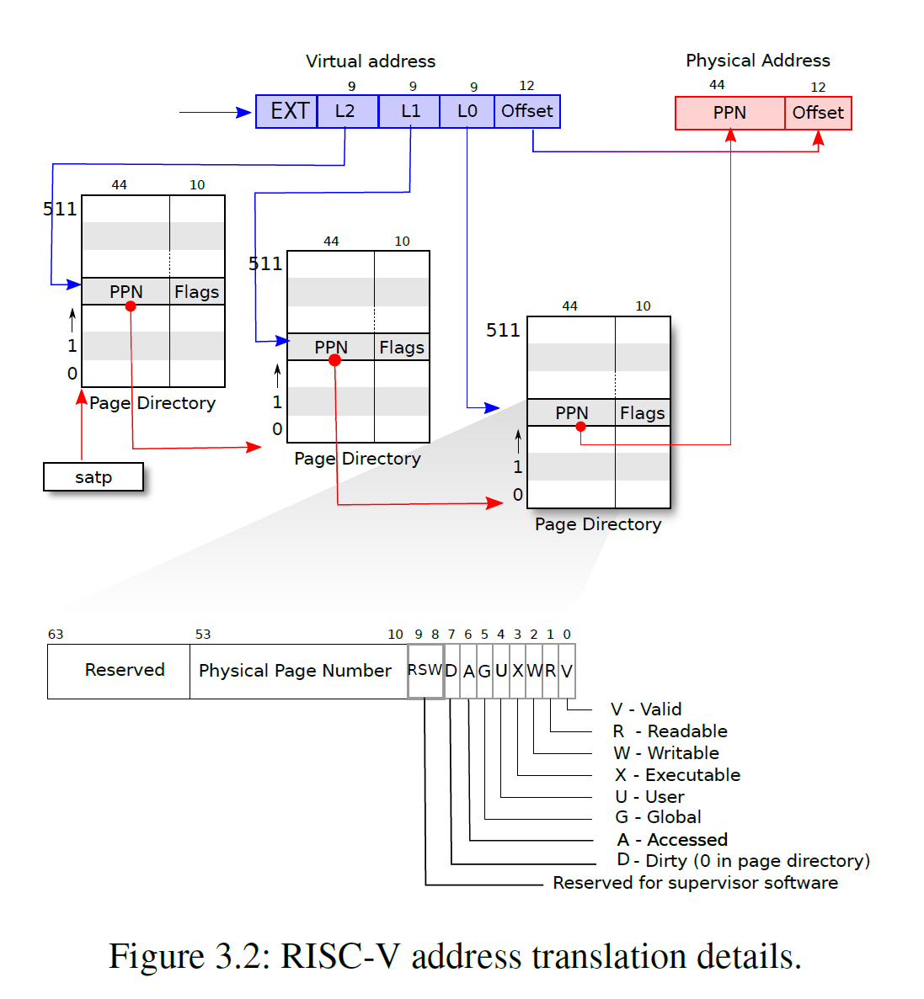

## Copy on write

> 必读资料：
>
> - [Lec08 - 8.4 Copy On Write Fork](https://mit-public-courses-cn-translatio.gitbook.io/mit6-s081/lec08-page-faults-frans/8.4-copy-on-write-fork)
> - [Lec08 - 8.5 Demand Paging](https://mit-public-courses-cn-translatio.gitbook.io/mit6-s081/lec08-page-faults-frans/8.5-demand-paging)
> - [Lec08 - 8.6 Memory Mapped Files](https://mit-public-courses-cn-translatio.gitbook.io/mit6-s081/lec08-page-faults-frans/8.6-memory-mapped-files)

**RISC-V address translation details**



### 1. Lab: Implement copy-on write

#### 1.1 COW 原理

`xv6` 中的 `fork()` 将父进程的所有用户空间内存复制到子进程中。如果父进程的内存空间很大，那么复制的过程会需要很长时间。而且，这些刚复制的内存空间经常会被浪费掉，例如，当子线程 `fork()` 后再调用 `exec()` 时，`exec()` 会丢弃子进程的页表，然后申请一个新的页表并把 `exec()` 要执行的目标文件和参数加载到页表中。

另一方面，`copy on write` (写时复制) 会导致父进程和子进程都是用同一个内存，但是并不能让父子进程同时对同一块内存进行写操作，此时就需要让父子进程指向不同的内存 (复制一份副本给子进程或父进程)

写时复制 (`COW`) 的目标是推迟为子级分配和复制物理内存页，直到真正需要副本时再分配和复制

`COW` 在 `fork()` 中只为子进程创建一个页表，用户内存的 `PTE` 指向父进程的物理页；在 `fork()` 中将父进程和子进程的所有的 `PTE` 标记为不可写 (`!PTE_W`)；当任一进程尝试写入其中一个 `COW` 页时 (可以使用 `RSW` 位将该 `PTE` 标记为 `COW` 页)，`CPU` 将强制发生中断 (需要在 `usertrap()` 中进行判断中断类型)；如果 `r_scause()` 为 13 或 15，通过 `r_stval()` 拿到对应的虚拟地址并为其分配真正的物理内存，将原始页面复制到新页面，并修改错误进程中的相关 `PTE` 以引用新页面，这次使用 `PTE` 标记为可写 (`PTE_W`)。 当页面错误处理程序返回时，用户进程将能够写入其页面副本

#### 1.2 物理页面引用计数

引入 `COW` 后，多个进程的之间页表的 `PTE` 可能指向的同一个物理内存，这使得释放实现用户内存的物理页变得有点棘手。给定的物理页可能被多个进程的页表引用，所以需要仅当最后一个引用消失时才应释放。

解决此问题的一个好的方法是为为每个物理页保留引用该页的用户页表数量的 “引用计数”，当 `kalloc()` 分配页面时，将页面的引用计数设置为 1。当 `fork` 导致子进程共享页面时增加页面的引用计数，并在每次任何进程从其页表中删除页面时减少页面的计数。 `kfree()` 仅当其引用计数为零时才应将页面放回到空闲列表中。可以将这些引用计数放到一个数组中，可以使用页面的物理地址除以 4096 来索引数组，并为数组提供与 `kalloc.c` 中的 `kinit()` 放置在空闲列表上的任何页面的最高物理地址相同的元素数

#### 1.3 代码实现

首先在 `kernel/kalloc.c` 中实现对物理内存的引用计数

```diff
+ #define PA2IDX(pa) (((uint64)pa) >> 12)

+ struct {
+   struct spinlock lock;
+   int count[PGROUNDUP(PHYSTOP) / PGSIZE];
+ } refc;
+ 
+ void
+ initrefc()
+ {
+   initlock(&refc.lock, "refc");
+   for(int i = 0; i < PGROUNDUP(PHYSTOP) / PGSIZE; i++) {
+     refc.count[i] = 0;
+   }
+ }
+ 
+ void
+ increfc(void *pa)
+ {
+   acquire(&refc.lock);
+   refc.count[PA2IDX(pa)]++;
+   release(&refc.lock);
+ }
+ 
+ void
+ decrefc(void *pa)
+ {
+   acquire(&refc.lock);
+   refc.count[PA2IDX(pa)]--;
+   release(&refc.lock);
+ }
+ 
+ int
+ getrefc(void *pa)
+ {
+   return refc.count[PA2IDX(pa)];
+ }
```

之后在 `kinit()` 中初始化引用计数数组

```diff
void
kinit()
{
+ initrefc();
  initlock(&kmem.lock, "kmem");
  freerange(end, (void*)PHYSTOP);

+ // freerange 会调用 kfree，让数组 -1，这里要加回来
+ char *p = (char *)PGROUNDUP((uint64)end);
+ for(; p + PGSIZE <= (char *)PHYSTOP; p += PGSIZE)
+   increfc((void *)p);
}
```

修改 `kfree()`，仅当一个物理页面引用计数为 0 时再释放

```diff
  if(((uint64)pa % PGSIZE) != 0 || (char*)pa < end || (uint64)pa >= PHYSTOP)
    panic("kfree");

+ decrefc((void *)pa);
+ if(getrefc((void *)pa) > 0)
+   return ;

  // Fill with junk to catch dangling refs.
  memset(pa, 1, PGSIZE);
```

修改 `kalloc()`，为新申请的物理页面的引用计数加 1

```diff
  release(&kmem.lock);

+ if(r) {
   memset((char*)r, 5, PGSIZE); // fill with junk
+   increfc((void *)r);
+ }
  return (void*)r;
```

通过对 `RSW` 位标记该物理页是否属于 `COW`，在 `riscv.h` 中添加

```diff
#define PTE_U (1L << 4) // 1 -> user can access
+ #define PTE_COW (1L << 8)
```

在 `uvmcopy` 中将子进程指向父进程的页表

```diff
  uint flags;
+ // char *mem;

  for(i = 0; i < sz; i += PGSIZE){
    if((pte = walk(old, i, 0)) == 0)
      panic("uvmcopy: pte should exist");
    if((*pte & PTE_V) == 0)
      panic("uvmcopy: page not present");
    pa = PTE2PA(*pte);
    flags = PTE_FLAGS(*pte);
+   // if((mem = kalloc()) == 0)
+   //   goto err;
+   // memmove(mem, (char*)pa, PGSIZE);

+   if(flags & PTE_W) {
+     flags = (flags | PTE_COW) & (~PTE_W);
+     *pte = PA2PTE(pa) | flags;
+   }
+   increfc((void *)pa);
+
+   if(mappages(new, i, PGSIZE, pa, flags) != 0){
+     // kfree(mem);
      goto err;
    }
```

在 `copyout` 中处理 `COW` 页的情况

```diff
    va0 = PGROUNDDOWN(dstva);

+   if(cow_alloc(pagetable, va0) != 0)
+     return -1;

    pa0 = walkaddr(pagetable, va0);
```

之后在 `usertrap` 判断中断发生的原因，如果是因为 `COW` 则为其分配新页面

```diff
+   } else if(r_scause() == 13 || r_scause() == 15) {
+     uint64 va = r_stval();
+ 
+     if(va >= MAXVA || (va <= PGROUNDDOWN(p->trapframe->sp) 
+         && va >= PGROUNDDOWN(p->trapframe->sp) - PGSIZE)) {
+         goto bad;
+     }
+ 
+     if(cow_alloc(p->pagetable, va) != 0) {
+       goto bad;
+     }
+ 
  } else {
+ bad:
    printf("usertrap(): unexpected scause %p pid=%d\n", r_scause(), p->pid);
```

在 `kernel/trap.c` 末尾实现 `cow_alloc()`

```diff
+ int
+ cow_alloc(pagetable_t pagetable, uint64 va)
+ {
+   if(va >= MAXVA)
+     return -1;
+ 
+   va = PGROUNDDOWN(va);
+   pte_t *pte = walk(pagetable, va, 0);
+   if(pte == 0 || (*pte & PTE_V) == 0)
+     return -1;
+ 
+   uint64 pa = PTE2PA(*pte);
+   if(pa == 0)
+     return -1;
+ 
+   uint flags = PTE_FLAGS(*pte);
+   if(flags & PTE_COW) {
+     char *mem = kalloc();
+     if(mem == 0)
+       return -1;
+ 
+     memmove(mem, (char *)pa, PGSIZE);
+     flags = (flags & (~PTE_COW)) | PTE_W;
+     *pte = PA2PTE((uint64)mem) | flags;
+     kfree((void *)pa);
+   }
+   return 0;
+ }
```

在 `kernel/defs.h` 中对相关方法进行声明

```diff
void            kinit(void);
+ void            increfc(void *pa);

...

void            usertrapret(void);
+ int             cow_alloc(pagetable_t pagetable, uint64 va);

...
int             copyinstr(pagetable_t, char *, uint64, uint64);
+ pte_t*          walk(pagetable_t pagetable, uint64 va, int alloc);
```


