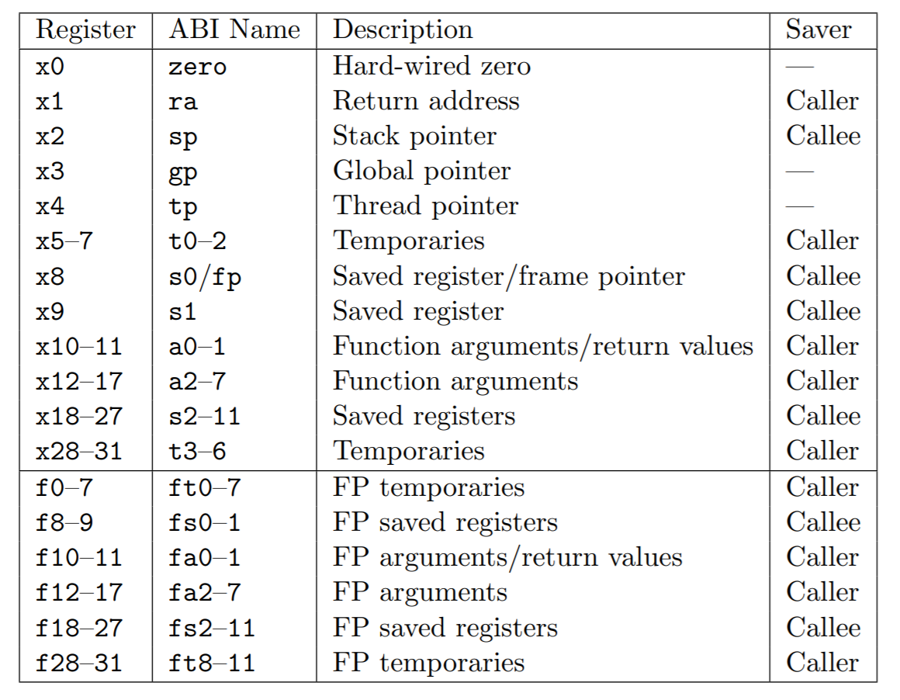

## Multithreading

> 必读资料：
>
> - [Lec11 Thread switching (Robert) - MIT6.S081 (gitbook.io)](https://mit-public-courses-cn-translatio.gitbook.io/mit6-s081/lec11-thread-switching-robert)
> - [Lecture Notes - Xiao Fan's Personal Page](https://fanxiao.tech/posts/2021-03-02-mit-6s081-notes/#91-multiplexing)

由于操作系统需要同时运行的进程的数量可能大于电脑 `CPU` 的数量，因此需要一种让进程 `time share CPU` 的机制，理想情况下这种机制对于用户进程应该是 **透明** 的，即让每个进程都认为自己拥有一个单独的虚拟 `CPU`

线程：一个串行的指令执行

`xv6` 的 `kernel thread` 支持共享内存，`user process` 不支持

### 1. Multiplexing

`xv6` 在 2 种情况下在进程之间切换从而实现 `multiplexing`：

- **`sleep / wakeup ` 机制：**进程等待设备或 `I/O`、等待子进程退出、在 `sleep sys call` 中等待
- **定时器机制：**周期性强迫一个进程进行切换，防止一个进程占用 `CPU` 过长时间


### 2. Context Switching

进程的上下文切换涉及到用户空间和内核空间之间的来回转换。当进程需要切换时，首先通过 `system call` 或中断陷入内核态，进入该进程的内核线程，然后将 **内核线程** 的上下文（注意不是用户进程的上下文，用户进程的上下文已经保存在了 `trapframe` 里面）切换到当前 `CPU` 的 `scheduler` 线程，再将上下文切换到需要运行的进程的内核线程，最后返回用户空间。

从一个内核线程切换到另一个线程需要保存旧线程的寄存器，恢复新线程之前保存的寄存器。`sp` 和 `pc` 将在此过程中被保存和切换。`swtch` 可以实现这种寄存器组状态 (也叫上下文) 的保存和切换。当进程需要 `yield CPU` 时，这个进程的 **内核线程将调用 `swtch` 来保存上下文并切换到 `scheduler` 的上下文**，所有的上下文都保存在 `struct context` 中。`swtch` 的传入参数为 `struct context *old` 和 `struct context *new`

`yield()` 函数切换了进程的状态为 `RUNNABLE`，调用了 `sched()`。`sched` 调用了 `swtch(&p->context, &mycpu()->context)` 来将上下文切换到 `cpu->scheduler`

```c++
void
sched(void)
{
  int intena;
  struct proc *p = myproc();

  if(!holding(&p->lock))
    panic("sched p->lock");
  if(mycpu()->noff != 1)
    panic("sched locks");
  if(p->state == RUNNING)
    panic("sched running");
  if(intr_get())
    panic("sched interruptible");

  intena = mycpu()->intena;
  swtch(&p->context, &mycpu()->context);
  mycpu()->intena = intena;
}
```

`sched()` 中，先要检查是否还获取着 `p->lock`，防止其他 `CPU` 的 `scheduler` 看见 `p->state==RUNNABLE` 的情况下试图去运行这个进程。通过检查 `mycpu()->noff` 来检查是否还获取着除了 `p->lock` 之外的其他锁，否则当切换到其他进程之后其他进程可能会 `acquire` 这个锁，而原先的进程由于没有在运行，因此一直无法释放掉这个锁，造成死锁

`swtch` 只保存 `callee saved` 寄存器，`caller saved` 寄存器在栈中被调用的代码保存。`swtch` 并没有保存 `pc` 寄存器，而是保存了 `ra`，**当恢复了新的进程之前保存的 `ra` 寄存器后，将返回到 `ra` 寄存器指向的上一个进程调用 `swtch` 的代码**。如果保存 `pc` 寄存器，将只能回到 `swtch` 本身。由于切换到的 `&mycpu()->context` 是被 `scheduler` 对 `swtch` 的调用所保存的，因此当进行 `swtch` 时，我们将返回到 `scheduler`，栈指针也将指向当前 `CPU` 的 `scheduler stack`

### 3. Scheduling

调度器 (`scheduler`) 是每个 `CPU` 中都会运行的一个特殊的线程，这个线程中不断运行 `scheduler` 函数，来选取下一个需要运行的进程

```c++
// Per-CPU process scheduler.
// Each CPU calls scheduler() after setting itself up.
// Scheduler never returns.  It loops, doing:
//  - choose a process to run.
//  - swtch to start running that process.
//  - eventually that process transfers control
//    via swtch back to the scheduler.
void
scheduler(void)
{
  struct proc *p;
  struct cpu *c = mycpu();
  
  c->proc = 0;
  for(;;){
    // Avoid deadlock by ensuring that devices can interrupt.
    intr_on();
    
    int nproc = 0;
    for(p = proc; p < &proc[NPROC]; p++) {
      acquire(&p->lock);
      if(p->state != UNUSED) {
        nproc++;
      }
      if(p->state == RUNNABLE) {
        // Switch to chosen process.  It is the process's job
        // to release its lock and then reacquire it
        // before jumping back to us.
        p->state = RUNNING;
        c->proc = p;
        swtch(&c->context, &p->context);

        // Process is done running for now.
        // It should have changed its p->state before coming back.
        c->proc = 0;
      }
      release(&p->lock);
    }
    if(nproc <= 2) {   // only init and sh exist
      intr_on();
      asm volatile("wfi");
    }
  }
}
```

想要 `yield CPU` 的进程首先要获取自己进程的锁 `p->lock`（防止其他 `CPU` 获取这个进程），修改当前的状态到 `RUNNABLE`，`release` 掉自己获取的其他锁，加载 `cpu->scheduler` 的上下文，返回到 `scheduler()` 之后， `release` 掉自己的进程锁。

**在 `scheduler` 调用 `swtch` 到新的进程之前，`scheduler` 需要已经获取这个进程的锁，并且将对这个进程的锁传递给被切换到的这个新的进程中，让新进程来 `release` 这个锁。**一般来说，一个锁应该由 `acquire` 它的进程来进行 `release`，但是由于一个进程的 `p->state` 是在 `scheduler` 中被改变的，需要对其进行保护，因此需要在 `scheduler` 中就获取这个进程的锁

当一个新的进程是第一次被 `scheduler` 调度的时候，不返回到 `sched`，而是返回到 `forkret`（因为之前并没有从 `sched` 中调用过 `swtch`）。`forkret` 将 `p->lock` 释放掉，然后回到 `usertrapret`。

### 4. mycpu and myproc

`xv6` 为每一个 `CPU` 都有一个 `struct cpu`，记录当前运行在这个 `CPU` 上的进程的指针 `struct proc *proc`、保存的寄存器 `struct context context`、`push_off` 的 `nesting` 的数量 `int noff` 等变量

`RISC-V` 将所有 `CPU` 进行编号，该编号称为 **`hartid`**，确保每个 `CPU` 的 `hartid` 都保存在这个 `CPU` 的 `tp` 寄存器内，可以让 `mycpu` 通过这个 `hartid` 来索引到一个 `struct cpu` 数组 `cpus[]` 中，从而获取对当前 `CPU` 的 `struct cpu` 的引用。当获取 `struct cpu` 之后如果发生了中断导致 `CPU` 被切换了，那么获取的 `struct cpu` 将是不正确的，因此需要用 `push_off` 来保证当前的中断使能被关闭

使用 `myproc()` 函数来返回一个指向当前 `CPU` 运行的进程 `c->proc` 的指针

### 5. callee 和 caller 寄存器



函数调用过程通常分为 6 个阶段：

1. 将参数存储到被调用的函数可以访问到的位置；
2. 跳转到函数起始位置；
3. 获取函数需要的局部存储资源，按需保存寄存器 (`callee saved registers`) ；
4. 执行函数中的指令；
5. 将返回值存储到调用者能够访问到的位置，恢复寄存器 (`caller saved registers`)，释放局部存储资源；
6. 返回调用函数的位置。

为了获得良好的性能，变量应该尽量存放在寄存器而不是内存中，但同时也要注意避免频繁地保存和恢复寄存器，因为它们同样会访问内存。

- 总之，**调用前后一定不变的寄存器称为 “由调用者保存的寄存器"，即 `callee saved`**
- 反之，**调用前后可能改变的寄存器则称为 “由被调用者保存的寄存器”，即 `caller saved`**

### 6. 进程启动和切换 (重要)

#### 6.1 前言

`xv6` 中的进程和线程可以混为一谈

在 `xv6` 中有几种进程：

- **内核进程/线程：**当进程运行在内核态
- **用户进程/线程：**当进程运行在用户态
- **调度器进程/线程：**`xv6` 会模拟多个 `CPU` 去运行程序，可以理解为每个 `CPU` 就是一个 **(调度器) 进程**，**其实调度器进程才是真正的线程，上面的两种进程其实都是抽象模拟出来的，本质上都是调度器这个线程，只不过 `xv6` 改变了调度器线程的寄存器相关信息，使得调度器线程去完成 内核/用户 进程需要做的事情**

可以看一下 `xv6` 中 `CPU` 的数据结构

```c++
// Per-CPU state.
struct cpu {
  struct proc *proc;          // The process running on this cpu, or null.
  struct context context;     // swtch() here to enter scheduler().
  int noff;                   // Depth of push_off() nesting.
  int intena;                 // Were interrupts enabled before push_off()?
};
```

注意这个 `context`，每个 `struct cpu` 中都有 `context` 字段，其存储的是调度器进程的寄存器信息，当 `xv6` 通过 `scheduler()` 切换进程时，会将进程的 `context` 个字段复制给各寄存器，此时 `xv6` 会执行 `ret` 跳转到 `ra` 寄存器指向的地址继续执行程序

**而当 `xv6` 通过 `sched()` 使当前进程让出 `CPU` 时，又会将 `struct cpu` 的 `context` 的值复制给各寄存器，然后执行 `ret` 会跳转到 `swtch(&c->context, &p->context)` ，给人的感觉就是调用 `swtch()` 返回了，之后继续执行下一条语句 `c->proc = 0`**，当 `c->proc` 为 0，代表此时是调度器进程在执行程序

**从 `xv6` 执行 `sched()` 使得当前进程让出 `CPU` 开始到下一次 `xv6` 调用 `swtch()` 之前，这段空档期是没有 内核/用户进程在运行的，而是调度器进程在负责代码的执行**

#### 6.2 启动和切换

在 `userinit()` 和 `fork()` 中调用了 `allocproc()` 方法，而 `allocproc()` 主要给进程的上下文 (`p->contex`) 设置对应的寄存器 `ra (return address)` 和 `sp (stack pointer)`

```c++
  // kernel/proc.c:allocproc()

  // Set up new context to start executing at forkret,
  // which returns to user space.
  memset(&p->context, 0, sizeof(p->context));
  p->context.ra = (uint64)forkret;
  p->context.sp = p->kstack + PGSIZE;
```

在 `userinit()` 和 `fork()` 中都有这么一句话 `p->state = RUNNABLE`，这一步将进程的状态设置为 `RUNNABLE`，这一步很关键

之后我们看一下 `xv6` 中切换进程的关键 `schduler()` 、`sched()` 和 `swtch()`

```c++
	// 主要看一下核心部分
	for(p = proc; p < &proc[NPROC]; p++) {
      acquire(&p->lock);
      if(p->state != UNUSED) {
        nproc++;
      }
      // 可以发现只有状态为 RUNNABLE 的进程才会有机会执行 swtch
      if(p->state == RUNNABLE) {
        // Switch to chosen process.  It is the process's job
        // to release its lock and then reacquire it
        // before jumping back to us.
        p->state = RUNNING;
        c->proc = p;
        // 到这里进程 p 还没有拿到 CPU，只是在做拿到前的准备工作
        // 当执行 swtch 后 p 才算是真正拿到 CPU
        // void swtch(struct context *old, struct context *new);
        swtch(&c->context, &p->context);

        // 到这里，进程 p 已经让出 CPU 了
        // Process is done running for now.
        // It should have changed its p->state before coming back.
        c->proc = 0;
      }
      release(&p->lock);
    }
```

下面看一下 `swtch`

```assembly
# void swtch(struct context *old, struct context *new);
.globl swtch
swtch:
        sd ra, 0(a0)
        sd sp, 8(a0)
        sd s0, 16(a0)
        sd s1, 24(a0)
        sd s2, 32(a0)
        sd s3, 40(a0)
        sd s4, 48(a0)
        sd s5, 56(a0)
        sd s6, 64(a0)
        sd s7, 72(a0)
        sd s8, 80(a0)
        sd s9, 88(a0)
        sd s10, 96(a0)
        sd s11, 104(a0)

        ld ra, 0(a1)
        ld sp, 8(a1)
        ld s0, 16(a1)
        ld s1, 24(a1)
        ld s2, 32(a1)
        ld s3, 40(a1)
        ld s4, 48(a1)
        ld s5, 56(a1)
        ld s6, 64(a1)
        ld s7, 72(a1)
        ld s8, 80(a1)
        ld s9, 88(a1)
        ld s10, 96(a1)
        ld s11, 104(a1)
        
        ret		# return ra address
```

这里将让出 `CPU` 的进程的相关寄存器信息进行记录，将马上要拿到 `CPU` 控制权的进程的相关寄存器信息存到各寄存器中；**最后执行 `ret` 会返回到当前 `ra` 寄存器指向的地址继续执行程序（也就是 `forkret`）**

正如上面讲的，所有的进程一开始都是在 `allocproc()` 中被创建的，而所有的进程在创建时 `p->context.ra` 指向的就是 `forkret` 方法；所以，所有的进程第一次拿到 `CPU` 后执行的方法都是 `forkret`

在 `forkret()` 中会调用 `usertrapret()`，在 `usertrapret()` 中通过 `w_sepc(p->trapframe->epc);` 设置了 `SEPC` 寄存器，之后 `usertrapret()` 会调用 `userret (kernel/trampoline.S)`，而 `userret` 最后会调用 `SRET`，`SRET` 会将 `SEPC` 寄存器的值赋值给 `PC` 寄存器，之后跳转到 `PC` 指向的地址继续执行程序

这里 `SEPC` 的值分为三种情况：

- 如果是 **在 `userinit()` 中调用 `allocproc()` 创建的进程** (**在 `xv6` 中是第一个进程，`shell` 进程**)：则 `p->trapframe->epc = 0`，是在 `userinit()` 中设置的

  ```c++
  p->trapframe->epc = 0;      // user program counter
  ```

  - 而 `userinit()` 通过 `uvminit(p->pagetable, initcode, sizeof(initcode));` 将 `initcode.S` 程序复制到了进程的 `text` 段，执行 `SRET` 后就会跳转到 `initcode.S` 继续执行程序

- 第二种是 **在 `fork()` 调用 `allocproc()` 创建的进程**，在 `fork()` 有有这么一步：

  ```c++
  // 将父进程的 trapframe 复制给 子进程
  *(np->trapframe) = *(p->trapframe);
  ```

  - 也就是说 `np->trapframe->epc` 和 `p->trapframe->epc` 的值是相同的
  - 在 **用户态** 调用 `fork()` 时会执行 `ECALL`，而 `ECALL` 会将 `PC` 寄存器的值存到 `SEPC` 后进入内核态，当执行 `SRET` 时又会将 `SEPC` 复制给 `PC` 从而返回用户态；所以程序就会从用户态执行 `fork()` 的下一条语句继续执行；**为什么是下一条？**因为在从用户态陷入内核态后会调用 `usertrap()`，而 `usertrap()` 中执行了 `p->trapframe->epc += 4;` 所以就会执行下一条语句

- 第三种情况也是在 `fork()` 中调用 `allocproc()` 创建进程，**只不过是先调用 `fork()` 后再调用 `exec()`**；执行 `exec` 系统调用会再次陷入 (`fork` 已经陷入一次了) 内核态，然后执行 `syscall()`，之后执行 `sys_exec()` 最后执行 `exec() (kernel/exec.c)`

  - 在 `exec()` 中会创建一个新的页表替代子进程原来的页表，在 `exec()` 中设置了 `p->trapframe->epc` 的值：

    ```c++
    // 假如执行的是 exec("ls", ".")
    // 则 epc 指向的就是 user/ls.c 的 main 方法
    p->trapframe->epc = elf.entry;  // initial program counter = main
    ```

  - 当  `exec()` 返回后，会调用 `usertrapret()`、`userret`，然后执行 `SRET`，最后会跳转到对应指令的 `main` 方法 (以 `ls` 命令为例，就会跳转到 `user/ls.c` 的 `main` 方法中)

**以上就是 `scheduler()` 中调用 `swtch()` 跳转到对应进程的过程，也就是进程拿到 `CPU` 后怎么执行自己的程序的**

---

**之后我们看一下进程是如何让出 `CPU` 的**

主要在 `sched()` 方法中

> `exit()`、`yield()`、`wait()`、`sleep()` 都会直接或间接的调用 `sched()`

```c++
void
sched(void)
{
  int intena;
  struct proc *p = myproc();

  if(!holding(&p->lock))
    panic("sched p->lock");
  if(mycpu()->noff != 1)
    panic("sched locks");
  if(p->state == RUNNING)
    panic("sched running");
  if(intr_get())
    panic("sched interruptible");

  intena = mycpu()->intena;
  // p->context 是当前进程的上下文
  // mycpu()->context 是调度器进程的上下文
  swtch(&p->context, &mycpu()->context);
  mycpu()->intena = intena;
}
```

在 `sched()` 中会调用 `swtch()`，将当前寄存器的信息保存到 `p->context` 中，然后将 `mycpu()->context` 的寄存器相关信息存到到寄存器硬件中，然后执行 `ret` 返回到当前 `ra` 寄存器指向的地址继续执行程序f

**最重要的是：此时 `ra` 寄存器的地址是什么？**

知道了 `ra` 的值，也就知道了 `xv6` 执行 `swtch()` 后会跳转到哪里继续执行程序

- 我们最初是在 `scheduler()` 中执行 `swtch()` 进行进程切换的，**在这里我们调用 `swtch()` 就像调用函数** 一样，所以在切换之前 `ra` 寄存器指向就是 `swtch()`，并且我们把他存到了 `mycpu()->context` 中
- 那么当我们在 `sched()` 调用 `swtch()` 后会将 `mycpu()->context` 加载到各寄存器，当然包括了 `ra` 寄存器，所以 `ra` 寄存器存的就是之前切换前的值，也就是 `scheduler()` 中的 `swtch()`

**当在 `sched()` 调用 `swtch()` 后，程序会跳转到 `scheduler()` 的 `swtch()`，给人的感觉就是之前在 `scheduler()` 中调用的 `swtch()` 这个 "函数" 现在返回了**

另外，还有一点很重要：

当 `swtch()` 返回后，会执行 `c->proc = 0`；这里的含义是：

当 `c->proc` 为 0，代表当前没有 **内核/用户进程** 拿到此 `CPU`，也就是说**当前是调度器进程在执行程序，这种状态会一直持续到下一次调用 `swtch(&c->context, &p->contex)`**

### 7. 如何实现 fork (重要)

有没有想过一个问题，问什么在 `xv6` 中 `pid = fork()` 后，`pid` 的值有两种：

```c++
int pid = fork();
if(pid == 0) {	// child process
	...
} else {		// parent process
	...
}
```

我们都知道一个是子进程的返回值，一个是父进程的返回值；但是究竟是如何在底层实现的呢？接下来我们主要讲解一下 `fork()` 的底层实现

不管在哪里调用 `fork()` 都是相同的原理，这里随便跳转一处；以 `init.c:28` 中 `pid = fork()` 为例进行讲解

先上源码：

```c++
	pid = fork();
    if(pid < 0){
      printf("init: fork failed\n");
      exit(1);
    }
    if(pid == 0){	// 子进程执行 exec("sh", argv)
      exec("sh", argv);
      printf("init: exec sh failed\n");
      exit(1);
    }

	for(;;){	// 父进程进入死循环
      ...
    }
```

下面是 `init.asm`

```assembly
    pid = fork();
  48:	00000097          	auipc	ra,0x0
  4c:	314080e7          	jalr	788(ra) # 35c <fork>
  50:	84aa                mv	s1,a0
```

> `auipc ra,0x0` 就是将 `PC` 寄存器加上 `0x0` 后赋值给 `ra` 寄存器
>
> `jalr 788(ra)` 就是跳转到 `ra + 788` 的地址上，这里 788 是十进制数
>
> `#35c <fork>` 是注释也就是跳转到 `fork` 方法，`ra + 788` 就是 `0x35c`，反推可以知道此时 `PC` 是 `0x4e`，没有问题

调用 `fork()` 系统调用后进程会陷入内核态，进入 `usertrap()`，进而调用 `syscall()`，之后调用 `sys_fork()`，最后进入到 `kernel/proc.c` 的 `fork()` 方法

接下来我们详细看一下 `fork()` 的源码

```c++
  int i, pid;
  struct proc *np;
  struct proc *p = myproc();

  // Allocate process.
  if((np = allocproc()) == 0){
    return -1;
  }
```

`p` 是父进程，而 `np` 就是我们即将创建的子进程，通过 `allocproc()` 去创建子进程

```c++
static struct proc*
allocproc(void)
{
  struct proc *p;

  for(p = proc; p < &proc[NPROC]; p++) {
    acquire(&p->lock);
    if(p->state == UNUSED) {
      goto found;
    } else {
      release(&p->lock);
    }
  }
  return 0;

found:
  p->pid = allocpid();

  // Allocate a trapframe page.
  if((p->trapframe = (struct trapframe *)kalloc()) == 0){
    release(&p->lock);
    return 0;
  }

  // An empty user page table.
  p->pagetable = proc_pagetable(p);
  if(p->pagetable == 0){
    freeproc(p);
    release(&p->lock);
    return 0;
  }

  // Set up new context to start executing at forkret,
  // which returns to user space.
  memset(&p->context, 0, sizeof(p->context));
  p->context.ra = (uint64)forkret;
  p->context.sp = p->kstack + PGSIZE;

  return p;
}
```

在 `allocproc()` 中主要做了几件事：

- 首先通过 `allocpid()` 给子进程分配进程号
- 给子进程 `p->trapframe` 申请一页内存
- 初始化 `p->pagetable` 子进程页表

- **初始化 `p->context` 子进程上下文，设置 `p->context.ra = (uint64)forkret` 和 `p->context.sp = p->kstack + PGSIZE`**

> 这里通过 `GDB` 输出一下 `forkret` 函数的地址：
>
> ```shell
> (gdb) p/x (uint64)forkret
> $1 = 0x80001992
> (gdb) p/x p->context.sp
> $2 = 0x3fffffc000
> ```

之后回到 `fork()`

```c++
  // Copy user memory from parent to child.
  if(uvmcopy(p->pagetable, np->pagetable, p->sz) < 0){
    freeproc(np);
    release(&np->lock);
    return -1;
  }
  np->sz = p->sz;

  np->parent = p;

  // copy saved user registers.
  *(np->trapframe) = *(p->trapframe);

  // Cause fork to return 0 in the child.
  np->trapframe->a0 = 0;
```

这里只讲重点，有两个重点：

-  `*(np->trapframe) = *(p->trapframe)` 这里将父进程的 `trapframe` 赋值给子进程的 `trapframe`，此时父子进程的 `trapframe` 是相同的

  > 我们通过 `GDB` 调试一下，看看 `trapframe` 具体是什么值
  >
  > ```shell
  > # 这里是在 fork() 末尾输出的值
  > (gdb) p *np->trapframe
  > $1 = {kernel_satp = 9223372036855332863, kernel_sp = 274877898752, kernel_trap = 2147493722, epc = 866, kernel_hartid = 2, 
  >   ra = 80, sp = 12224, gp = 361700864190383365, tp = 361700864190383365, t0 = 361700864190383365, t1 = 361700864190383365, 
  >   t2 = 361700864190383365, s0 = 12256, s1 = 361700864190383365, a0 = 0, a1 = 12031, a2 = 1, a3 = 361700864190383365, 
  >   a4 = 361700864190383365, a5 = 361700864190383365, a6 = 361700864190383365, a7 = 1, s2 = 2168, s3 = 361700864190383365, 
  >   s4 = 361700864190383365, s5 = 361700864190383365, s6 = 361700864190383365, s7 = 361700864190383365, 
  >   s8 = 361700864190383365, s9 = 361700864190383365, s10 = 361700864190383365, s11 = 361700864190383365, 
  >   t3 = 361700864190383365, t4 = 361700864190383365, t5 = 361700864190383365, t6 = 361700864190383365}
  > (gdb) p/x *np->trapframe
  > $2 = {kernel_satp = 0x8000000000087fff, kernel_sp = 0x3fffffe000, kernel_trap = 0x8000275a, epc = 0x362, 
  >   kernel_hartid = 0x2, ra = 0x50, sp = 0x2fc0, gp = 0x505050505050505, tp = 0x505050505050505, t0 = 0x505050505050505, 
  >   t1 = 0x505050505050505, t2 = 0x505050505050505, s0 = 0x2fe0, s1 = 0x505050505050505, a0 = 0x0, a1 = 0x2eff, a2 = 0x1, 
  >   a3 = 0x505050505050505, a4 = 0x505050505050505, a5 = 0x505050505050505, a6 = 0x505050505050505, a7 = 0x1, s2 = 0x878, 
  >   s3 = 0x505050505050505, s4 = 0x505050505050505, s5 = 0x505050505050505, s6 = 0x505050505050505, s7 = 0x505050505050505, 
  >   s8 = 0x505050505050505, s9 = 0x505050505050505, s10 = 0x505050505050505, s11 = 0x505050505050505, t3 = 0x505050505050505, 
  >   t4 = 0x505050505050505, t5 = 0x505050505050505, t6 = 0x505050505050505}
  > ```

- `np->trapframe->a0 = 0` 将 0 赋值给 `np->trapframe->a0`，而这里的 0 实际上就是在用户态调用 `fork()` 返回的值（另一种情况是非 0）；这里是先存到 `np->trapframe->a0` (**子进程的 `a0` 寄存器)** 中了，查看 `syscall()` 也可以发现，调用 `sys_fork()` 的返回值存储到了 `p->trapframe->a0` (**父进程的 `a0` 寄存器**) 中了，而这两个值也就是 `fork()` 的返回值；此时 `np->trapframe->a0` 为 0，而 `p->trapframe->a0` 是子进程的 `pid`

  > 在 `xv6` 中调用一个方法，如果该方法有返回值，那么返回值最终会存储到 `a0` 寄存器

接下来我们只要搞清楚为什么 `fork()` 会返回两次就搞清楚了，其实这里可以猜到两个返回是父子进程各一次

>  **第 5 部分我们讲了 `xv6` 是如何进行切换进程 (线程) 的**

在 `fork()` 中把子进程 (`np`) 的状态变为了 **`RUNNABLE`**，这样调度器线程就会在死循环中检测到该子进程已经准备好执行程序了，之后调度器进程就会在 `scheduler()` 中执行 `swtch(&c->context, &p->context)`；进而使得子进程拿到 `CPU` 去执行自己的任务

执行 `swtch()` 后会跳转到 `np->context.ra` 指向的地址，还记得我们前面说过的吗，对于每个进程来说，第一次通过 `swtch()` 拿到 `CPU` 都会跳转到 `forkret`，而此时 `np->context.ra` 指向的就是 `forkret`（是在 `allocproc()` 中被设置的）

在 `forkret()` 中会执行 `usertrapret`，然后执行 `userret`，在 `userret` 中会将 `np->trapframe` 的各值赋值给各寄存器，这里我们需要关注的是 `SEPC` 寄存器

而在 `fork()` 时，`np` 子进程的 `trapframe` 被赋值为 `p` 父进程的 `trapframe` ，查看上面 `GDB` 的调试可以看到 `np->trapframe->epc` 的值为 `0x362`；在 `init.asm` 中查看对应的汇编代码：

```assembly
.global fork
fork:
 li a7, SYS_fork
 35c:	4885                	li	a7,1
 ecall
 35e:	00000073          	ecall
 ret
 362:	8082                	ret		# 这里
```

> 这里其实就是在 `user/init.c:28` 的 `pid = fork();` 的汇编代码

在 `userret` 最后会调用 `SRET`，此时程序就会跳转到 `0x362` 处继续执行程序，也就是执行了 `ret` 汇编指令，执行 `ret` 汇编指令后，程序就会跳转到 `ra` 指向的地址 (**相当于 `pid = fork()` 调用的 `fork()` 返回了**) 

而当 `fork()` 调用返回，会将 `a0` 寄存的值赋值给 `pid`，所以此时 `pid` 为 0 (上文说了子进程的 `a0` 寄存器 (`np->trapframe->a0`) 为 0，而父进程的 `a0` 寄存器 (`p->trapframe->a0`) 为子进程的进程号)

**上面是调度器线程对子进程执行 `swtch()`，对父进程也是同样的道理，流程也是相同的，不同的是对于父进程来说 `fork()` 返回后，`pid` 的值为子进程的进程号**

**最后！**

这就是为什么 `fork()` 会返回两次，以及 `xv6` 是如何在底层实现 `fork()` 的

### 8. Lab1: Uthread: switching between threads

这个 `lab` 和 `xv6` 切换内核的规则是类似的，仿照 `xv6` 的去实现即可

首先在 `user/uthread.c` 开头添加线程上下文结构体 `struct context`

```diff
#define MAX_THREAD  4

+ struct context{
+   uint64 ra;    /*   0 */
+   uint64 sp;    /*   8 */
+ 
+   // callee-saved
+   uint64 s0;    /*  16 */
+   uint64 s1;    /*  24 */
+   uint64 s2;    /*  32 */
+   uint64 s3;    /*  40 */
+   uint64 s4;    /*  48 */
+   uint64 s5;    /*  56 */
+   uint64 s6;    /*  64 */
+   uint64 s7;    /*  72 */
+   uint64 s8;    /*  80 */
+   uint64 s9;    /*  88 */
+   uint64 s10;   /*  96 */
+   uint64 s11;   /* 104 */
+ };

struct thread {
  char       stack[STACK_SIZE]; /* the thread's stack */
  int        state;             /* FREE, RUNNING, RUNNABLE */

+   struct context context;
};
```

修改 `thread_schedule()`，调用 `thread_switch()` 以切换线程

```diff
    current_thread = next_thread;
    /* YOUR CODE HERE
     * Invoke thread_switch to switch from t to next_thread:
     * thread_switch(??, ??);
     */
+   thread_switch((uint64)&t->context, (uint64)&next_thread->context);
  } else
```

修改 `thread_create()`，初始化每个进程的 `context`

```diff
  t->state = RUNNABLE;

+ memset(&t->context, 0, sizeof(t->context));
+ t->context.ra = (uint64)func;
+ t->context.sp = (uint64)t->stack + STACK_SIZE - 1;
```

最后在 `user/uthread_switch.S` 中实现 `thread_switch()`

```assembly
	.text

	/* void thread_switch(uint64 old, uint64 new);
	* save the old thread's registers,
	* restore the new thread's registers.
	*/

	.globl thread_switch
thread_switch:
	
	sd ra, 0(a0)
	sd sp, 8(a0)
	sd s0, 16(a0)
	sd s1, 24(a0)
	sd s2, 32(a0)
	sd s3, 40(a0)
	sd s4, 48(a0)
	sd s5, 56(a0)
	sd s6, 64(a0)
	sd s7, 72(a0)
	sd s8, 80(a0)
	sd s9, 88(a0)
	sd s10, 96(a0)
	sd s11, 104(a0)

	ld ra, 0(a1)
	ld sp, 8(a1)
	ld s0, 16(a1)
	ld s1, 24(a1)
	ld s2, 32(a1)
	ld s3, 40(a1)
	ld s4, 48(a1)
	ld s5, 56(a1)
	ld s6, 64(a1)
	ld s7, 72(a1)
	ld s8, 80(a1)
	ld s9, 88(a1)
	ld s10, 96(a1)
	ld s11, 104(a1)

	ret    /* return to ra */
```

### 9. Lab2: Using threads

这个 `lab` 也非常简单，就是添加锁机制控制多线程的经常问题

在 `notxv6/ph.c` 开头对给个桶声明一个锁

```diff
int nthread = 1;
+ pthread_mutex_t mutex[NBUCKET];
```

在 `main()` 对锁初始化

```diff
    keys[i] = random();
  }

+ for(int i = 0; i < NBUCKET; i++) {
+   pthread_mutex_init(&mutex[i], NULL);
+ }
```

在 `put()` 中添加锁，防止多线程竞争

```diff
    if (e->key == key)
      break;
  }
+ pthread_mutex_lock(&mutex[i]);
  if(e){
    // update the existing key.
    e->value = value;
  } else {
    // the new is new.
    insert(key, value, &table[i], table[i]);
  }
+ pthread_mutex_unlock(&mutex[i]);
}
```

这里是有一点问题的，正确的做法其实是：

- 对 `get()` 也添加锁
- 在 `put()` 中的 `for (e = table[i]; e != 0; e = e->next) {` 之前加锁

但是这种方法会导致超时，而且通过 `main()` 可以看出来不会有 读操作 和 写操作 同时进行的可能，因为是等全部进程写完后才会进行读操作，所以对于读操作来说就不用加锁了

### 10. Lab3: Barrier

这个 `lab` 也很简单，主要就是使用条件变量同步多线程

在 `barrier_init()` 添加

```diff
  //
  // Block until all threads have called barrier() and
  // then increment bstate.round.
  //

+ pthread_mutex_lock(&bstate.barrier_mutex);
+ if(++bstate.nthread == nthread) {
+   bstate.round++;
+   bstate.nthread = 0;
+   pthread_cond_broadcast(&bstate.barrier_cond);
+ } else {
+   pthread_cond_wait(&bstate.barrier_cond, &bstate.barrier_mutex);
+ }
+ pthread_mutex_unlock(&bstate.barrier_mutex);
```


