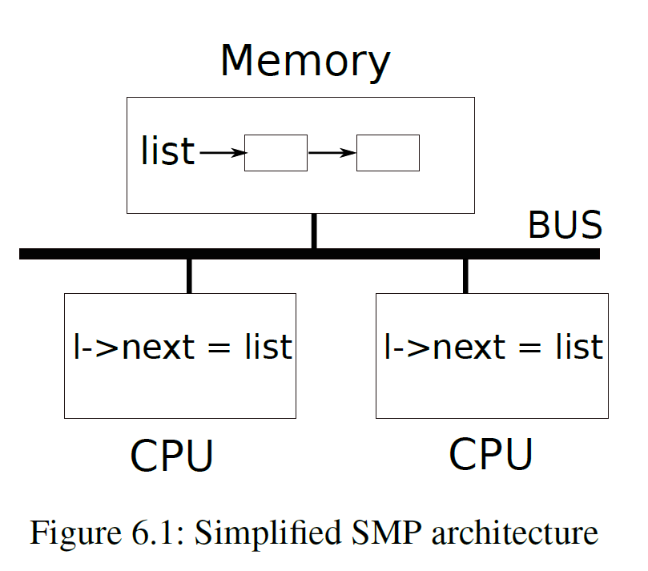
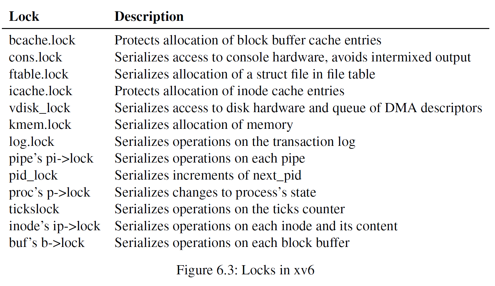

## Locking

>必读资料：
>
>[Lec10 multiprocessors-and-locking (Frans)](https://mit-public-courses-cn-translatio.gitbook.io/mit6-s081/lec10-multiprocessors-and-locking)
>
>[Lecture Notes - Xiao Fan's Personal Page (fanxiao.tech)](https://fanxiao.tech/posts/2021-03-02-mit-6s081-notes/#81-race-conditions)

多核 `CPU` 同时对某个共享的数据结构进行读写操作可能会发生冲突，因此需要 `concurrency control`，即 **锁**。锁提供了一种互斥机制，一段时间内只有一个 `CPU` 才能拥有这个锁，如果一个锁和一个被共享的数据结构联系起来，那么这个数据结构一次只能被一个 `CPU` 使用

### 1. Race conditions

`kernel allocator` 中有一个 `free` 链表用来指示当前空闲待分配的内存，`kalloc()` 将一页内存从 `free` 中弹出，`kfree()` 将一页内存压入 `free`。这个 `free` 链表被两个 `CPU` 的两个不同进程共享，如下图所示



**`race condition`**：一个内存地址同时被至少一个写入操作访问，会造成 `bug`

```c++
struct element *list = 0;
struct lock listlock;

void push (int data) {
    struct element *l;
    l = malloc(sizeof *l);
    l->data = data;
    acquire(&listlock);
    // critical section
    l->next = list;
    list = l;
    release(&listlock);
}
```

在 `acquire `和 `release` 之间的代码叫做 **`critical section`**。

当两个进程同时要求一个相同的锁时，这两个进程发生冲突，`xv6` 对进程锁冲突没有做预防举措，但是更复杂的其他的 `kernel` 对此有实现。

注意 `acquire` 和 `release` 的位置很重要，不要包围不必要的代码，否则会降低程序运行效率。

### 2. Code: Locks

`xv6` 有两种锁：`spinlock` 和 `sleep-lock`。`spinlock` 的代码位于 `kernel/spinlock.h` 的 `struct spinlock` 中

```c++
struct spinlock {
  uint locked;       // Is the lock held?

  // For debugging:
  char *name;        // Name of lock.
  struct cpu *cpu;   // The cpu holding the lock.
};
```

`locked` 为 0 时说明这个锁是可以 `acquire` 的。

`acquire` 中需要让类似于

```c++
if (lk->locked == 0)
    lk->locked = 1;
```

这样的逻辑原子化，否则当两个不同的进程同时执行到上面的判断条件时，可能会同时获取这个锁。`RISC-V` 是通过 `amoswap r, a` 来实现的，它将 `a` 内存地址中的内容和 `r` 寄存器中的内容互换。在 `acquire` 中，通过一个对 `amoswap` 的包装函数 `__sync_lock_test_and_set(&lk->locked, 1)` 来实现这个原子操作，这个函数的返回值是 `lk->locked` 的旧的值(被换下来的值)

```c++
while(__sync_lock_test_and_set(&lk->locked, 1) != 0)
    ;
```

通过 `while` 不断尝试将 1 和 `&lk->locked` 互换(`spinning`)，当原先的 `lk->locked` 是 0 时跳出循环，这个锁被取得，否则当原先的 `lk->locked` 是 1 时不会跳出循环，并且 `lk->locked` 和 1 互换还是 1，不会改变它的状态。

`release` 是 `acquire` 的反向操作，先将 `lk->cpu` 清零。然后调用

```c++
__sync_lock_release(&lk->locked);
// 相当于
// s1 = &lk->locked
// amoswap.w zero, zero, (s1)
```

将 `lk->locked` 置 0，这也是一个原子操作。

由于编译器有时候为了性能优化会重新排列代码的执行顺序，对于顺序执行的代码来说，这种重新排列顺序并不会改变代码执行的结果，但是对于并发执行的代码，则可能改变结果，因此需要在 `acquire` 和 `release` 中用`__sync_synchronize()` 来保证 `CPU` 和编译器不进行重新排列顺序。`__sync_synchronize()` 是一个 `barrier`，任何在这一行代码之前的代码都不能 `reorder` 到这一行代码的后面。

### 3. Deadlocks and lock ordering

如果一块代码需要同时拥有多个锁，那么应该让其他需要相同锁的进程按照相同的顺序acquire这些锁，否则可能出现死锁。比如进程 1 和 2 都需要锁 A 和锁 B，如果进程 1 先 `acquire` 了锁 A，进程2 `acquire` 了锁 B，那么接下来进程 1 需要 `acquire` 锁 B，进程 2 需要 `acquire` 锁 A，但是这两个都不能 `acquire` 到也无法 `release` 各自的锁，就会出现死锁。

由于 `sleep` 在 `xv6` 中的机制，`xv6` 中有很多长度为 2 的 `lock-order`。比如 `consoleintr` 中要求先获得 `cons.lock`，当整行输入完毕之后再唤醒等待输入的进程，这需要获得睡眠进程的锁。`xv6` 的文件系统中有一个很长的 lock chain，如果要创建一个文件需要同时拥有文件夹的锁、新文件的 `inode` 的锁、磁盘块缓冲区的锁、磁盘驱动器的 `vdisk_lock` 的锁以及调用进程的 `p->lock` 的锁



除了 `lock ordering` 之外，锁和中断的交互也可能造成死锁。比如当 `sys_sleep` 拥有 `tickslock` 时，发生定时器中断，定时器中断的 `handler` 也需要 `acquire tickslock`，就会等待 `sys_sleep` 释放，但是因为在中断里面，只要不从中断返回 `sys_sleep` 就永远无法释放，因此造成了死锁。对这种死锁的解决方法是：如果一个中断中需要获取某个特定的 `spinlock`，那么当 `CPU` 获得了这个 `spinlock` 之后，该中断必须被禁用。`xv6` 的机制则更加保守：当 `CPU` 获取了任意一个 `lock` 之后，将 `disable` 掉这个 `CPU` 上的所有中断（其他 `CPU` 的中断保持原样）。当 `CPU` 不再拥有 `spinlock` 时，将通过 `pop_off` 重新使能中断

### 4. Sleep locks

`spinlock` 的两个缺点：

- 如果一个进程拥有一个锁很长时间，另外一个企图 `acquire` 的进程将一直等待
- 当一个进程拥有锁的时候，不允许把当前使用的 `CPU` 资源切换给其他线程，否则可能导致第二个线程也 `acquire` 这个线程，然后一直无法切回到原来的线程，无法 `release` 锁，从而导致死锁。

`xv6` 提供了一种 `sleep-locks`，可以在试图 `acquire` 一个被拥有的锁时 `yield` CPU。`spin-lock` 适合短时间的关键步骤，`sleep-lock` 适合长时间的锁

### 5. RCU

`RCU(Read-Copy Update)` 是一种能让多个读进程对链表进行同时读取，并让一个写进程同时对链表进行写入修改操作的机制，这种机制避免了进程进行读/写操作都需要获取锁而造成的锁竞争问题，适用于大量进程同时对链表结构进行读取的操作。

基本原理是：写进程在写入某一个链表中的节点时，比如

`head->E1->E2->E3->nil`

试图修改 `E2->content`，则不直接修改 `E2->content`，因为在修改 `E2->content` 的过程中可能会有别的进程在读，此时可能读入写了一半的内容，我们希望一个读进程读取的内容要么是修改之前的，要么是修改之后的，而不是修改一半的内容。读进程的操作是

1. `lock`，防止其他写进程同时进行写入
2. `e = alloc()`，新分配一个 `element`
3. `e->next = E2->next`，此时同时有 2 个 `element` 指向 `E3`，但是其他读进程在读的时候还是读取的是旧的 `E2`
4. `e->content = new_content`
5. `E1->next = e`，此时其他读进程在读的时候是新的 `E2`，这是一个原子操作
6. `unlock`

由于编译器有时候为了优化会将 2 3 4 5 等步骤打乱，因此需要在第 5 步之前设置 `memory barrier`，即只有在 2 3 4 均完成的情况下才能执行第 5 步

同时需要释放原先的 `E2`，但是由于可能很多读进程已经获取了对原先 `E2` 的指针，必须等待这些读进程读取完毕不再使用 `E2` 才能将原先的 `E2` 释放掉，这是通过以下规则实现的：

1. 所有的读进程不能够在进行 `context switch` 时拥有着对 `RCU-protected data` 的指针，也就是说在读进程读完 `E2` 之前，不能 `yield` CPU
2. 写进程需要等到所有的 `CPU` 都进行了一次 `context switch` 才能释放掉原先的数据，也就是 `E2` (通过 `synchronize_rcu()` 实现)

```c++
// list reader using RCU interface
rcu_read_lock(); // 设置flag防止context switch
e = head;
while (p) {
    e = rcu_dereference(e); // 获取对e的指针
    a = e->content;
    e = e->next;
}
rcu_read_unlock(); // 可以开始context switch

// list writer using RCU interface, replacing head
acquire(lock);  // normal spin lock
old = head;     
e = alloc();
e->content = new_content;
e->next = head->next;
rcu_assign_pointer(&head, e); // commit the writes
release(lock);

synchronize_rcu(); // wait untill all cpus have context switched, meaning that no reader can hold the pointer to old head
free(old);
```

### 6. Lab1: Memory allocator

`xv6` 在通过 `kalloc()` 和 `kfree()` 申请和释放内存时都需要加锁，所有的内存都存储在 `kmem.freelist` 这个链表中，而全局只有一把锁，这就造成锁的粒度太大，`kalloc()` 和 `kfree()` 只能以串行的方式去申请和释放；但是对于不同的 `CPU` 来说其实时可以同时申请和释放内存的

为了使得这两个方法可以并行，对于每个 `CPU` 创建一个单独的锁，将 `kmem.freelist` 分给所有 `CPU`，这样就可以使得不同 `CPU` 之间可以同时的申请和释放内存了

修改 `struct kmem` 的定义

```diff
struct {
+ struct spinlock lock[NCPU];
+ struct run *freelist[NCPU];
} kmem;
```

在 `kinit()` 中对所有的锁进行初始化

```diff
void
kinit()
{
+ for(int i = 0; i < NCPU; i++) {
+   initlock(&kmem.lock[i], "kmem");
+ }
  freerange(end, (void*)PHYSTOP);
}
```

修改 `kfree()`，只对当前 `CPU` 加锁

```diff
  r = (struct run*)pa;

+ push_off();
+ int cid = cpuid();
+ pop_off();
+
+ acquire(&kmem.lock[cid]);
+ r->next = kmem.freelist[cid];
+ kmem.freelist[cid] = r;
+ release(&kmem.lock[cid]);
}
```

同样的，修改 `kalloc()`

```diff
  struct run *r;

+ push_off();
+ int cid = cpuid();
+ pop_off();
+
+ acquire(&kmem.lock[cid]);
+ r = kmem.freelist[cid];
+ if(r) {
+   kmem.freelist[cid] = r->next;
+   release(&kmem.lock[cid]);
+ } else {
+   release(&kmem.lock[cid]);
+   for(int i = 0; i < NCPU; i++) {
+     if(i == cid) continue;
+     acquire(&kmem.lock[i]);
+     r = kmem.freelist[i];
+     if(r) {
+       kmem.freelist[i] = r->next;
+       release(&kmem.lock[i]);
+       break;
+     }
+     release(&kmem.lock[i]);
+   }
+ }

  if(r)
    memset((char*)r, 5, PGSIZE); // fill with junk
```

### 7. Lab2: Buffer cache

> 可参考 [Lab lock: Parallelism/locking](https://juejin.cn/post/6926103573923266573)

添加 `struct bucket`，修改 `struct bcache`

```diff
+ extern uint ticks;

struct {
  struct spinlock lock;
  struct buf buf[NBUF];

  // Linked list of all buffers, through prev/next.
  // Sorted by how recently the buffer was used.
  // head.next is most recent, head.prev is least.
- struct buf head;
} bcache;

+ struct {
+   struct spinlock lock;
+   struct buf head;
+ } bucket[NBUCKET];

+ int hash(int key) {
+   return key % NBUCKET;
+ }
```

修改 `struct buf`，增加 `timestamp`、删除 `prev` 字段

```diff
struct buf {
  int valid;   // has data been read from disk?
  int disk;    // does disk "own" buf?
  uint dev;
  uint blockno;
  struct sleeplock lock;
+ uint timestamp;
  uint refcnt;      // 每个块缓冲区的引用计数
  struct buf *next;
  uchar data[BSIZE];
};
```

修改 `binit()`，初始化 `bucket` 的锁以及 `struct buf` 的锁

```diff
void
binit(void)
{
  struct buf *b;

  initlock(&bcache.lock, "bcache");

  // Create linked list of buffers
+ int avg = NBUF / NBUCKET;
+ b = bcache.buf;
+ for(int i = 0; i < NBUCKET; i++) {
+   initlock(&bucket[i].lock, "bucket");
+   for(int j = 0; j < avg; j++) {
+     initsleeplock(&b->lock, "buffer");
+     b->blockno = i;
+     b->next = bucket[i].head.next;
+     bucket[i].head.next = b;
+     b++;
+   }
+ }
}
```

修改 `brelse()`

```diff
void
brelse(struct buf *b)
{
  if(!holdingsleep(&b->lock))
    panic("brelse");

  releasesleep(&b->lock);

+ int idx = hash(b->blockno);
+ acquire(&bucket[idx].lock);
  b->refcnt--;
  if (b->refcnt == 0) {
    // no one is waiting for it.
+   b->timestamp = ticks;
  }
  
+ release(&bucket[idx].lock);
}
```

修改 `bpin()`

```diff
void
bpin(struct buf *b) {
+ int idx = hash(b->blockno);
+ acquire(&bucket[idx].lock);
  b->refcnt++;
+ release(&bucket[idx].lock);
}
```

修改 `bunpin()`

```diff
void
bunpin(struct buf *b) {
+ int idx = hash(b->blockno);
+ acquire(&bucket[idx].lock);
  b->refcnt--;
+ release(&bucket[idx].lock);
}
```

最后修改 `bget()`

```c++
static struct buf*
bget(uint dev, uint blockno)
{
  struct buf *b;

  int idx = hash(blockno);
  acquire(&bucket[idx].lock);

  // Is the block already cached?
  for(b = bucket[idx].head.next; b; b = b->next) {
    if(b->dev == dev && b->blockno == blockno) {
      b->refcnt++;
      release(&bucket[idx].lock);
      acquiresleep(&b->lock);
      return b;
    }
  }

  // Not cached.
  // Recycle the least recently used (LRU) unused buffer.
  uint time = 1e9;
  struct buf *tbuf = 0;
  for(b = bucket[idx].head.next; b; b = b->next) {
    if(b->refcnt == 0 && b->timestamp < time) {
      time = b->timestamp;
      tbuf = b;
    }
  }

  if(tbuf)
    goto find;
  
  acquire(&bcache.lock);

refind:
  for(b = bcache.buf; b < bcache.buf + NBUF; b++) {
    if(b->refcnt == 0 && b->timestamp < time) {
      time = b->timestamp;
      tbuf = b;
    }
  }

  if(!tbuf)
    panic("bget: no buffers");

  int idx2 = hash(tbuf->blockno);
  acquire(&bucket[idx2].lock);
  if(tbuf->refcnt != 0) {
    release(&bucket[idx2].lock);
    time = 1e9;
    goto refind;
  }

  struct buf *cur = &bucket[idx2].head;
  while(cur->next != tbuf) {
    cur = cur->next;
  }

  // remove tbuf forom bucket[idx2]
  cur->next = tbuf->next;
  release(&bucket[idx2].lock);

  // add tbuf to bucket[idx]
  tbuf->next = bucket[idx].head.next;
  bucket[idx].head.next = tbuf;
  release(&bcache.lock);

find:
  tbuf->dev = dev;
  tbuf->blockno = blockno;
  tbuf->valid = 0;
  tbuf->refcnt = 1;
  release(&bucket[idx].lock);
  acquiresleep(&tbuf->lock);
  return tbuf;
}
```


