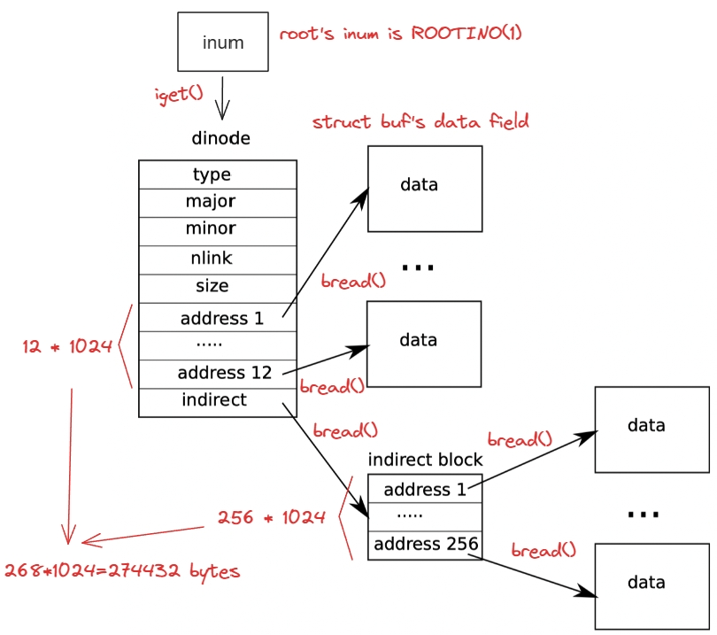

## File system

>必读资料：
>
>[Lec14 File systems (Frans)](https://mit-public-courses-cn-translatio.gitbook.io/mit6-s081/lec14-file-systems-frans)
>
>[Lec15 Crash recovery (Frans)](https://mit-public-courses-cn-translatio.gitbook.io/mit6-s081/lec15-crash-recovery-frans)
>
>[Chapter9 File System(I)](https://cactus-agenda-c84.notion.site/Chapter9-File-System-I-8b57997c4e66455c8bd6d89d5ec62cbb)
>
>[Lecture Notes - Xiao Fan's Personal Page](https://fanxiao.tech/posts/2021-03-02-mit-6s081-notes/#110-overview)
>
>[xv6-riscv-文件系统 | Banbao](https://banbao991.github.io/2021/06/07/OS/xv6-source-code/05-FileSystem/)

### 0. Overview

文件系统：组织并存储数据。

文件系统的特性：

- 需要一个存储文件夹和文件的数据结构来记录存储文件内容的硬盘块的 `ID` ，并且记录磁盘的哪些部分是空闲的

- 在不同的用户和应用程序之间共享数据
- 数据在重启/意外崩溃之后依然保持原样
- 由于访问硬盘速度远慢于访问内存，因此文件系统必须在内存里设置一个对经常访问的文件内容的缓存区。

`xv6` 文件系统的组织架构


- **`disk` 层 (`kernel/virtio_disk.c`)：**对 `virtio` 硬盘上的文件块进行读写操作
- **`buffer cache` 层 (`kernel/bio.c`)：**对磁盘文件块进行缓存，并确保只有 1 个内核进程能在一段时间内修改文件块上存储的数据。
- **`logging` 层 (`kernel/log.c`)：**让更高的层级能够将对文件块的所有 `update` 打包到一个 **`transaction`** 中，从而能保证所有文件块能够在将要崩溃时原子地进行 `update`
- **`inode` 层 (`kernel/fs.c`)：**为每个文件提供一个独一无二的 **`inode number`**
- **`directory` 层 (`kernel/fs.c`)：**将每个文件夹作为一个特殊的 `inode`，这个 `inode` 的内容是文件夹 `entry`
- **`pathname` 层 (`kernel/fs.c`)：**将文件夹组织为层级，并通过递归查找来解析路径
- **`file descriptor` 层 (`kernel/file.c`)：**将管道、设备等 `UNIX` 资源用文件系统进行抽象


### 1. Disk layer

>  **`kernel/virtio_disk.c`**


文件系统将磁盘分为了几个部分，每个部分的最小单元是 `block`，一个 `block` 的大小为 1024 字节，如下图所示


- **`block 0`：** 启动区域，文件系统不会使用，包含了操作系统启动所需要的代码
- **`blcok 1`：** **`superblock`**，存储了文件系统的元数据（`block` 的大小、`block` 的数目、`inode` 的数目等），里面有一个 `mkfs` 的程序，用来构建初始的文件系统
- **`block 2-31`：** `log block`
- **`block 32-44`：** `inode`，一个 `inode` 的大小为 64 字节，一个 `block` 的大小为 1024 字节，因此 `block32` 为 `inode 1-16`，`block33` 为 `inode 17-32`
- **`block 45`：**`bitmap block`，用来跟踪哪些 `block` 是在使用
- 最后从 `block 70` 开始是 `data block`，要么是在 `bitmap` 中被标记为空闲状态，要么存储了文件/文件夹的内容

### 2. Buffer cache layer

> **`kernel/bio.c`**


`buffer cache` 层有两个作用：

1. 将对磁盘块的访问权限进行同步，保证内存中只保存一个该磁盘块的拷贝，且一次只有一个内核线程访问这个拷贝，但同时可以有多个对这个 `block` 的引用
2. 将被频繁访问的块缓存到内存中

`buffer cache` (`bcache` 结构体)中的`buf`数量是一定的 (`NBUF`)，因此当新的文件块需要加入缓冲区时，需要将最早使用的缓冲区中的文件块替换为新的文件块。缓冲区的使用早晚通过 `head` 来判断。

`buffer cache` 本身是一个双向链接的链表，链表元素为 `buf` 结构体，具体结构如下

```c++
struct buf {
  int valid;   // has data been read from disk?
  int disk;    // does disk "own" buf?
  uint dev;
  uint blockno;
  struct sleeplock lock;
  uint refcnt;
  struct buf *prev; // LRU cache list
  struct buf *next;
  uchar data[BSIZE];
};
```

`binit()` 如下

```c++
void
binit(void)
{
  struct buf *b;

  initlock(&bcache.lock, "bcache");

  // Create linked list of buffers
  bcache.head.prev = &bcache.head;
  bcache.head.next = &bcache.head;
  for(b = bcache.buf; b < bcache.buf+NBUF; b++){
    b->next = bcache.head.next;
    b->prev = &bcache.head;
    initsleeplock(&b->lock, "buffer");
    bcache.head.next->prev = b;
    bcache.head.next = b;
  }
}
```

`buffer cache` 层的接口函数有 2 个，分别是 `bread()` 和 `bwrite()`

```c++
// Return a locked buf with the contents of the indicated block.
struct buf*
bread(uint dev, uint blockno)
{
  struct buf *b;

  b = bget(dev, blockno);
  if(!b->valid) {
    virtio_disk_rw(b, 0);
    b->valid = 1;
  }
  return b;
}
```

`bread` 通过 `bget` 获取一个指定了设备 `dev` 和 `blockno` (磁盘号) 的 `buf *`，这是从硬盘指定的块中获取的一个缓冲数据结构体，保存在内存中，可以进行修改

```c++
// Look through buffer cache for block on device dev.
// If not found, allocate a buffer.
// In either case, return locked buffer.
static struct buf*
bget(uint dev, uint blockno)
{
  struct buf *b;

  acquire(&bcache.lock);

  // Is the block already cached?
  for(b = bcache.head.next; b != &bcache.head; b = b->next){
    if(b->dev == dev && b->blockno == blockno){
      b->refcnt++;
      release(&bcache.lock);
      acquiresleep(&b->lock);
      return b;
    }
  }

  // Not cached.
  // Recycle the least recently used (LRU) unused buffer.
  for(b = bcache.head.prev; b != &bcache.head; b = b->prev){
    if(b->refcnt == 0) {
      b->dev = dev;
      b->blockno = blockno;
      b->valid = 0;
      b->refcnt = 1;
      release(&bcache.lock);
      acquiresleep(&b->lock);
      return b;
    }
  }
  panic("bget: no buffers");
}
```

`bget()` 先查看需要 `buffer` 的文件块是否已经在 `bcache`中，如果没有，就将 `LRU buf` 替换为这个新的文件块。`b->valid=0` 说明这个 `buf` 是刚刚被替换掉的而不是本来就有的，因此要让 `bread()` 从硬盘中再加载一下相应 `block` 中的数据到这个 `buf` 中。`bcache.lock` 负责保护哪些 `block` 被缓存的信息，而 `b->lock` 负责对这个缓存块的读写行为进行保护。`acquiresleep` 是获取这个锁之后立即让这个进程进入睡眠，这是因为当获取着锁的时候会 `disable` 掉中断，这样就永远也无法听到来自硬盘的中断

```c++
// Write b's contents to disk.  Must be locked.
void
bwrite(struct buf *b)
{
  if(!holdingsleep(&b->lock))
    panic("bwrite");
  virtio_disk_rw(b, 1);
}
```

向硬盘指定块中写入数据。`struct buf` 中已经保存了 `dev` 和 `blockno` 等数据，因此可以直接调用 `virtio_disk_rw(b,1)` 进行写入。`brelse` 负责释放 `bread` 中返回的 `buf` 的锁。当发现指向这个 `buf` 的 `reference` 变为 0 时，将其移动到双向链表的最开头。

```c++
// Release a locked buffer.
// Move to the head of the most-recently-used list.
void
brelse(struct buf *b)
{
  if(!holdingsleep(&b->lock))
    panic("brelse");

  releasesleep(&b->lock);

  acquire(&bcache.lock);
  b->refcnt--;
  if (b->refcnt == 0) {
    // no one is waiting for it.
    b->next->prev = b->prev;
    b->prev->next = b->next;
    b->next = bcache.head.next;
    b->prev = &bcache.head;
    bcache.head.next->prev = b;
    bcache.head.next = b;
  }
  
  release(&bcache.lock);
}
```

#### 2.1 Block allocator

文件和文件夹都存储在磁盘块中，磁盘块必须从一个空闲池中进行分配。

**真正的数据 (即磁盘内容) 都存储在 `struct buf` 中的 `data` 字段**

`block allocator` 为磁盘的是否空闲的状态准备了一个 `bitmap`，每一位对应一个磁盘块，0 表示空闲 1 表示正在使用，`mkfs` 负责设置这些位。

`balloc` 负责分配新的磁盘块，`bfree` 负责释放磁盘块

```c++
// Allocate a zeroed disk block.
static uint
balloc(uint dev)
{
  int b, bi, m;
  struct buf *bp;

  bp = 0;
  for(b = 0; b < sb.size; b += BPB){
    bp = bread(dev, BBLOCK(b, sb));
    for(bi = 0; bi < BPB && b + bi < sb.size; bi++){
      m = 1 << (bi % 8);
      if((bp->data[bi/8] & m) == 0){  // Is block free?
        bp->data[bi/8] |= m;  // Mark block in use.
        log_write(bp);
        brelse(bp);
        bzero(dev, b + bi);
        return b + bi;
      }
    }
    brelse(bp);
  }
  panic("balloc: out of blocks");
}
```

`balloc` 最外层循环读取每个 `bitmap bit` 所代表的 `block`（`BPB` 是一个 `Block` 的 `bit` 数目，`BBLOCK` 负责把 `bit` 转化为 `blockno`），内循环负责检查所有 `BPB` 位，查看这个 `block` 是否空闲

---

### 3. Logging layer

> **`kernel/log.c`**


由于很多对文件系统的操作都涉及了对硬盘的多次写入，当某次写入后发生崩溃将导致文件系统出现问题。`xv6` 通过 `logging` 来解决这个问题，`xv6` 的 `syscall` 不会直接对硬盘上的 `block` 进行写入，而是将所有想要进行的对硬盘的写入操作的描述放到 `log` 中，当 `syscall` 将所有的写入操作都放到 `log` 后向硬盘写入一个 **`commit`** 记录来表示这个 `log` 已经记录了所有的操作，然后 `syscall` 进行全部的写入操作，并将硬盘上的 `log` 全部清除。

当操作系统崩溃后进行重启，将在进行任何进程之前从崩溃中恢复。如果在对硬盘的所有写入操作 `commit` 之前发生了崩溃，那么这个 `log` 将被视为不完整的 `log`，`xv6` 将直接忽略这个 `log`，如果崩溃发生在 `commit` 之后，说明这个 `log` 是完整的，则恢复系统将重复这些步骤，最后删除 `log`。

#### 3.1 Log design

`log` 位于硬盘上的 `log block` 中，由一个 `header block` 和后面的一系列被 `log` 的 `block` 的 `copy` 组成。`header block` 中记录了所有被 `log` 的 `block` 的 `blockno` 和 `log block` 的总数 `count`。`xv6` 只有在一个 `transaction commits` 时才向 `header block` 写入，并在将 `logged block copy` 写入到文件系统中的 `logged block` 后将 `count` 归零。

为了支持不同的进程对文件系统同时的操作，可以将多个 `syscall` 对硬盘的写入打包到一个 `transaction` 当中，因此 `commit` 必须保证当前没有 `syscall`

**`group commit`** 可以将多个不同进程的 `syscall` 的 `transaction` 放在一起进行 `commit`。

由于 `log block` 有数量限制，因此一个 `syscall` 能够写入的 `block` 数量也同样有限制，比如 `sys_write` 将一个 `write` 分成了好几个 `transaction` 以 `fit log`。

- **`write ahead`** 规则：只有所有被修改的 `buffer` 都被写入到了 `log block` 才能开始向文件系统中的 `home location` 写入 `block`
- **`freeing`** 规则：直到所有的 `log block` 都被写入了 `home location`，并且消除了 `header block`，才能开始修改或者释放 `log block`

#### 3.2 Code: Logging

在 `syscall` 中对 `log` 使用的典型流程：

```c++
begin_op();
...
bp = bread();
bp->data = ...;
log_write(bp);
...
end_op();
```

`begin_op` 将等待直到当前 `logging` 系统不再 `committing` 且有足够的空余 `log block` 能够容纳这次 `syscall` 中所有的写入，`log.outstanding` 是需要进行 `block` 写入但是还没有调用 `log_write` 的 `syscall` 的个数，因此也记录了目前预定了 `log space` 的 `syscall` 的个数，`MAXOPBLOCKS` 是一个 `syscall` 最高可以使用的 `log block`

```c++
// called at the start of each FS system call.
void
begin_op(void)
{
  acquire(&log.lock);
  while(1){
    if(log.committing){
      sleep(&log, &log.lock);
    } else if(log.lh.n + (log.outstanding+1)*MAXOPBLOCKS > LOGSIZE){
      // this op might exhaust log space; wait for commit.
      sleep(&log, &log.lock);
    } else {
      log.outstanding += 1;
      release(&log.lock);
      break;
    }
  }
}
```

`log_write` 在完成对 `buf` 的修改之后，需要实现 `bwrite` 的功能，但是先要在 `log block` 中给传入的这个 `buf` 预留一个位子，并且将这个 `buf` `pin` 在 `buffer cache` 中（此时这个传入的 `buf` 还没有被写入 `log block` 中，因此它还是修改后的 `block` 的唯一拷贝，因此不能让其在 `buffer cache` 中被 `evict` 掉）。当一个 `transaction` 中对同一个 `block` 进行了多次读写操作时，不会另外预留 `log block`，这叫做 **`log absorption`**。

```c++
// Caller has modified b->data and is done with the buffer.
// Record the block number and pin in the cache by increasing refcnt.
// commit()/write_log() will do the disk write.
//
// log_write() replaces bwrite(); a typical use is:
//   bp = bread(...)
//   modify bp->data[]
//   log_write(bp)
//   brelse(bp)
void
log_write(struct buf *b)
{
  int i;

  if (log.lh.n >= LOGSIZE || log.lh.n >= log.size - 1)
    panic("too big a transaction");
  if (log.outstanding < 1)
    panic("log_write outside of trans");

  acquire(&log.lock);
  for (i = 0; i < log.lh.n; i++) {
    if (log.lh.block[i] == b->blockno)   // log absorbtion
      break;
  }
  log.lh.block[i] = b->blockno;
  if (i == log.lh.n) {  // Add new block to log?
    bpin(b);
    log.lh.n++;
  }
  release(&log.lock);
}
```

`end_op` 先要减少 `outstanding syscall` 的数量，如果该数量被减为了 0（即所有的 `syscall` 都已经完成了 `log_write`），则调用 `commit()` 来将当前的 `transaction commit` 掉。

```c++
// called at the end of each FS system call.
// commits if this was the last outstanding operation.
void
end_op(void)
{
  int do_commit = 0;

  acquire(&log.lock);
  log.outstanding -= 1;
  if(log.committing)
    panic("log.committing");
  if(log.outstanding == 0){
    do_commit = 1;
    log.committing = 1;
  } else {
    // begin_op() may be waiting for log space,
    // and decrementing log.outstanding has decreased
    // the amount of reserved space.
    wakeup(&log);
  }
  release(&log.lock);

  if(do_commit){
    // call commit w/o holding locks, since not allowed
    // to sleep with locks.
    commit();
    acquire(&log.lock);
    log.committing = 0;
    wakeup(&log);
    release(&log.lock);
  }
}
```

`commit `分成四个阶段

```c++
static void
commit()
{
  if (log.lh.n > 0) {
    write_log();     // Write modified blocks from cache to log
    write_head();    // Write header to disk -- the real commit
    install_trans(0); // Now install writes to home locations
    log.lh.n = 0;
    write_head();    // Erase the transaction from the log
  }
}
```

- **`write_log` 将所有被修改了的 `block` (`buf`)写入到 `log block` 中**

  ```c++
  // Copy modified blocks from cache to log.
  static void
  write_log(void)
  {
    int tail;
  
    for (tail = 0; tail < log.lh.n; tail++) {
      struct buf *to = bread(log.dev, log.start+tail+1); // log block
      struct buf *from = bread(log.dev, log.lh.block[tail]); // cache block
      memmove(to->data, from->data, BSIZE);
      bwrite(to);  // write the log
      brelse(from);
      brelse(to);
    }
  }
  ```

- **`write_head` 将 `header block` 写入到硬盘中，其中包括 `log block` 的总数 `log.lh.n` 和每个 `log block` 接下来需要写入到的 `data block` 的 `blockno`，这是一个 `commit` 真正开始的节点。**

  ```c++
  // Write in-memory log header to disk.
  // This is the true point at which the
  // current transaction commits.
  static void
  write_head(void)
  {
    struct buf *buf = bread(log.dev, log.start);
    struct logheader *hb = (struct logheader *) (buf->data);
    int i;
    hb->n = log.lh.n;
    for (i = 0; i < log.lh.n; i++) {
      hb->block[i] = log.lh.block[i];
    }
    bwrite(buf);
    brelse(buf);
  }
  ```

- **`install_trans `将 `log block` 写入到需要写入的 `home data block` 中**

  ```c++
  // Copy committed blocks from log to their home location
  static void
  install_trans(int recovering)
  {
    int tail;
  
    for (tail = 0; tail < log.lh.n; tail++) {
      struct buf *lbuf = bread(log.dev, log.start+tail+1); // read log block
      struct buf *dbuf = bread(log.dev, log.lh.block[tail]); // read dst
      memmove(dbuf->data, lbuf->data, BSIZE);  // copy block to dst
      bwrite(dbuf);  // write dst to disk
      if(recovering == 0)
        bunpin(dbuf);
      brelse(lbuf);
      brelse(dbuf);
    }
  }
  ```

- **最后将 `log header` 中的 `count` 变为 0**

`recover_from_log` 在 `initlog` 中被调用，每次操作系统重启之前都将调用一次。它调用 `install_trans(1)`，当 `log.ln.n` 不为 0 时将重新进行一次将 `log block` 写入到 `data block` 中。

---

### 4. Inode layer

> **`kernel/fs.c`**


```c++
#define T_DIR     1   // Directory
#define T_FILE    2   // File
#define T_DEVICE  3   // Device
```

`inode` 用来表示一个文件、一个目录或一个设备，无论是存储什么类型的数据 `inode->addrs[0~11]` 都是直接映射，其值一个磁盘号，通过 `bread` 可以获取该磁盘号对应的磁盘在内存上的缓存 (缓存的数据类型就是 `struct buf`)；而 `inode->addrs[12]` 是间接映射，指向的一个存储磁盘号的数组的首地址，该数组中一共有 256 个空间，即拥有 256 个磁盘号；获取到对应缓存数据后 (`struct buf`)，`inode` 的真正的数据就存储在 `buf` 的 `data` 字段中

- 如果是文件，则 `inode->type` 为 `T_DIR`，文件的内容就存储在 `struct buf` 中的 `data` 字段
- 如果是目录，则 `inode->type` 为 `T_FILE`，`data` 字段中存储的就是一个个的 `struct dirnet` 变量，每一个变量表示一个文件；目录中只是简单记录了每个文件的 `name` 和 `inum`
- 如果是设备，则 `inode->type` 为 `T_DEVICE`

**`inode`** 可能指代 2 种数据结构：

- **储存在硬盘上的数据结构 (`struct inode`)**，包含了 `inode` 类型、`inode` 指向的文件/文件夹大小、一个数据 `blockno` 的列表
- **存储在内存中的数据结构 (`struct dinode`)**，拥有 `on-disk inode` 的拷贝以及其他 `kernel` 需要的 `metadata`

`on-disk inode` 放在一个连续的区域内，这个区域有很多 `block`，叫做 `inode block`，每个 `inode` 大小相同，为 64 字节

`on-disk inode` 以 `struct dinode` 的形式定义

```c++
struct dinode {
  short type;           // File type
  short major;          // Major device number (T_DEVICE only)
  short minor;          // Minor device number (T_DEVICE only)
  short nlink;          // Number of links to inode in file system
  uint size;            // Size of file (bytes)
  uint addrs[NDIRECT+1];   // Data block addresses
};
```

`type` 指定了是文件、文件夹还是设备，`type == 0` 表示这个 `inode` 处于空闲状态。`nlink` 表示连接到这个 `inode` 的 `directory entry` 的个数，用来判断这个 `inode` 应该何时被释放。`size` 记录了这个文件/文件夹的大小，`addrs` 记录了这个 `inode` 拥有的文件内容分布在的 `disk block` 的所有 `blockno`

内存中的 `inode` 是 `active inodes`，用 `struct inode` 定义

```c++
// in-memory copy of an inode
struct inode {
  uint dev;           // Device number
  uint inum;          // Inode number
  int ref;            // Reference count
  struct sleeplock lock; // protects everything below here
  int valid;          // inode has been read from disk?

  short type;         // copy of disk inode
  short major;
  short minor;
  short nlink;
  uint size;
  uint addrs[NDIRECT+1];
};
```

所谓 `active inodes`，是指内存中有 C 指针指向了这个 `inode`，`ref` 是指向这个 `inode` 的指针数量，当 `ref == 0` 时 `kernel` 将把这个 `inode` 从内存中剔除。`iget` 函数和 `iput` 函数实现对 `inode pointer` 的获取和释放。

在 `inode` 层中总共有 4 种 `lock`：

- `icache.lock` 负责确保 1 个 `inode` 只在 `cache` 中出现最多 1 次 ，并且保证  `ref` 正确记录引用到这个 `inode` 的数量，因此对 `ref` 的修改都需要用 `icache.lock` 进行保护
- 每个 `inode` 自己也有 1 个 `lock` 来保护对 `inode` 成员变量以及 `inode` 指向的文件或文件夹的内容的保护
- `ref` 是内存中指向这个 `inode` 的个数，当 `ref` 大于 0 时，不会将这个 `inode` 从 `icache` 中剔除
- `nlink` 这个成员变量在 `on-disk inode` 中也存在，统计指向这个文件的 `directory entry` 的个数，当为 0 时将释放掉这个 `inode`

典型的调用顺序：

```c++
ip = iget(dev, inum);
ilock(ip);
...examine and modify ip->xxx
iunlock(ip);
iput(ip);
```

`iget` 返回了一个直到调用 `iput` 都有效的 `inode`，任何代码均可同时访问，因此可以有很多指针指向同一个 `inode`。`iget` 返回的 `inode` 可能没有任何有用的内容 (`valid == 0`)，因此需要调用 `ilock` 来从硬盘中读取内容，并将获取 `inode` 的锁。`iunlock` 释放 `inode` 的锁。将对 `inode` 的引用获取和对 `inode` 上锁分离开来，从而在查找路径等情况中避免死锁。

`inode cache` 主要目的是实现不同进程对 `inode` 访问的同步，`cache` 只是次要的，因为当 `inode` 被经常访问时，这个 `inode` 很可能会被保存在 `buffer cahce` 中。`inode cache` 是 **`write-through`** 的，当 `cache` 中的 `inode` 被修改，将会立即通过 `iupdate` 将修改写入到磁盘中。

#### 4.1 Code: inodes

`ialloc` 负责从硬盘上的 `inode blocks` 中寻找空闲的 `inode`，当找到之后将新的 `type` 写入到 `disk` 中然后通过调用 `iget` 返回一个内存中的 `inode`（将这个 `inode` 写入到 `inode cache`）中。

```c++
// Allocate an inode on device dev.
// Mark it as allocated by  giving it type type.
// Returns an unlocked but allocated and referenced inode.
// 每次只会有一个进程可以持有对 bp 的引用
struct inode*
ialloc(uint dev, short type)
{
  int inum;
  struct buf *bp;
  struct dinode *dip;

  // 遍历所有可能的 inode 编号，找到 inode 所在的 block，再看位于 block 中的 inode 数据的 type 字段
  for(inum = 1; inum < sb.ninodes; inum++){
    bp = bread(dev, IBLOCK(inum, sb));
    dip = (struct dinode*)bp->data + inum%IPB;
    // 如果是一个空闲的 inode
    if(dip->type == 0){  // a free inode
      memset(dip, 0, sizeof(*dip));
      dip->type = type;
      log_write(bp);   // mark it allocated on the disk
      brelse(bp);
      return iget(dev, inum);
    }
    brelse(bp);
  }
  panic("ialloc: no inodes");
}
```

`ialloc` 必须保证其他进程不会同时对这个 `inode` 进行读写，这是通过 `bp` 已经通过 `bget` 上了 `sleeplock` 来保证的。

`iget` 在 `inode cache` 中查找和传入的 `device`、`inode no` 相同的 `active entry`，如果找到了这个 `entry` 就返回对这个 `inode` 的一个新的指针，否则找到一个空的 `entry` 将其 `dev`、`inum` 等设置为对应的数值，并设置 `valid` 为 0 待后续从 `block` 中读取数据。

```c++
// Find the inode with number inum on device dev
// and return the in-memory copy. Does not lock
// the inode and does not read it from disk.
static struct inode*
iget(uint dev, uint inum)
{
  struct inode *ip, *empty;

  acquire(&icache.lock);

  // Is the inode already cached?
  empty = 0;
  for(ip = &icache.inode[0]; ip < &icache.inode[NINODE]; ip++){
    if(ip->ref > 0 && ip->dev == dev && ip->inum == inum){
      ip->ref++;
      release(&icache.lock);
      return ip;
    }
    if(empty == 0 && ip->ref == 0)    // Remember empty slot.
      empty = ip;
  }

  // Recycle an inode cache entry.
  if(empty == 0)
    panic("iget: no inodes");

  ip = empty;
  ip->dev = dev;
  ip->inum = inum;
  ip->ref = 1;
  ip->valid = 0;
  release(&icache.lock);

  return ip;
}
```

`iput` 将释放 1 个对 `inode` 的 C 指针，`ref--`，如果 `ref==0` 且 `nlink==0`（不在任何文件夹中出现），则释放掉这个 `inode`（`ip->type=0`）和它对应的所有 `data block`（通过 `itrunc`）。

```c++
// Drop a reference to an in-memory inode.
// If that was the last reference, the inode cache entry can
// be recycled.
// If that was the last reference and the inode has no links
// to it, free the inode (and its content) on disk.
// All calls to iput() must be inside a transaction in
// case it has to free the inode.
void
iput(struct inode *ip)
{
  acquire(&icache.lock);

  if(ip->ref == 1 && ip->valid && ip->nlink == 0){
    // inode has no links and no other references: truncate and free.

    // ip->ref == 1 means no other process can have ip locked,
    // so this acquiresleep() won't block (or deadlock).
    acquiresleep(&ip->lock);

    release(&icache.lock);

    itrunc(ip);
    ip->type = 0;
    iupdate(ip);
    ip->valid = 0;

    releasesleep(&ip->lock);

    acquire(&icache.lock);
  }

  ip->ref--;
  release(&icache.lock);
}
```


`on-disk inode` 结构 `dinode` 包括了一个 `size` 和 `NDIRECT+1` 个 `addr`，前 `NDIRECT` 个 `addr` 叫做 **`direct blocks`**，最后一个 `addr` 给出了 **`indirect block`** 的地址，因此一个文件的前12kB（`NDIRECT x BSIZE`）可以从 `inode` 中的 `direct block addr` 直接读取，后 256kB（`NINDIRECT x BSIZE`）可以通过 `indirect block addr` 翻译得到。因此 `xv6` 支持的最大的文件大小为 268kB

`bmap()` 负责获取 `inode` 中的第 n 块 `data block` 的地址。当 `bn<NDIRECT` 时直接返回 `ip->addrs[bn]`，如果没有这个地址就调用 `balloc` 分配一个 `data block`。当 `NDIRECT<bn<NINDIRECT` 时先 `bread(ip->dev, ip->addrs[NDIRECT])`，然后获取 `bp->data[bn-NDIRECT]`

```c++
// Return the disk block address of the nth block in inode ip.
// If there is no such block, bmap allocates one.
static uint
bmap(struct inode *ip, uint bn)
{
  uint addr, *a;
  struct buf *bp;

  if(bn < NDIRECT){
    if((addr = ip->addrs[bn]) == 0)
      ip->addrs[bn] = addr = balloc(ip->dev);
    return addr;
  }
  bn -= NDIRECT;

  if(bn < NINDIRECT){
    // Load indirect block, allocating if necessary.
    if((addr = ip->addrs[NDIRECT]) == 0)
      ip->addrs[NDIRECT] = addr = balloc(ip->dev);
    bp = bread(ip->dev, addr);
    a = (uint*)bp->data;
    if((addr = a[bn]) == 0){
      a[bn] = addr = balloc(ip->dev);
      log_write(bp);
    }
    brelse(bp);
    return addr;
  }

  panic("bmap: out of range");
}
```

---

### 5. Directory layer

> **`kernel/fs.c`**


文件夹和文件的实现非常类似，它的 `inode` 类型为 `T_DIR`，数据是许多 `directory entry`，每个 `entry` 的数据类型为 `struct dirent`，包含一个名称和 `inode number`

`dirlookup` 是在 `directoy` 中查找名称为 `name` 的 `directoy entry`

```c++
// Look for a directory entry in a directory.
// If found, set *poff to byte offset of entry.
struct inode*
dirlookup(struct inode *dp, char *name, uint *poff)
{
  uint off, inum;
  struct dirent de;

  if(dp->type != T_DIR)
    panic("dirlookup not DIR");

  for(off = 0; off < dp->size; off += sizeof(de)){
    if(readi(dp, 0, (uint64)&de, off, sizeof(de)) != sizeof(de))
      panic("dirlookup read");
    if(de.inum == 0)
      continue;
    if(namecmp(name, de.name) == 0){
      // entry matches path element
      if(poff)
        *poff = off;
      inum = de.inum;
      return iget(dp->dev, inum);
    }
  }

  return 0;
}
```

注意，`dirlookup` 正是 `iget` 没有直接对 `inode` 上锁的原因，因为在调用 `dirlookup` 的时候，实际上已经对 `dp` 上锁了，如果查找的 `directory entry` 是 `.`（当前文件夹 `/inode` 本身），那么会试图对 `dp` 再 `acquire` 一次锁，造成死锁。

`dirlink` 将一个新的 `directory entry` 写入文件夹 `dp` 中，查找 `dp` 中尚未分配的 `entry(inum==0)`，如果找到了就将 `off` 设置为这个 `entry` 的 `offset`，然后用 `writei` 写入，如果没有找到就将 `off` 设置为 `dp->size`，将这个 `entry` 加在最后。

 ```c++
 // Write a new directory entry (name, inum) into the directory dp.
 int
 dirlink(struct inode *dp, char *name, uint inum)
 {
   int off;
   struct dirent de;
   struct inode *ip;
 
   // Check that name is not present.
   if((ip = dirlookup(dp, name, 0)) != 0){
     iput(ip);
     return -1;
   }
 
   // Look for an empty dirent.
   for(off = 0; off < dp->size; off += sizeof(de)){
     if(readi(dp, 0, (uint64)&de, off, sizeof(de)) != sizeof(de))
       panic("dirlink read");
     if(de.inum == 0)
       break;
   }
 
   strncpy(de.name, name, DIRSIZ);
   de.inum = inum;
   if(writei(dp, 0, (uint64)&de, off, sizeof(de)) != sizeof(de))
     panic("dirlink");
 
   return 0;
 }
 ```

---

### 6. Pathname layer

> **`kernel/fs.c`**


`namei` 函数负责对 `pathname` 进行解析，并返回 `inode`。`namei` 调用了 `namex` 函数，`namex` 中传入了参数 `nameiparent`，当为 1 时返回的 `inode` 是传入 `path` 的父文件夹，并将最后的 `element` 名称复制到 `name` 中。`namex` 不断调用了 `skipelem`，一步步将当前的 `inode` 变为下一级 `inode`，直到得到最终需要的 `inode` 为止。注意：在每个循环中都要先进行 `ilock(ip)`，因为直到 `ilock` 才能保证 `ip->type` 从硬盘中读取

```c++
// Look up and return the inode for a path name.
// If parent != 0, return the inode for the parent and copy the final
// path element into name, which must have room for DIRSIZ bytes.
// Must be called inside a transaction since it calls iput().
static struct inode*
namex(char *path, int nameiparent, char *name)
{
  struct inode *ip, *next;

  if(*path == '/')
    ip = iget(ROOTDEV, ROOTINO);
  else
    ip = idup(myproc()->cwd);

  while((path = skipelem(path, name)) != 0){
    ilock(ip);
    if(ip->type != T_DIR){
      iunlockput(ip);
      return 0;
    }
    if(nameiparent && *path == '\0'){
      // Stop one level early.
      iunlock(ip);
      return ip;
    }
    if((next = dirlookup(ip, name, 0)) == 0){
      iunlockput(ip);
      return 0;
    }
    iunlockput(ip);
    ip = next;
  }
  if(nameiparent){
    iput(ip);
    return 0;
  }
  return ip;
}
```

由于 `namex` 中可能涉及到多个 `data block` 的 I/O，因此可能是比较耗时的，当一个 `kernel thread` 执行 `namex` 被 `disk I/O` 阻塞时，其他 `thread` 再执行 `namex` 查找不同的文件夹 `path` 时不会被阻塞。

---

### 7. File Disriptor layer

> **`kernel/file.c`**


`file descriptor layer` 可以让 `UNIX` 中的所有资源，包括设备 (比如 `console`) 来统一表示为文件。每个打开的文件 (`file descriptor`) 都用 `struct file` 来表示，这是一个 `pipe/inode/device` 的包装结构体。

```c++
struct file {
  enum { FD_NONE, FD_PIPE, FD_INODE, FD_DEVICE } type;
  int ref; // reference count
  char readable;
  char writable;
  struct pipe *pipe; // FD_PIPE
  struct inode *ip;  // FD_INODE and FD_DEVICE
  uint off;          // FD_INODE
  short major;       // FD_DEVICE
};
```

`system call` 调用一次 `open()` 将增加一个 `open file`，同一个 `file` 可以被多个不同的进程 `open`，出现在这些进程的 `file table` 中。`struct file` 中的 `reference count` 记录了同一个 `file` 被引用的次数。

所有打开的文件都保存在 `global file table`，即 `ftable` 中。

`filealloc` 负责在 `file table` 中分配一个文件，在 `ftable` 中扫描 `ref==0` 的 `file`，增加 `ref` 后返回这个 `file *`。

`filedup` 负责对这个 `file descriptor` 的 `ref++` 并返回这个文件的 `file *`。

`fileclose` 负责对 `file descriptor` 的 `ref--`，当 `ref==0` 时根据这个 `file` 的类型释放掉 `pipe` 或者 `inode`

```c++
// Close file f.  (Decrement ref count, close when reaches 0.)
void
fileclose(struct file *f)
{
  struct file ff;

  acquire(&ftable.lock);
  if(f->ref < 1)
    panic("fileclose");
  if(--f->ref > 0){
    release(&ftable.lock);
    return;
  }
  ff = *f;
  f->ref = 0;
  f->type = FD_NONE;
  release(&ftable.lock);

  if(ff.type == FD_PIPE){
    pipeclose(ff.pipe, ff.writable);
  } else if(ff.type == FD_INODE || ff.type == FD_DEVICE){
    begin_op();
    iput(ff.ip);
    end_op();
  }
}
```

`fileread` 和 `filewrite` 分别确认 `f->readable` 和 `f->writable` 是否允许当前的读写操作，然后再根据 `f->type` 是 `FD_PIPE/FD_DEVICE/FD_INODE` 进行对应的 `piperead`/`readi` 等操作。`fileread` 和 `filewrite` 都使用了 `f->off` 来指示当前的读写到了哪一个位置。

#### 7.1 Code: System calls

`sys_link` 和 `sys_unlink` 这两个 `syscall` 实现对 `inode` 增加或者删除引用

`sys_link` 传入一个参数 `old` 和一个参数 `new`，`new` 是需要链接到 `old` 的路径。`sys_link` 增加 `ip->nlink`，然后调用 `nameiparent` 查找到 `new` 的父文件夹，调用 `dirlink` 在父文件夹下创建一个名称为 `new` 的 `directory entry`，链接到 `old` 所代表的 `inode`。如果中间出现了错误，需要跳转到 `bad` 来减去 `ip->nlink`

```c++
// Create the path new as a link to the same inode as old.
uint64
sys_link(void)
{
  char name[DIRSIZ], new[MAXPATH], old[MAXPATH];
  struct inode *dp, *ip;

  if(argstr(0, old, MAXPATH) < 0 || argstr(1, new, MAXPATH) < 0)
    return -1;

  begin_op();
  if((ip = namei(old)) == 0){
    end_op();
    return -1;
  }

  ilock(ip);
  if(ip->type == T_DIR){
    iunlockput(ip);
    end_op();
    return -1;
  }

  ip->nlink++;
  iupdate(ip);
  iunlock(ip);

  if((dp = nameiparent(new, name)) == 0)
    goto bad;
  ilock(dp);
  if(dp->dev != ip->dev || dirlink(dp, name, ip->inum) < 0){
    iunlockput(dp);
    goto bad;
  }
  iunlockput(dp);
  iput(ip);

  end_op();

  return 0;

bad:
  ilock(ip);
  ip->nlink--;
  iupdate(ip);
  iunlockput(ip);
  end_op();
  return -1;
}
```

`sys_link` 为已经存在的 `inode` 创建一个新的 `directoy entry`，而 `create` 则是为一个新的 `inode` 创建一个新的 `directory entry`。`create` 首先调用 `nameiparent` 获取父文件夹，然后调用 `dirlookup` 来查看这个文件夹下是否已经存在同名的 `inode`，如果存在且调用这个 `create` 的是 `open` 来创建一个文件的话，那么直接返回这个 `inode`。如果这个名称不存在，则调用 `ialloc`。如果是 `mkdir` 调用的 `create`（即 `type==T_DIR`)，则要创建 `..` 和 `.` 作为对父级 `inode` 和当前 `inode` 的引用，最终将当前的 `name` `dirlink` 到当前 `inode`。

```c++
static struct inode*
create(char *path, short type, short major, short minor)
{
  struct inode *ip, *dp;
  char name[DIRSIZ];

  if((dp = nameiparent(path, name)) == 0)
    return 0;

  ilock(dp);

  if((ip = dirlookup(dp, name, 0)) != 0){
    iunlockput(dp);
    ilock(ip);
    if(type == T_FILE && (ip->type == T_FILE || ip->type == T_DEVICE))
      return ip;
    iunlockput(ip);
    return 0;
  }

  if((ip = ialloc(dp->dev, type)) == 0)
    panic("create: ialloc");

  ilock(ip);
  ip->major = major;
  ip->minor = minor;
  ip->nlink = 1;
  iupdate(ip);

  if(type == T_DIR){  // Create . and .. entries.
    dp->nlink++;  // for ".."
    iupdate(dp);
    // No ip->nlink++ for ".": avoid cyclic ref count.
    if(dirlink(ip, ".", ip->inum) < 0 || dirlink(ip, "..", dp->inum) < 0)
      panic("create dots");
  }

  if(dirlink(dp, name, ip->inum) < 0)
    panic("create: dirlink");

  iunlockput(dp);

  return ip;
}
```

`sys_open` 有两种模式，当 `O_CREATE flag` 置 1 时调用了 `create`，当置 0 时调用了 `namei` 来找到这个 `inode`，然后调用 `filealloc` 和 `fdalloc` 来分配 `struct file` 和 `file descriptor`。

---

### 8. Real world

`xv6` 中的 `buffer cache` 采用了一个非常简单的链表来对 `LRU` 进行剔除，但是实际的操作系统中采用了 `hash` 表和 `heap` 来进行 `LRU` 剔除，且加入了虚拟内存系统来支持 `memory-mapped` 文件。

在目录树中采用了线性扫描 `disk block` 的方式进行查找，在 `disk block` 较多的情况下会消耗很多时间，因此 `Windows` 的 `NTFS` 等文件系统将文件夹用 `balanced tree` 进行表示，以确保对数事件的查找。

`xv6` 要求文件系统只能有一个硬盘设备，但是现代操作系统可以采用 `RAID` 或者软件的方式来将很多硬盘组成一个逻辑盘

现代操作系统还应该具备的其他特性：`snapshots`、增量式备份。

---

### 9. 具体细节 (重要)

#### 9.1 mkfs 创建文件系统映像

`xv6` 中的根目录 (`/`) 是在 `mkfs/mkfs.c` 中被创建的

在 `Makefile` 中：

```makefile
fs.img: mkfs/mkfs README $(UEXTRA) $(UPROGS)
	mkfs/mkfs fs.img README $(UEXTRA) $(UPROGS)
```

`fs.img` 是 `xv6` 文件系统映像，可以看出来是通过 `mkfs/mkfs.c` 创建的

指令的命令相当于：

```shell
mkfs/mkfs fs.img README user/_cat user/_echo user/_forktest user/_grep user/_init user/_kill user/_ln user/_ls user/_mkdir user/_rm user/_sh user/_stressfs user/_usertests user/_grind user/_wc user/_zombie user/_symlinktest
```

而在 `xv6` 运行起来后，执行 `ls` 命令可以看到如下结果：

```shell
$ ls
.              1 1 1024
..             1 1 1024
README         2 2 2059
cat            2 3 23680
echo           2 4 22536
forktest       2 5 13296
grep           2 6 26912
init           2 7 23392
kill           2 8 22440
ln             2 9 22320
ls             2 10 25848
mkdir          2 11 22552
rm             2 12 22544
sh             2 13 40752
stressfs       2 14 23536
usertests      2 15 146640
grind          2 16 36912
wc             2 17 24632
zombie         2 18 21816
symlinktest    2 19 32464
bigfile        2 20 24072
console        3 21 0
```

这些内容就是 **根目录 (`/`)** 下的文件，根目录和这些文件 (包括 `.` 和 `..`) 都是被包含在由 `mkfs/mkfs.c` 创建的文件系统映像中的

这一节主要看一下 `mkfs/mkfs.c` 是如何创建文件系统映像 (`mkfs.img`) 的

主要看 `main()` 函数

```c++
  // argv[1] 为 fs.img
  fsfd = open(argv[1], O_RDWR|O_CREAT|O_TRUNC, 0666);
  if(fsfd < 0){
    perror(argv[1]);
    exit(1);
  }
 
  // 1 fs block = 1 disk sector
  // 这里是把 File system 的各区域进行划分
  nmeta = 2 + nlog + ninodeblocks + nbitmap;
  nblocks = FSSIZE - nmeta;

  sb.magic = FSMAGIC;
  sb.size = xint(FSSIZE);
  sb.nblocks = xint(nblocks);
  sb.ninodes = xint(NINODES);
  sb.nlog = xint(nlog);
  sb.logstart = xint(2);
  sb.inodestart = xint(2+nlog);
  sb.bmapstart = xint(2+nlog+ninodeblocks);

  // nmeta 70 (boot, super, log blocks 30 inode blocks 13, bitmap blocks 25) blocks 199930 total 200000
  printf("nmeta %d (boot, super, log blocks %u inode blocks %u, bitmap blocks %u) blocks %d total %d\n", nmeta, nlog, ninodeblocks, nbitmap, nblocks, FSSIZE);
```

上面的代码主要是在做一些准备工作，划分各个 `layer` 的大小，继续往下看

```c++
for(i = 0; i < FSSIZE; i++)
    wsect(i, zeroes);
```

`FSSIZE` 的大小为 200000，也就是 `fs.img` 一共有 200000 `bytes`，差不多是 200 MB

然后看一下 `wsect()` 这个方法

```c++
void
wsect(uint sec, void *buf)
{
  if(lseek(fsfd, sec * BSIZE, 0) != sec * BSIZE){
    perror("lseek");
    exit(1);
  }
  if(write(fsfd, buf, BSIZE) != BSIZE){
    perror("write");
    exit(1);
  }
}
```

其实就是先移动 `fs.img` 的光标到 `sec * BSIZE` 的位置，然后将 `buf` 写入到这个位置中

而 `zeroes` 这个数组为空，所以这里就是先用 0 填充 `fs.img` 整个文件，也是在为之后写数据做准备

```c++
  memset(buf, 0, sizeof(buf));
  memmove(buf, &sb, sizeof(sb));
  wsect(1, buf);
```

之后将 `sb` 写到了 `fs.img` 的 1024 字节开始的地方；也就是说前面预留了 1024 字节，这个 1024 字节就是 **`boot` 区域**，而 `sb` 是写到了 **`super` 区域**


```c++
  // 申请根目录，拿到根目录对应的 inum，注意这里是 T_DIR
  rootino = ialloc(T_DIR);
  assert(rootino == ROOTINO);

  // 向根目录中写入 .
  bzero(&de, sizeof(de));
  de.inum = xshort(rootino);
  strcpy(de.name, ".");
  iappend(rootino, &de, sizeof(de), 1);

  // 向根目录中写入 ..
  bzero(&de, sizeof(de));
  de.inum = xshort(rootino);
  strcpy(de.name, "..");
  iappend(rootino, &de, sizeof(de), 1);
```

上面这段代码首先是创建了根目录，将根目录的 `inum` 赋值给 `rootino`，这里 `rootino` 为 1

之后写入两个目录分别为 `.` 和 `..`，**并且 `.` 和 `..` 的 `inum` 都是 `rootino`**

注意这里是如何将目录写入到根目录的：

- 首先创建一个 `struct dirnet` 变量，然后记录 `dirnet.inum` 和 `dirnet.name`
- 之后通过 `iappend()` 将这个变量写到根目录下

可以看出，这里把 `.` 和 `..` 抽象成了一个 `struct dirnet` 变量（**很重要！！！**）

然后看一下 `ialloc()` 是如何申请 `inum` 的

```c++
uint ialloc(ushort type) {
  // freeinode 从 1 递增，所以根目录的 inum 为 1
  uint inum = freeinode++;
  // 创建 struct dinode 变量
  struct dinode din;

  bzero(&din, sizeof(din));
  din.type = xshort(type);
  din.nlink = xshort(1);
  din.size = xint(0);
  // 将 din 的内容同步到 fs.img 中
  winode(inum, &din);
  return inum;
}
```

之后，我们先来看一下 `rinode()` 和 `rsect()` 两个方法，之后重点看 `iappend()`

```c++
// Block containing inode i
#define IPB           (BSIZE / sizeof(struct dinode))
#define IBLOCK(i, sb)     ((i) / IPB + sb.inodestart)

// 通过 rinode() 拿到 inum 对应的 inode 并存到 ip 中
void rinode(uint inum, struct dinode *ip) {
  char buf[BSIZE];
  uint bn;
  struct dinode *dip;

  // IBLOCK(inum, sb) -> ((inum) / (1024 / sizeof(struct dinode)) + sb.inodestart)
  // 通过 inum 拿到对应的那块 inode block (sb.inodestart 为 32)
  // inode 区域一共有 13 个 inode block，每个 inode block 大小为 1024 字节
  // 并且每个 inode block 中都存储的是 struct dinode (16 字节)
  // 所以一个 inode block 中存储了 64 个 struct dinode
  // inum 从 1 开始，根目录的 inum 为 1，其他的依次递增
  // 首先 ((inum) / (1024 / sizeof(struct dinode)) 就是拿到当前的 inum 是在第几个 inode block，然后加上 32，因为 inode 区域是从 32 开始的
  bn = IBLOCK(inum, sb);
  
  // 调用 rsect，将 fs.img 文件光标移动到 bn*1024 处，然后读出 1024 字节的内容存到 buf 中
  rsect(bn, buf);
  
  // 这里将 buf 强转为 struct dinode 类型，验证上面说的话，inode block 中存储的都是 struct dinode
  // 加上 inum % IPB，就是拿到 inode block 这块中的第 inum 个 struct dinode
  dip = ((struct dinode*)buf) + (inum % IPB);
  // 赋值给 ip
  *ip = *dip;
}

void rsect(uint sec, void *buf) {
  if(lseek(fsfd, sec * BSIZE, 0) != sec * BSIZE){
    perror("lseek");
    exit(1);
  }
  if(read(fsfd, buf, BSIZE) != BSIZE){
    perror("read");
    exit(1);
  }
}
```

上面代码说的很详细了，就不再过多赘述了

现在我们来看一下 `iappend()`，这个函数 **很重要！！！**

```c++
// 找到 inum 对应的 inode，让后将 xp 的前 n 个字节写入到 inode 中
void iappend(uint inum, void *xp, int n) {
  char *p = (char*)xp;
  uint fbn, off, n1;
  struct dinode din;
  char buf[BSIZE];
  uint indirect[NINDIRECT];
  uint x;

  // 拿到 inum 对应的 inode
  rinode(inum, &din);
  off = xint(din.size);		// din.size 当前的 inode 已经写入了 din.size 字节内容了
  // printf("append inum %d at off %d sz %d\n", inum, off, n);
  while(n > 0){
    // inode 的内容也是分块的，每一块是 1024 字节 (因为 struct buf 的 data 字段为 1024 字节)
    // 这里是在找该将现在的内容写到第几块中
    fbn = off / BSIZE;
    assert(fbn < MAXFILE);		// 判断是否已经超出单个文件的最大容量 (268*1024 bytes)
     
    // inode->addrs[0 ~ 11] 是直接映射，inode->addrs[12] 是间接映射
    // 如果符合，说明是直接映射
    if(fbn < NDIRECT){
      if(xint(din.addrs[fbn]) == 0){
        // 找到空闲的 data block num
        // 之后会在 kernel/fs.c bmap() 中根据 off 查找对应的 data block num
        din.addrs[fbn] = xint(freeblock++);
      }
      x = xint(din.addrs[fbn]);
    } else {
      // 间接映射
      if(xint(din.addrs[NDIRECT]) == 0){
        // addrs[12] 还没有用过，所以要初始化
        // 通过 bitmap 位图找到一个空闲的磁盘号 freelock 分配给 addrs[12]
        // freeblock 是从 70 开始的，对应的是 data 区域的第一个 block
        din.addrs[NDIRECT] = xint(freeblock++);
      }
      // din.addrs 改变了，需要向 fs.img 中同步更新
      rsect(xint(din.addrs[NDIRECT]), (char*)indirect);
      // 第二层映射
      if(indirect[fbn - NDIRECT] == 0){
        // 同样，如果没有创建，就先分配一个 data block num
        indirect[fbn - NDIRECT] = xint(freeblock++);
        // 同步更新
        wsect(xint(din.addrs[NDIRECT]), (char*)indirect);
      }
      // x 是我们要写入的那个磁盘的磁盘号
      x = xint(indirect[fbn-NDIRECT]);
    }
    n1 = min(n, (fbn + 1) * BSIZE - off);
    // 首先将磁盘上原来的数据读到 buf 中
    rsect(x, buf);
    // 将数据追加到原来数据的末尾
    bcopy(p, buf + off - (fbn * BSIZE), n1);
    // 重新写入
    wsect(x, buf);
    n -= n1;
    off += n1;
    p += n1;
  }
  din.size = xint(off);
  // 同步更新 fs.img
  winode(inum, &din);
}
```

上面解释的很详细，总结一下就是先初始化 `fs.img` 然后将 `.` 和 `..` 抽象成 `struct dirnet` 后写入到根目录中

我们继续往下看：

>创建文件系统 `fs.img` 的命令：
>
>```shell
>mkfs/mkfs fs.img README user/_cat user/_echo user/_forktest user/_grep user/_init user/_kill user/_ln user/_ls user/_mkdir user/_rm user/_sh user/_stressfs user/_usertests user/_grind user/_wc user/_zombie user/_symlinktest
>```

```c++
  // argv[i]: _cat, _echo ...
  // 写入每个文件，也就是输入 ls 显示的内容
  for(i = 2; i < argc; i++){
    // get rid of "user/"
    char *shortname;
    if(strncmp(argv[i], "user/", 5) == 0)
      shortname = argv[i] + 5;
    else
      shortname = argv[i];
    
    assert(index(shortname, '/') == 0);

    // 依次打开 _cat，_echo ... 文件 (在 user 目录下)
    if((fd = open(argv[i], 0)) < 0){
      perror(argv[i]);
      exit(1);
    }

    // Skip leading _ in name when writing to file system.
    // The binaries are named _rm, _cat, etc. to keep the
    // build operating system from trying to execute them
    // in place of system binaries like rm and cat.
    if(shortname[0] == '_')
      shortname += 1;

    // 为要写入的文件分配一个 inum，这里 传入的类型是 T_FILE
    inum = ialloc(T_FILE);

    bzero(&de, sizeof(de));
    // 记录当前文件的 inum
    de.inum = xshort(inum);
    strncpy(de.name, shortname, DIRSIZ);
    // inode type 为 T_DIR 的，则 inode 存储的都是 struct dirent 变量
    // 一个 struct dirent 代表一个文件，记录了文件的 inum 和 name
    // 通过 inum 可以找到文件真正的内容:
    // ((struct dinode *)(bread(inode->dev, IBLOCK(inode->inum, sb))))->addrs
    // 首先将该文件对应的 struct dirnet 存到 rootino 对应的 inode block 中
    iappend(rootino, &de, sizeof(de));

    // 之后将文件真正的内容存到 inum 对应的 inode block 中
    while((cc = read(fd, buf, sizeof(buf))) > 0)
      iappend(inum, buf, cc);

    close(fd);
  }
```

上面讲的很详细，这里主要说一点：

对于一个文件来说，存到文件系统中是分为两部分的：

- **第一部分是将文件的 `inum` 和 `name` 抽象成 `struct dirnet` 类型的一个变量 `de` 后存储到了根目录对应的 `inode block` 中**
- **第二部分是将文件真正的内容存到了 `de.inum` 对应的 `inode block` 中**

注意这里存到了两个不同的 `inode block` 中

**在想要读取文件真正内容的时候：**

- **首先要读取根目录对应的 `inode block`，根据强转为 `struct dirnet` 类型 `de` 后，通过 `de.name` 判断该 `struct dirnet` 是否是我们想要找的文件**
- **之后拿到 `de.inum` 找到对应的 `inode block`，而该 `inode block` 才是文件真正存储内容的地方**

> 通过 `inum` 拿到的 `inode block`，其类型是 `struct buf`，`buf.data` 存储了真正的数据 (`struct dirnet` 或者是 文件真正的内容)

以上就是 `mkfs.c` 创建文件系统映像的整个过程

#### 9.2 xv6 加载文件系统映像

**`xv6` 加载文件系统映像过程**

> **约定：**根目录对应的 `inode` 称为 `root_inode`

- 首先在 `proc.c userinit()` 中通过 `p->cwd = namei("/");` 去加载根目录

```shell
# 在 p->cwd = namei("/") 处打断点
(gdb) b proc.c:236
Breakpoint 1 at 0x80001cc4: file kernel/proc.c, line 236.
(gdb) c
Continuing.

Breakpoint 1, userinit () at kernel/proc.c:236
236       p->cwd = namei("/");
(gdb) s
namei (path=path@entry=0x800081f0 "/") at kernel/fs.c:770
770       return namex(path, 0, name);
(gdb) s
namex (path=path@entry=0x800081f0 "/", nameiparent=nameiparent@entry=0, name=name@entry=0x8000a120 <stack0+4000> "") at kernel/fs.c:735
735       if(*path == '/')

# 发现是通过 iget 获取根目录对应的 inode
# 根目录的设备为 ROOTDEV (1), inum 为 ROOTINO (1)
(gdb) n
736         ip = iget(ROOTDEV, ROOTINO);

# 之后没有做别的事情，直接返回到 userinit 了
(gdb) 
740       while((path = skipelem(path, name)) != 0){
(gdb) 
758       if(nameiparent){
(gdb) 
userinit () at kernel/proc.c:238
238       p->state = RUNNABLE;
```

> 可以发现在 `iget` 方法中只对  `root_inode` 的 `dev`、`inum`、`ref`、`valid` 字段赋值了，但其实最终要的 `type`、`size`、`addrs` 等字段都没有被赋值。所以要找到是在什么地方被赋值的

- 以 `root_inode->type` 为例，通过 `gdb` 监视这个 `root_inode->type`，找到该变量什么时候发生改变的

```shell
# 首先拿到 type 变量的地址
(gdb) p &p->cwd->type
$2 = (short *) 0x8001ac1c <icache+92>

# watch 该地址
(gdb) watch *0x8001ac1c
Hardware watchpoint 2: *0x8001ac1c
(gdb) c
Continuing.

Hardware watchpoint 2: *0x8001ac1c

Old value = 0		# type 初值为 0
New value = 1		# 现在为 1，代表的是 T_DIR
ilock (ip=ip@entry=0x8001abd8 <icache+24>) at kernel/fs.c:323
323         ip->major = dip->major;

# 查看调用堆栈。可以发现源头是 initcode.S，最终调用了 ilock 方法，在 ilock 中给 root_inode 其他字段进行赋值
(gdb) bt
#0  ilock (ip=ip@entry=0x8001abd8 <icache+24>) at kernel/fs.c:323
#1  0x0000000080003db2 in namex (path=0x3fffffdf15 "", path@entry=0x3fffffdf10 "/init", nameiparent=nameiparent@entry=0, 
    name=name@entry=0x3fffffdbd0 "init") at kernel/fs.c:741
#2  0x0000000080003f14 in namei (path=path@entry=0x3fffffdf10 "/init") at kernel/fs.c:770
#3  0x0000000080004c64 in exec (path=path@entry=0x3fffffdf10 "/init", argv=argv@entry=0x3fffffde10) at kernel/exec.c:26
#4  0x0000000080005b2c in sys_exec () at kernel/sysfile.c:482
#5  0x0000000080002b18 in syscall () at kernel/syscall.c:142
#6  0x0000000080002802 in usertrap () at kernel/trap.c:67
#7  0x0505050505050505 in ?? ()
(gdb) n 7
330         if(ip->type == 0)

# 打印 root_inode
(gdb) p *ip
$3 = {dev = 1, inum = 1, ref = 2, lock = {locked = 1, lk = {locked = 0, name = 0x80008650 "sleep lock", cpu = 0x0}, name = 0x80008588 "inode", pid = 1}, valid = 1, type = 1, major = 0, minor = 0, nlink = 1, size = 1024, addrs = {70, 0 <repeats 12 times>}}
```

> 这里可以看到 `root->inode->addrs` 的值为 `addrs = {70, 0 <repeats 12 times>}}`，可以发现 `root_inode` 其实只使用了 `addrs[0]`，而 `addrs[1] ~ addrs[12]` 并没有使用，并且 `addrs[0] = 70`，指向的是磁盘号为 70 的那块磁盘

- 在赋值之前还有这么两句

  ```c++
  #define IBLOCK(i, sb)     ((i) / IPB + sb.inodestart)
  
  // ip->dev 为 1 (ROOTDEV), IBLOCK(ip->inum, sb) 为 32，bread 返回就是第一个 inode block
  bp = bread(ip->dev, IBLOCK(ip->inum, sb));
  // 磁盘(即文件)真正的数据都是存在 struct buf 中的 data 数组中的
  // 可以发现第一个 inode block 的数据是 struc dinode 类型的，被存储在 ((struct dinode *)bp->data)[ip->inum % IPB] 中
  dip = (struct dinode *)bp->data + ip->inum % IPB;
  ```

  - `struct inode` 中 `inum` 字段代表的是 `Inode number`。而 `IBLOCK(ip->inum, sb)` 就是 **`inode block` 的磁盘号**
  - `struct inode` 中 `addrs` 字段 **指向的地址** 存储了当前 `inode` (目录或文件) 真正的数据，而 `addrs[0~11]` 是直接映射，其值代表的是 **`data block` 的磁盘号**，`addrs[12]` 是间接映射
  - 如果 `inode` 是 **目录**，则 `addrs` 指向的磁盘中 (`struct buf` 中的 `data` 字段) 存储的就是当前目录下所有的文件，**类型是 `struct dirent`** (将 `uchar` 强转为 `struct dirnet`)
  - 如果 `inode` 是 **文件**，则 `addrs` 指向的磁盘中存储的就是文件的内容，类型就是 `sturct buf` 中 `data` 字段的类型 (`uchar`)

---

#### 9.3 dirlookup 过程

**涉及的函数及原型：**

```c++
// 在 dp 中查找名字为 name 文件，返回其对应的 inode
struct inode *dirlookup(struct inode *dp, char *name, uint *poff);

// 在 ip 中偏移量为 off 的位置读取 n 个字节到 user_dst/dst
int readi(struct inode *ip, int user_dst, uint64 dst, uint off, uint n);

// 根据 直接/间接 映射的规则返回 ip->addrs[bn] (磁盘号)，如果为空，则先 balloc
static uint bmap(struct inode *ip, uint bn);

// 在位图中找到一个空闲的索引(即磁盘号) 分配给 dev
static uint balloc(uint dev);

// 获取 bmap 返回的磁盘号对应的那块缓存(struct buf)
struct buf *bread(uint dev, uint blockno);

// 根据 dev 和 inum 获取对应的 inode (如果 icache 中没有则存储)
static struct inode *iget(uint dev, uint inum);
```

> **注意！**
>
> 根目录 (`'/'`) 的 `inum` 为 1 (`ROOTINO`)，对应的 `dev` 为 1(`ROOTDEV`)
>
> - 通过 `struct inode *ip = iget(ROOTDEV, ROOTINO);` 可以拿到根目录对应的 `inode`
>
> 当 `inode->type` 为 `T_DIR`，代表当前的 `inode` 是一个目录，而在 `xv6` 中无论 `inode` 是 目录 (`T_DIR`) 还是 文件 (`T_FILE`)，真正的内容都存储在 `inode->addrs` 指向的那块磁盘中；`inode->addrs` 就是一个 `uint` 变量，是一个整数，代表的是一个磁盘号，通过 `bread(ip->dev, inode->addrs)` 可以拿到对应的磁盘 (数据类型为 `struct buf`)，而真正的数据都存在了 `struct buf` 的 `data` 字段；**`data`** 字段大小为 1024 字节
>
> - 如果 `inode->type` 是目录 (`T_DIR`)，则 `data` 字段中存储的都是一个个 `struct dirnet` 变量，一个 `struct dirnet` 变量代表一个文件，但是 `struct dirnet` 中只记录了文件的 `inum` 和 `name` 字段，通过 `dirnet.inum` 可以拿到文件的 `finode`，而这个 `finode` 其实才是文件真的 `inode`，因为此时的 `finode->type` 为文件 (`T_FILE`)
> - 如果 `inode->type` 是文件 (`T_FILE`)，则 `data` 字段中存储的就是文件真正的内容
>
> 由于 `data` 字段是 1024 字节，所以文件也会被分块，而 `finode->addrs[13]` 中 `addrs[0 ~ 11]` 都是直接映射，`addrs[12]` 是间接 (双重) 映射
>
> **故 `xv6` 中支持的最大文件大小为：`12 * 1024 + 256 * 1024 = 268 * 1024 = 274432 bytes` (与 Lab1 相关)** 
>
> 

**流程图：**


**第一步**

> 一个 `struct inode` 表示一个文件，文件真正的数据存储在 `inode->addrs` 中
>
> 
>
> - 其中 `inode->addrs[0 ~ 11]` 是直接映射，其值指向的是一个数据块 (这个数据块由 `balloc` 生成，表示的是磁盘号)
> - 而 `inode->addrs[12]` 是间接映射，其值指向的是 `indirect block`，`indirect block` 中有 256 个值，每个值指向了一个数据块
> - 通过 `struct buf *b = bread(dev, inode->addrs[i])` 可以得到这个磁盘号对应的磁盘内容，而 `b->data` 就是上面所说数据块存储内容的地方 (`b->data` 是 1024 字节)
> - **其实对于第一个 `inode` (也就是 `inode->inum` 为 1) 来说，只用了 `inode->addrs[0]`，并且 `inode->addrs[0]` 指向的 `data` 中存储的都是 `struct dirnet` 类型的变量**

- 首先调用 `dirlookup(struct inode *dp, char *name, uint *poff)`，其中 `dp->size` 为 1024，`sizeof(struct dirnet)` 为 16
- 在 `dirlookup` 中会循环调用 `readi`

---

**第二步**

- `readi` 的目标是从 `ip` 中偏移量为 `off` 的位置开始读取 `n` 个字节

- 首先通过 `bmap(ip, off/BSIZE)` 根据相应的映射规则获取 `ip->addrs[off/BSIZE]` 的值

  - `if off/BSIZE < NDIRECT `，则为 **直接映射**
  - `if off/BSIZE > NDIRECT`，则为 **间接映射**

  - 解释一下这里为什么要 `除 BSIZE`，因为 `ip->addrs[i]` 指向的是 `struct buf` 中的 `data`，而 `data` 是 1024 字节，也就是说每个 `ip->addrs` 指向的都是 1024 字节的空间（而这 1024 字节存储的是文件真正的数据）
  - 如果 `ip->addrs[off/BSIZE] == 0`，则要调用 `balloc` 在位图上找一块空闲的索引 **(该索引就是磁盘号)**

- 而 `bmap` 返回的值其实就是磁盘号，而想要读取的 `n` 个自己就存储在这个磁盘号对应的磁盘中，通过 `bread` 就可以获取这块磁盘对应在内存中的缓存 `bp`

- 之后通过 `either_copyout` 将 `bp` 这块缓存相应的内容拷贝到 `user_dst/dst` 中

---

**第三步**

> 

- 第三步对应了在 `bmap` 中调用 `balloc` 获取位图中第一个空闲的位置

  - 位图对应的是 `bit map block`，大小为 1024 字节。每个字节有 8 比特，相当于 8 个标记为，所以一共有 8 * 1024 个 (`BPB`) 标记为。从 0 开始，到 8*1024 - 1结束，对应的是
    $$
    data\; block_0 - data\; block_{8*1024-1}
    $$

- 外层的 `for` 循环 `b = 0 to 200000 - 1`，遍历每个位图块

  - 其实这里应该是 `b = 0 to 19930 - 1`，19930 是 `sb.nblocks` 的大小，表示的是有多少个 `data blocks`。更严谨一点应该是 `b = 0 to 8*1024-1`，因为在 `xv6` 中 `bit map block` 只有一块，大小为 1024 字节

- 内层循环遍历每一块中每个字节的每一位，一共要遍历 8 * 1024 次

- 最后找到空闲的索引并返回，而这个空闲的索引就代表着空闲的磁盘号

---

**第四步、第五步**

- 第四步返回了空闲的磁盘号
- 第五步返回的是第四步的结果

---

**第六步**

- 调用`bread`，传入空闲的磁盘号，可以获取这块磁盘对应在内存中的缓存 `bp`，然后返回 `bp`

---

**第七步**

- 在 `dirlookup` 拿到对应的 `bp`，此时 `bp` 就可以强转为 `struct dirnet` 类型。因为 `inode->inum` 为 1 的 `inode`，其 `inode->data` 存储的就是 `struct dirnet` 类型的变量
- 判断 `dirnet.name` 是否和要找的 `name` 相同

---

**第八步**

- 如果相同，则调用 `iget`，`iget` 会根据传入的 `dev` 和 `inum` 在 `icache` 中找到其对应的 `inode` 并返回
  - `icache` 中存储的都是活跃的 `inode`
  - 如果 `icache` 中没有满足要求的 `inode`，则找到一个空闲的 `inode` 记录对应的 `dev` 和 `inum`，并返回这个 `inode`

---

**第九步**

- 如果不同，说明当前的 `struct dirnet` 变量不是我们要找的文件。继续 `for` 往下找

#### 9.4 cat 流程

在 `xv6` 中执行 `cat filename` 首先会通过 `open` 打开对应的文件，然后通过 `read` 读取文件内容，最后通过 `write` 输出到终端

> 在 `open` 中可以看到是如何通过 `fd` 找到文件对应的 `inode` 的，在 `read` 中可以看到如何读取 `inode` 真正的数据

整个流程通过 `gdb` 调试和文字进行描述

- 首先在 `user/cat.c:35` 的 `if((fd = open(argv[i], 0)) < 0){` 语句打个断点，确保当调用的 `open` 是由 `cat` 触发的

  ```shell
  $ riscv64-unknown-elf-gdb
  ...
  (gdb) file user/_cat 
  Reading symbols from user/_cat...
  (gdb) b cat.c:35
  Breakpoint 1 at 0xb2: file user/cat.c, line 35.
  (gdb) c
  Continuing.
  ```

  ```shell
  $ make qume-gdb
  ...
  # 之后 xv6 启动起来后，输入 cat cat，查看 cat 文件的内容
  init: starting sh
  $ cat cat
  ```

  ```shell
  $ riscv64-unknown-elf-gdb
  ...
  (gdb) c
  Continuing.
  
  # 命中断点
  Breakpoint 1, main (argc=<optimized out>, argv=<optimized out>) at user/cat.c:35
  35          if((fd = open(argv[i], 0)) < 0){
  (gdb) delete 1
  ```

- 之后在 `sys_open` 打断点，因为是由 `sys_open` 通过查找 `fd` 找到对应的 `inode`

  ```shell
  # 读取 内核态 的符号
  (gdb) file kernel/kernel
  Reading symbols from kernel/kernel...
  
  # 在 sys_open 中打断点
  (gdb) b sys_open 
  Breakpoint 2 at 0x8000568a: file kernel/sysfile.c, line 291.
  (gdb) c
  Continuing.
  
  # 命中断点
  Breakpoint 2, sys_open () at kernel/sysfile.c:291
  291     {
  ```

- 单步执行，查看 `sys_open` 获取的参数

  ```shell
  (gdb) n
  298       if((n = argstr(0, path, MAXPATH)) < 0 || argint(1, &omode) < 0)
  (gdb) 
  302       begin_op();
  
  # path 的值为 cat
  (gdb) p path
  $1 = "cat\000\000\000\000\000\000\020\370\207\000\000\000\000p\237\377\377?\000\000\000>\024\000\200\000\000\000\000\005\005\005\005\005\005\005\005\377\377\377\377\377\377\377\377\000\000\001\000\000\000\000\000\f\000\000\000\000\000\000\000\210\031\001\200\000\000\000\000\000\000\001\000\000\000\000\000\220\237\377\377?\000\000\000B\035\000\200\000\000\000\000\000\260\371\207\000\000\000\000\240\237\377\377?\000\000\000\300\237\377\377?\000\000\000\240\237\377\377?\000\000"
  (gdb) p omode
  $2 = 0
  ```

- 看源码可以看到 `ip = namei(path))` 就是通过 `path` 去查找 `cat` 文件

  ```shell
  (gdb) n
  304       if(omode & O_CREATE){
  (gdb) 
  312         if((ip = namei(path)) == 0){
  
  # 进入 namei
  (gdb) s
  namei (path=path@entry=0x3fffff9f10 "cat") at kernel/fs.c:770
  770       return namex(path, 0, name);
  
  # 进入 namex
  (gdb) s
  namex (path=path@entry=0x3fffff9f10 "cat", nameiparent=nameiparent@entry=0, name=name@entry=0x3fffff9e60 "") at kernel/fs.c:735
  735       if(*path == '/')
  
  (gdb) n 2
  740       while((path = skipelem(path, name)) != 0){
  
  # 这里的 ip 其实就是根目录的 inode (root_inode)
  (gdb) p ip
  $3 = (struct inode *) 0x8001abd8 <icache+24>
  
  # 可以看到 root_inode->inum 为 1
  (gdb) p *ip
  $4 = {dev = 1, inum = 1, ref = 4, lock = {locked = 0, lk = {locked = 0, name = 0x80008650 "sleep lock", cpu = 0x0}, 
      name = 0x80008588 "inode", pid = 0}, valid = 1, type = 1, major = 0, minor = 0, nlink = 1, size = 1024, addrs = {70, 
      0 <repeats 12 times>}}
      
  (gdb) n
  741         ilock(ip);
  
  # 通过 skipelem(path,name) 解析 path 拿到要找的文件名为 cat (name 的值) 
  (gdb) p path
  $5 = 0x3fffff9f13 ""
  (gdb) p name
  $6 = 0x3fffff9e60 "cat"
  
  (gdb) n
  742         if(ip->type != T_DIR){
  (gdb) 
  746         if(nameiparent && *path == '\0'){
  (gdb) 
  751         if((next = dirlookup(ip, name, 0)) == 0){
  
  # 进入 dirlookup 方法
  (gdb) s
  dirlookup (dp=dp@entry=0x8001abd8 <icache+24>, name=name@entry=0x3fffff9e60 "cat", poff=poff@entry=0x0) at kernel/fs.c:635
  635       if(dp->type != T_DIR)
  ```

- 在 `namex` 中拿到了根目录的 `inode` (即 `root_inode`)，然后调用 `dirlookup` 在根目录中查找是否有 `cat` 文件

- 首先在 `dirlookup` 方法中的 `if(namecmp(name, de.name) == 0){` 处打个断点。`dirlookup` 具体是如何找到根目录的数据 (根目录的数据类型是 `struct dirnet`，存储了文件的名字等信息，但没有存储文件的内容) 的，可以看 **7. dirlookup 过程**

  ```shell
  # 在 if(namecmp(name, de.name) == 0){ 处打断点
  (gdb) b fs.c:643
  Breakpoint 3 at 0x80003ca0: file kernel/fs.c, line 643.
  (gdb) c
  Continuing.
  
  Breakpoint 3, dirlookup (dp=dp@entry=0x8001abd8 <icache+24>, name=name@entry=0x3fffff9e60 "cat", poff=poff@entry=0x0) at kernel/fs.c:643
  643         if(namecmp(name, de.name) == 0){
  ```

- 之后我们打印 `de.name` 就可以看到找到的是哪个文件 (找到文件的顺序就是执行 `ls` 显示的结果的顺序)

  ```shell
  # 第一次 for 循环，找到文件是 .
  (gdb) p de.name
  $7 = ".", '\000' <repeats 12 times>
  (gdb) c
  Continuing.
  
  Breakpoint 3, dirlookup (dp=dp@entry=0x8001abd8 <icache+24>, name=name@entry=0x3fffff9e60 "cat", poff=poff@entry=0x0) at kernel/fs.c:643
  643         if(namecmp(name, de.name) == 0){
  
  # 第二次 for 循环，找到的文件是 ..
  (gdb) p de.name
  $8 = "..", '\000' <repeats 11 times>
  (gdb) c
  Continuing.
  
  Breakpoint 3, dirlookup (dp=dp@entry=0x8001abd8 <icache+24>, name=name@entry=0x3fffff9e60 "cat", poff=poff@entry=0x0) at kernel/fs.c:643
  643         if(namecmp(name, de.name) == 0){
  
  # 第三次 for 循环，找到文件是 README
  (gdb) p de.name
  $9 = "README\000\000\000\000\000\000\000"
  (gdb) c
  Continuing.
  
  Breakpoint 3, dirlookup (dp=dp@entry=0x8001abd8 <icache+24>, name=name@entry=0x3fffff9e60 "cat", poff=poff@entry=0x0) at kernel/fs.c:643
  643         if(namecmp(name, de.name) == 0){
  
  // # 第四次 for 循环，找到文件是 cat (终于找到了)
  (gdb) p de.name
  $10 = "cat\000\000\000\000\000\000\000\000\000\000"
  
  # 发现 cat 文件的 inum 为 3
  # 而 根目录的 inum 为 1，README 的 inum 为 2
  # 说明 . 和 .. 是没有 inum 的
  # 没有 inum 也就是说没有对应的 inode
  (gdb) p de.inum
  $11 = 3
  ```

- 在 `dirlookup` 中找到了 `cat` 文件，之后通过 `iget` 找对 `cat` 文件对应的 `inode`。在 `iget` 中会先在 `icache` 中查找是否有符合要求 (`ip->ref > 0 && ip->dev == dev && ip->inum == inum`) 的 `inode`，如有则返回，如没有则添加一个 `inode` 到 `icache` 中 (`icache` 中记录了活跃的 `inode`)

  > 这一部分看源码就可以，就不通过 `gdb` 单步调试了，直接 `finish`

  ```shell
  (gdb) n
  645           if(poff)
  (gdb) 
  648           return iget(dp->dev, inum);
  
  # 进入 iget
  (gdb) s
  iget (dev=1, inum=3) at kernel/fs.c:263
  263       acquire(&icache.lock);
  
  # finish 下面的可以不看 
  (gdb) finish
  Run till exit from #0  iget (dev=1, inum=3) at kernel/fs.c:263
  0x0000000080003cc8 in dirlookup (dp=dp@entry=0x8001abd8 <icache+24>, name=name@entry=0x3fffff9e60 "cat", poff=poff@entry=0x0) at kernel/fs.c:648
  648           return iget(dp->dev, inum);
  Value returned is $12 = (struct inode *) 0x8001ace8 <icache+296>
  (gdb) n
  namex (path=0x3fffff9f13 "", path@entry=0x3fffff9f10 "cat", nameiparent=nameiparent@entry=0, name=name@entry=0x3fffff9e60 "cat") at kernel/fs.c:755
  755         iunlockput(ip);
  (gdb) 
  756         ip = next;
  (gdb) 
  740       while((path = skipelem(path, name)) != 0){
  (gdb) 
  758       if(nameiparent){
  ```

- 输出 `cat` 文件对应的 `inode`

  ```shell
  # 这里还没有执行 ilock(ip)，在 ilock(ip) 中会从磁盘读取对应的磁盘内容存到 ip 中
  (gdb) n
  sys_open () at kernel/sysfile.c:316
  316         ilock(ip);
  
  # 可以看到 valid 为 0，说明此时的 inode 从 iget() 拿到后还没有被 ilock() 过
  # 但是 inode 中竟然有值，why ? (见下方解释)
  (gdb) p *ip
  $13 = {dev = 1, inum = 3, ref = 1, lock = {locked = 0, lk = {locked = 0, name = 0x80008650 "sleep lock", cpu = 0x0}, 
      name = 0x80008588 "inode", pid = 0}, valid = 0, type = 2, major = 0, minor = 0, nlink = 1, size = 23680, addrs = {74, 
      75, 76, 77, 78, 79, 80, 81, 82, 83, 84, 85, 0}}
  
  # 执行 ilock(ip)
  (gdb) n
  317         if(ip->type == T_DIR && omode != O_RDONLY){
  
  # valid 为 1 了，而且部分字段被更新了
  (gdb) p *ip
  $14 = {dev = 1, inum = 3, ref = 1, lock = {locked = 1, lk = {locked = 0, name = 0x80008650 "sleep lock", cpu = 0x0}, 
      name = 0x80008588 "inode", pid = 3}, valid = 1, type = 2, major = 0, minor = 0, nlink = 1, size = 23680, addrs = {74, 
      75, 76, 77, 78, 79, 80, 81, 82, 83, 84, 85, 0}}
  ```

  >  **解释一下为什么 `iget()` 得到的 `inode` 为什么会有初值？**
  >
  > - 当我们在 `xv6` 中执行 `cat cat` 时，首先会在 `sh.c` 中读取命令、解析命令、执行命令
  >
  > - 而 `cat cat` 会在 `sh.c` 的 `runcmd()` 方法中走 `case EXEC:` 这个分支，执行 `exec` 进而跳转到 `sys_exec`
  >
  > - 而在 `sys_exec` 中有这样的语句：
  >
  >   ```c++
  >   // 拿到 cat 文件对应的 inode (cat_inode)，调用 namei，进而调用 dirlookup，然后到 iget，此时 cat_inode 就会被保存在 icache 中，但是此时很多字段还没有被赋值 (需要调用 ilock 去赋值)
  >   if((ip = namei(path)) == 0){
  >     end_op();
  >     return -1;
  >   }
  >   // 对 inode 进行 ilock
  >   ilock(ip);
  >   ```
  >
  > - 在 `ilock` 中就执行了 `bread` 获取磁盘内容并存到 `inode` 中，所以当我们通过 `sys_open -> namei -> dirlookup -> iget` 读取到 `cat_inode` 时就有初值的原因
  >
  > - 在上面的 `gdb` 调试中

- 之后直接执行到 `if((f = filealloc()) == 0 || (fd = fdalloc(f)) < 0){`，在这里打个断点

  ```shell
  (gdb) b sysfile.c:363
  Breakpoint 4 at 0x800056fc: file kernel/sysfile.c, line 363.
  (gdb) c
  Continuing.
  
  Breakpoint 4, sys_open () at kernel/sysfile.c:363
  363       if((f = filealloc()) == 0 || (fd = fdalloc(f)) < 0){
  ```

  - 这里要单独说一下 `filealloc()` 和 `fdalloc()`

    - 在 `struct proc` 中有一个 `struct file *ofile[16]`，它代表的就是每个进程最多可以创建 16 个文件描述符，并且每个进程的描述符都是 0 ~ 15

  - `filealloc()` 就是在 `ftable` 找到一个空闲的 `struct file`，**所有进程共同使用 `ftable` 中的 `struct file`，`ftable` 中只有 100 个 `struct file`**

  - `fdalloc()` 就是把 `filealloc()` 返回的那个空闲的 `struct file` 添加到 `p->ofile` 中

    ```c++
    static int
    fdalloc(struct file *f)
    {
      int fd;
      struct proc *p = myproc();
    
      for(fd = 0; fd < NOFILE; fd++){
    	  // 找到一个空闲的位置，将 struct file 存到里面，并返回其索引
          if(p->ofile[fd] == 0){
          p->ofile[fd] = f;
          return fd;
        }
      }
      return -1;
    }
    ```

  - 所以当我们只有 `fd` 时，就可以通过 `p->ofile[fd]` 拿到对应的 `struct file`，而 `struct file` 变量中的 `ip` 字段记录的就是文件对应的 `inode`

- 拿到对应的 `struct file` 后，给其成员变量赋值，最终的是 `f->ip = ip;`，这一步将 `cat` 文件对应的 `inode` 存到了 `struct file` 中的成员变量 `ip` 中

  > 在 `sys_open` 的最后做了一些善后处理，我们就不详细解释了

- `cat.c` 中的 `open` 也就执行完毕了，之后调用了 `cat()` 方法，在 `cat()` 方法中调用了 `read(fd, buf, sizeof(buf)` 去读取 `cat` 文件的内容，具体看一下这块

- 把之前的断点都删除，然后在 `cat.c:12` 中 `while((n = read(fd, buf, sizeof(buf))) > 0) {` 处打个断点，确保当我们进入 `sys_read` 时是由 `cat` 所引起的

  ```shell
  (gdb) file user/_cat 
  Reading symbols from user/_cat...
  Error in re-setting breakpoint 2: Function "sys_open" not defined.
  Error in re-setting breakpoint 3: No source file named fs.c.
  Error in re-setting breakpoint 4: No source file named sysfile.c.
  (gdb) info b
  Num     Type           Disp Enb Address            What
  2       breakpoint     keep n   0x000000008000568a 
          breakpoint already hit 1 time
  3       breakpoint     keep n   0x0000000080003ca0 
          breakpoint already hit 4 times
  4       breakpoint     keep n   0x00000000800056fc 
          breakpoint already hit 1 time
  (gdb) delete 2
  (gdb) delete 3
  (gdb) delete 4
  (gdb) b cat.c:12
  Breakpoint 5 at 0x10: file user/cat.c, line 12.
  (gdb) c
  Continuing.
  
  Breakpoint 5, cat (fd=fd@entry=3) at user/cat.c:12
  12        while((n = read(fd, buf, sizeof(buf))) > 0) {
  (gdb) delete 5
  ```

- 在 `sys_read` 中会调用 `file_read` 去读取文件内容，所以直接在 `file_read` 打断点

  > 在 `sys_read` 中调用了 `argfd()` 方法，该方法中将 `fd` 读取后返回 `myproc()->ofile[fd]` (也就是 `struct file`)
  >
  > 在 `file_read` 中对应的源码主要是这块内容：
  >
  > ```c++
  > } else if(f->type == FD_INODE){
  >   ilock(f->ip);
  >   // 通过 readi 读取文件内容
  >   // 通过 struct file 的 ip 字段获取文件对应的 inode
  >   if((r = readi(f->ip, 1, addr, f->off, n)) > 0)
  >     f->off += r;
  >   iunlock(f->ip);
  > }
  > ```

  ```shell
  (gdb) file kernel/kernel
  Reading symbols from kernel/kernel...
  (gdb) b fileread 
  Breakpoint 6 at 0x80004704: file kernel/file.c, line 114.
  (gdb) c
  Continuing.
  
  Breakpoint 6, fileread (f=0x8001c7f0 <ftable+64>, addr=2400, n=512) at kernel/file.c:114
  114     {
  
  (gdb) n 6
  128         if((r = readi(f->ip, 1, addr, f->off, n)) > 0)
  
  # 进入 readi
  (gdb) s
  readi (ip=0x8001ace8 <icache+296>, user_dst=user_dst@entry=1, dst=dst@entry=2400, off=0, n=n@entry=512) at kernel/fs.c:552
  552       if(off > ip->size || off + n < off)
  ```

- `readi` 就不过多介绍了和之前一样的流程，首先通过 `bmap` 获取数据在 `inode` 第几块的 `addrs` (假如是第 `i` 块)，就可以拿到 `ip->addrs[i]` 的值；之后通过 `bread` 拿到磁盘号为 `i` 的磁盘在内存中的缓存 (`struct buf`)；最后通过 `either_copyout` 将磁盘内容拷贝到 `dst` 中；之后 `readi` 返回

- 在 `cat.c:12` 中是循环 `read`，`read` 一次 `write` 一次，直到把 `cat` 的所有内容读完 `cat.c` 就执行完毕了

  > `write` 的相应流程就是之前 `lab` 的内容，就不过多解释

#### 9.5 inodes block 的存储结构


这里仔细讲一下：

-  `mkfs` 创建系统镜像时用到了哪些类型的 `block`
-  `inodes` 与 `data` 的对应关系

首先，**`mkfs` 创建系统镜像时用到了哪些类型的 `block`：**

- `super block`
- `inodes`
- `bit map`
- `data`


**其次，重点讲一下 `inodes` 与 `data` 的对应关系（图右半部分）：**

`inodes` 中存储的是 `struct dinode`，而 `struct dinode` 有两种类型：

- `T_DIR` 目录，如图中右半部分的 `struct dinode1`
- `T_FILE` 文件，如图中右半部分的 `struct dinode2`

**对于 `T_DIR` 来说：**

`dinode1.addrs` 中存储的是 `data block` 的编号（`data block` 的编号是 `70~20000`），而对应的 `data block` 中存储的内容都是 `struct dirent`，每个 `struct dirent` 是 16 字节，所以一个 `data block` 是 1024 字节，可以存储 `64` 个 `struct dirent`

通过 `mkfs.c` 就可以发现，程序首先申请了一个 `inodes block`，并且在 `inodes block` 中申请了一个 `struct dinode`，用 `dinode1` 表示，并且 `dinode1.type` 为 `T_DIR`，这也是第一个 `struct dinode`，所以它的编号是 1，用 `rootino` 表示。之后将所有文件，例如 `_ls`、`_cat` 等文件包装成 `struct dirent` 放到了根目录中（`dinode.addrs` 指向的 `data block`）

每当要存储一个文件到该目录时，首先申请一个 `struct dinode2`，编号为 `2`（因为 `dinode1` 的编号 是 1）。`dirent` 中就记录了 `dinode2` 的编号 2 和文件的名字 (如 `_ls`)

然后把这个 `dirent` 写到 `dinode2.addr[i]` 中，首先从 `addrs[0]` 开始写，根据图中假设 `addrs[0]` 为 70，那么就会找到编号为 70 的 `data block`，然后把 `dirent` 追加到 `data block` 的末尾

**对于 `T_FILE` 来说：**

还是根据上面的思路继续说，`dinode2` 代表一个文件，已经被存储到了 `dinode1.addrs[0]` 中（`dinode1` 是一个目录，里面只存储文件的必要信息，不存储文件的真正内容）。那么之后就是要存储这个文件的真正内容了，其实就是存到了 `dinode2.addrs` 中了

> `addrs[0~11]` 是直接映射，它们都分别指向了一个 `data block`，而这些 `data block` 里面就存储着文件的内容
>
> `addrs[12]` 是间接映射，`addrs[12]` 也指向了一个 `data block`（编号为 83），但是这个 `data block` 中存储了 256 个 `uint` 类型的变量，每个变量的值就是一个 `data block` 的编号，假设第一个 `uint` 类型的变量为 `84`，则编号为 `84` 的 `data block` 中存储着文件的真正内容。**所以看出来是双层映射**


#### 9.6 block 在硬盘结构和内存结构的存储区别

这节主要说一下 `inodes block` 和 `data block` 在 **硬盘上存储的结构** 以及在 **内存上存储的结构**


首先是在 **硬盘上的结构：**

- `inodes block` 的结构对应的是 `fs.h` 中的 `struct dinode`。`dinode` 是 64 字节，而一个 `inodes block` 是 1024 字节，也就是说每个 `inodes block` 中可以存储 1024/64=16 个 `struct dinode`

- `data block` 有两种情况：
  - 存储的是 **目录：**对应的是 `fs.h` 中的 `struct dirent`，`dirent` 是 16 字节，而一个 `data block` 是 1024 字节，也就是说每个 `data block` 中可以存储 1024/16=64 个 `struct dirent`
  - 存储的是 **文件：**此种情况是直接将文件的内容存到 `data block` 中，若文件大于 1024 字节，则会存储到多个 `data block` 中

其次是在 **内存上的结构：**


- `inodes block` 在内存中对应的是 `file.h` 中的 `struct inode`。根据上图可以看出 `dinode` 和 `inode` 的区别，`xv6` 从硬盘上读取一个 `struct dinode` (读取 64 字节) 后，会再创建一个 `struct inode`，并且将 `dinode` 中的所有字段都记录到 `inode` 中，同时在 `inode` 中还记录了一些额外的信息供 `xv6` 使用。


- `data block` 在内存中对应的是 `buf.h` 中的 `struct buf`。根据上图可以看出 `data block` 在硬盘上和内存上的区别，`xv6` 从一个 `data block` 中读取数据后会存储到 `struct buf` 的 `data` 字段，同时记录一些额外的信息供 `xv6` 使用。

#### 9.7 log block 结构

`xv6` 一共有 30 个 `log block`，每个 `log block` 大小是 1024 字节。第一个 `log block` (编号为 2 的 `block`) 中存储的是 `struct logheader`，后 29 个 `log block` 存储的是数据 (对应的是 `struct buf` 中的 `data` 字段)

首先来看一下 `struct logheader` 和 `struct log`

```c++
#define LOGSIZE 3*10

struct logheader {
  int n;
  int block[LOGSIZE];
};

struct log {
  struct spinlock lock;
  int start;
  int size;
  int outstanding; // how many FS sys calls are executing.
  int committing;  // in commit(), please wait.
  int dev;
  struct logheader lh;
};
struct log log;
```

在未修改的情况下，`LOGSIZE` 为 30，即 `logheader` 可以存储 30 个 `blockno`。`block[i]` 代表的是 `block` 的编号，通过 `bread(log.dev, log.lh.block[i])` 可以拿到 `log.lh.block[i]` 对应的那块 `block`。


**接下来通过举一个例子来详细解释一下上图：**

我们就按照 `xv6` 中使用 `log` 的典型流程的顺序说明

```c++
begin_op();
...
bp = bread();
bp->data = ...;
log_write(bp);
...
end_op();
```

首先通过 `bp = bread()` 拿到我们想要修改的那个 `block`，通过 `bp->data = ...` 将这块 `block` 修改后，我们需要通过 `log_write(bp)` 将修改后的 `block` 写入到 `log block` 中，但其实 `log_write(bp)` 只是将 `bp->blockno` 记录到了 `log.lh.block[i]` 中，详细看一下代码：

```c++
void
log_write(struct buf *b)
{
  int i;

  // 首先判断 log.lh.block 是否存满了
  if (log.lh.n >= LOGSIZE || log.lh.n >= log.size - 1)
    panic("too big a transaction");
  if (log.outstanding < 1)
    panic("log_write outside of trans");

  acquire(&log.lock);
  for (i = 0; i < log.lh.n; i++) {
    // 如果 log.lh.block[i] == b->blockno，说明 b->blockno 这块 data block 之前已经修改了但是还没有 commit，所以这次修改和之前的可以合并为一次之后一起 commit
    if (log.lh.block[i] == b->blockno)   // log absorbtion
      break;
  }
  // 记录 b->blockno 到 log.lh.block[i]
  log.lh.block[i] = b->blockno;
  if (i == log.lh.n) {  // Add new block to log?
    // pin 一下这块 data block，仿真 b.refcnt 为 0 后释放
    // 因为此时 b 是这块 data block 修改后的唯一备份
    bpin(b);
    log.lh.n++;
  }
  release(&log.lock);
}
```

之后会调用 `end_op()`，在 `endop()` 中我们只讲解最重要的 `commit()`，我们来看一下代码：

```c++
static void
commit()
{
  if (log.lh.n > 0) {
    write_log();     // Write modified blocks from cache to log
    write_head();    // Write header to disk -- the real commit
    install_trans(0); // Now install writes to home locations
    log.lh.n = 0;
    write_head();    // Erase the transaction from the log
  }
}
```

首先是 `write_log()`。`log.lh.n` 代表有多少个 `block` 发生了改变，`log.lh.block[i]` 记录是这些改变的 `block` 的 `id`。首先通过 `bread` 拿到了对应的 `block` 为 `from`，然后要将这个改变的 `block` 先存储到 `log block` 中，`to` 就是从 `log block` 中依次取出 (从第二个 `log block` 取出，第一个只存放 `logheader`) 一个 `block` 用于存放 `from`

```c++
static void
write_log(void)
{
  int tail;

  for (tail = 0; tail < log.lh.n; tail++) {
    struct buf *to = bread(log.dev, log.start+tail+1); // log block
    struct buf *from = bread(log.dev, log.lh.block[tail]); // cache block
    memmove(to->data, from->data, BSIZE);
    bwrite(to);  // write the log
    brelse(from);
    brelse(to);
  }
}
```

之后看 `write_head()`。`write_log()` 把改变的 `block` 写到了 `log block` 中 (第 2 个到 31 个的 `log block`)，之后就是要更新第一个 `log block`

```c++
static void
write_head(void)
{
  struct buf *buf = bread(log.dev, log.start);
  struct logheader *hb = (struct logheader *) (buf->data);
  int i;
  hb->n = log.lh.n;
  for (i = 0; i < log.lh.n; i++) {
    hb->block[i] = log.lh.block[i];
  }
  bwrite(buf);
  brelse(buf);
}
```

之后执行 `install_tans(0)`。可以看到将 `log block` 中存储的数据写到了真正修改的 `block` 中，这里只是对第二个及之后的 `log block` 进行操作，第一个 `log block` 只存储了 `logheader` 是不需要进行同步的

所以可以知道总体的流程：

- `bp = bread(dev, inum)` 拿到编号为 `inum` 的 `block`
- `bp->data = ...` 修改这个 `block`
- `log_write()`，将 `inum` 保存到 `log.lh.block[i]` 中
- `commit()`，包括 `write_log()` 和 `write_head()`。将修改后的 `bp` 保存到 `log block` 中，然后同步 `logheader`
- `install_trans(0)`，将保存在 `log block` 的 `bp` 同步到编号为 `inum` 的 `block`
  - 相当于 `log block` 对修改的 `block` 做了缓存，并持久化到了磁盘中。如果这时断电，由于修改的数据保存到了磁盘中，当 `xv6` 再次启动时会调用 `initlog()`，从而调用 `recover_from_log()`，首先会读取之前存在磁盘上的 `log block`，此时会发现第一个 `log block` 的 `log.lh.n > 0`，就可以知道之前有修改的数据并没有真正同步，然后就会调用 `install_trans(1)` 进行同步

```c++
static void
install_trans(int recovering)
{
  int tail;

  for (tail = 0; tail < log.lh.n; tail++) {
    struct buf *lbuf = bread(log.dev, log.start+tail+1); // read log block
    struct buf *dbuf = bread(log.dev, log.lh.block[tail]); // read dst
    memmove(dbuf->data, lbuf->data, BSIZE);  // copy block to dst
    bwrite(dbuf);  // write dst to disk
    if(recovering == 0)
      bunpin(dbuf);
    brelse(lbuf);
    brelse(dbuf);
  }
}
```

之后执行 `log.lh.n = 0`。因为上一步已经把所有修改后的 `block` 进行了同步，所以需要更新 `logheader`

最后再次调用 `write_head()` 以更新 `log.lh.n`

至此，艺术已成！


### 10. Lab1: Large files

#### 10.1 实验原理

`inode` 区域是由一个个 `inode block` 组成的，每个 `inode block` 大小为 1024 字节

- `inode block` 在硬盘中的数据结构为 `struct dinode (kernel/fs.h)`

- `inode block` 在内存中的数据结果为 `struct inode (kernel/file.h)`

而这两个数据结构中，其中一个共同的字段就是 `uint addrs[13]`

其中：

- **`addrs[0 ~ 11]` 是直接映射**
- **`addrs[12]` 是间接映射**


所以在 `xv6` 中支持单个文件的最大容量为 `12*1024 + 256*1024 = 268*1024 = 274432 bytes`

而这个 `lab` 的任务就是将 `addrs[0~10]` 改为直接映射，`addrs[11]` **为间接 (双重) 映射**，`addrs[12]` 为**间接 (三重) 映射**

#### 10.2 代码实现

首先更改 `NDIRECT` 的定义，在 `kernel/fs.h` 中

```diff
+ #define NDIRECT 11
#define NINDIRECT (BSIZE / sizeof(uint))
+ #define DBNINDIRECT NINDIRECT * NINDIRECT
+ #define MAXFILE (NDIRECT + NINDIRECT + DBNINDIRECT)

struct dinode {
  short minor;          // Minor device number (T_DEVICE only)
  short nlink;          // Number of links to inode in file system
  uint size;            // Size of file (bytes)
+ uint addrs[NDIRECT+1+1];   // Data block addresses
};
```

然后更改 `struct inode` 中的 `addrs`，在 `kernel/file.h` 中

```diff
  uint size;
+ uint addrs[NDIRECT+1+1];
};
```

之后先修改 `bmap(struct inode *ip, uint bn)`，通过 `bn` 和 `ip` 找到对应的 `addrs`，如果没有有需要申请一个空闲的磁盘号给 `addrs`

这里要把 `addrs[12]` 改为三重映射，仿照上面的修改即可

```diff
    brelse(bp);
    return addr;
  }
+ bn -= NINDIRECT;
+
+ if(bn < DBNINDIRECT) {
+   uint idx1 = bn / NINDIRECT;
+   uint idx2 = bn % NINDIRECT;
+
+   if((addr = ip->addrs[NDIRECT + 1]) == 0)
+     ip->addrs[NDIRECT + 1] = addr = balloc(ip->dev);
+   bp = bread(ip->dev, addr);
+   a = (uint*)bp->data;
+   if((addr = a[idx1]) == 0) {
+     a[idx1] = addr = balloc(ip->dev);
+     log_write(bp);
+   }
+   brelse(bp);
+
+   bp = bread(ip->dev, addr);
+   a = (uint*)bp->data;
+   if((addr = a[idx2]) == 0) {
+     a[idx2] = addr = balloc(ip->dev);
+     log_write(bp);
+   }
+   brelse(bp);
+   return addr;
+ }

  panic("bmap: out of range");
```

最后修改 `itrunc(struct inode *ip)` 释放 `ip`

```diff
  int i, j;
+ struct buf *bp, *bp2;
+ uint *a, *a2;

...

    ip->addrs[NDIRECT] = 0;
  }

+ if(ip->addrs[NDIRECT + 1]) {
+   bp = bread(ip->dev, ip->addrs[NDIRECT + 1]);
+   a = (uint *)bp->data;
+   for(int j = 0; j < NINDIRECT; j++) {
+     if(a[j]) {
+       bp2 = bread(ip->dev, a[j]);
+       a2 = (uint *)bp2->data;
+       for(int k = 0; k < NINDIRECT; k++) {
+         if(a2[k])
+           bfree(ip->dev, a2[k]);
+       }
+       brelse(bp2);
+       bfree(ip->dev, a[j]);
+       a[j] = 0;
+     }
+   }
+   brelse(bp);
+   bfree(ip->dev, ip->addrs[NDIRECT + 1]);
+   ip->addrs[NDIRECT + 1] = 0;
+ }
+
  ip->size = 0;
```

完成

### 11. Lab2: Symbolic links

这个实验就是实现创建软连接

#### 11.1 代码实现

修改 `Makefile`

```diff
	$U/_zombie\
+	$U/_symlinktest\
```

修改 `kernel/fcntl.h` 添加 `O_NOFOLLOW` 的定义

```diff
#define O_TRUNC   0x400
+ #define O_NOFOLLOW 0x800
```

修改 `kernel/stat.h` 添加 `T_SYMLINK` 的定义

```diff
#define T_DEVICE  3   // Device
+ #define T_SYMLINK 4   // soft link
```

之后就是添加 `symlink` 系统调用，修改 `kernel/syscall.c`

```diff
extern uint64 sys_uptime(void);
+ extern uint64 sys_symlink(void);

...

[SYS_close]   sys_close,
+ [SYS_symlink] sys_symlink,
```

修改 `kernel/syscall.h`

```diff
#define SYS_close  21
+ #define SYS_symlink 22
```

修改 `user/user.h`

```diff
int uptime(void);
+ int symlink(char *target, char *path);
```

修改 `user/usys.pl`

```diff
entry("uptime");
+ entry("symlink");
```

之后在 `kernel/sysfile.c` 末尾实现 `sys_symlink()`

```c++
uint64
sys_symlink(void)
{
  struct inode *ip;
  char target[MAXPATH], path[MAXPATH];
  if(argstr(0, target, MAXPATH) < 0 || argstr(1, path, MAXPATH) < 0)
    return -1;

  begin_op();
  if((ip = namei(path)) == 0) {
    ip = create(path, T_SYMLINK, 0, 0);
    iunlock(ip);
  }
  ilock(ip);

  if(writei(ip, 0, (uint64)target, ip->size, MAXPATH) != MAXPATH) {
    panic("symlink");
  }
  iunlockput(ip);
  end_op();

  return 0;
}
```

最后在 `sys_open` 中添加打开软连接文件的方式

```diff
  if(omode & O_CREATE){
    ip = create(path, T_FILE, 0, 0);
    if(ip == 0){
      end_op();
      return -1;
    }
  } else {
    if((ip = namei(path)) == 0){
      end_op();
      return -1;
    }
    ilock(ip);
    if(ip->type == T_DIR && omode != O_RDONLY){
      iunlockput(ip);
      end_op();
      return -1;
    }
  
+   if(ip->type == T_SYMLINK) {
+     if((omode & O_NOFOLLOW) == 0) {
+       int deep = 0;
+       char sympath[MAXPATH];
+
+       while(1) {
+         if(deep >= 10) {
+           iunlockput(ip);
+           end_op();
+           return -1;
+        }
+
+         // read the path name from inode
+         if(readi(ip, 0, (uint64)sympath, ip->size - MAXPATH, MAXPATH) != MAXPATH) {
+           panic("open symlink failed");
+         }
+         iunlockput(ip);
+
+         if((ip = namei(sympath)) == 0) {
+           end_op();
+           return -1;
+         }
+
+         ilock(ip);
+         if(ip->type != T_SYMLINK) {
+           break;
+         }
+         deep++;
+       }
+     }
+   }
  }
```

