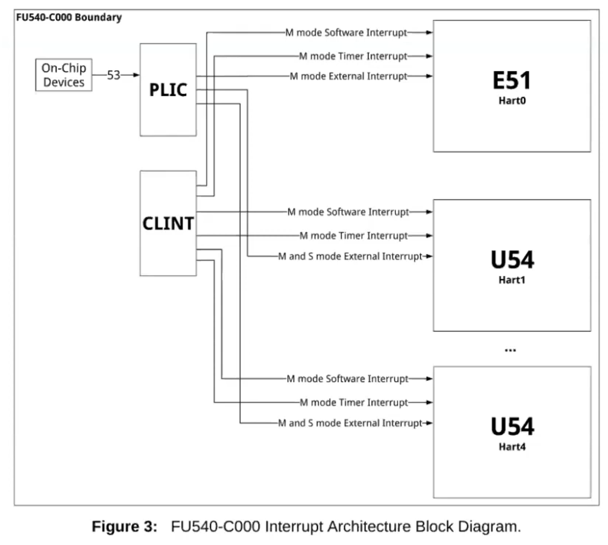
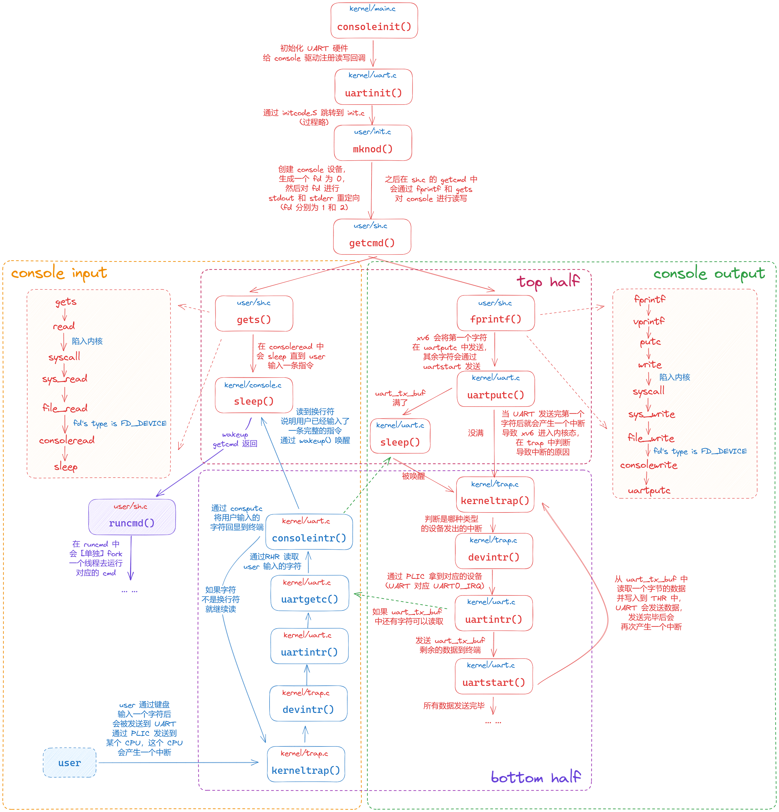

## Interrupts

> 必读资料：
>
> - [Lec09 Interrupts (Frans) - MIT6.S081](https://mit-public-courses-cn-translatio.gitbook.io/mit6-s081/lec09-interrupts)
> - [Lecture Notes - Xiao Fan's Personal Page](https://fanxiao.tech/posts/2021-03-02-mit-6s081-notes/#61-lab-5-lazy-allocation)

设备会产生中断，`xv6` 处理设备中断的代码位于 `kernel/trap.c` 中的 `devintr`。

进程的内核态中执行 **`top half`**，中断时间中执行 **`bottom half`**。`top half` 是通过 `read` 或 `write` 这样的 `system call` 来进行调用的，从而能让这个设备执行 I/O 操作。当设备执行完 I/O 操作之后，将产生一个设备中断，这个设备驱动的 `interrupt handler` 作为 `bottom half` 执行相应的操作。`interrupt handler` 中没有任何用户进程的上下文，因此无法进行 `copyin` 或 `copyout`，只有 `top half` 才能和用户进程进行交互。

- **`PLIC`**：Platform-Level Interrupt Controller，负责对从外部设备产生的中断进行管理
- **`CLINT`**：Core-Local Interrupter，负责定时器相关的中断

### 1. Console input

`console driver (kernel/console.c)` 是一个设备驱动，通过 `UART` 串口接受输入的符号。用户进程通过 `read system call` 来从 `console` 中一行行读取输入

`xv6` 中使用的 `UART` 是 `QEMU` 模拟的 16550 芯片。`UART` 硬件对于进程来说是一组 `memory-mapped` 寄存器，**即 `RISC-V` 上有一些物理地址是直接和 `UART` 设备相连的。`UART` 的地址从 `0x10000000` 或 `UART0` 开始，每个 `UART` 控制寄存器的大小为 1 字节**，其位置定义在 `kernel/uart.c` 中

- **`LSR (line status register)` 寄存器**：用来指示输入的字节是否准备好被用户进程读取
- **`RHR (receive holding register)` 寄存器**：用来放置可以被用户进程读取的字节。当 `RHR` 中的一个字节被读取时，`UART` 硬件将其从内部的 `FIFO` 硬盘中删除，当 `FIFO` 中为空时，`LSR` 寄存器被置 0
- **`THR (transmit holding register)` 寄存器**：当用户进程向 `THR` 写入一个字节时，`UART` 将传输这个字节

`xv6` 的 `main` 函数将调用 `consoleinit` 来初始化 `UART` 硬件，使得 `UART` 硬件在接收到字节或传输完成一个字节时发出中断

`xv6 shell` 程序通过 `user/init.c` 开启的文件描述符来从 `console` 读取字节（在 `while` 循环中调用 `getcmd`，在其中调用 `gets`，再调用 `read system call`）。在 `kernel` 中调用 `consoleread`，等待输入完毕之后的中断，然后将输入缓存在 `cons.buf` 中，将输入 `either_copyout` 到 `user space` 后返回用户进程。如果用户没有输入完整的一行，则读取进程将在 `sleep system call` 中等待。

当用户输入了一个字符后，`UART` 硬件将产生一个中断，这个终端将触发 `xv6` 进入 `trap`。`trap handler` 将调用 `devintr` 来通过 `scause` 寄存器判断是外部设备触发了这个中断，然后硬件将调用 `PLIC` 来判断是哪个外部设备触发的这个中断，如果是 `UART` 触发的，`devintr` 将调用 `uartintr`。`uartintr` 将读取从 `UART` 硬件中写入的字符然后将其传送给 `consoleintr`，`consoleintr` 将积累这些字符直到整行都已经被读取，然后将唤醒仍在 `sleep` 的 `consoleread`。当 `consoleread` 被唤醒后，将这一行命令复制给 `user space` 然后返回。

---

#### 1.1 RISC-V 对中断的支持

- **`SIE (supervisor interrupt enable)` 寄存器**，用来控制中断，其中有一位是控制外部设备的中断 （`SEIE`），一位控制 `suffer interrupt` (一个 `CPU` 向另外一个 `CPU` 发出中断)(`SSIE`)，一位控制定时器中断 (`STIE`)

- **`SSTATUS (supervisor status)` 寄存器**，对某一个特定的 `CPU` 核控制是否接收寄存器，在 `kernel/riscv.h` 中的`intr_on`被设置

- **`SIP (supervisor interrupt pending)` 寄存器**，可以观察这个寄存器来判断有哪些中断在 `pending`

---

#### 1.2 case study

用户在键盘上输入了一个字符 `l`，这个 `l` 通过键盘被发送到 `UART`，然后通过 `PLIC` 发送到 `CPU` 的一个核，这个核产生中断，跑到 `devintr`，`devintr` 发现是来自 `UART` 的，调用 `uartintr`，调用 `uartgetc()` 通过 `RHR` 寄存器来获取这个字符，然后调用 `consoleintr`，判断这个字符是否是特殊字符(`backspace` 等)，如果不是则将这个字符通过 `consputc(c)` 回显给 `user`，然后将其存储在 `cons.buf` 中，当发现整行已经输入完成后 (`c=='\n' || c ==C('D'))`)，唤醒 `consoleread()`

---

### 2. Console output

对 `console` 上的文件描述符进行 `write system call`，最终到达 `kernel/uart.c` 的 `uartputc` 函数。输出的字节将缓存在 `uart_tx_buf` 中，这样写入进程就不需要等待 `UART` 硬件完成字节的发送，只要当这个缓存区满了的情况下 `uartputc` 才会等待。当 `UART` 完成了一个字符的发送之后，将产生一个中断，`uartintr` 将调用 `uartstart` 来判断设备是否确实已经完成发送，然后将下一个需要发送的字符发送给 `UART`。因此让 `UART` 传送多个字符时，第一个字符由 `uartputc` 对 `uartstart` 的调用传送，后面的字符由 `uartintr` 对 `uartstart` 的调用进行传送

`I/O concurrency`：设备缓冲和中断的解耦，从而让设备能够在没有进程等待读入的时候也能让 `console driver` 处理输入，等后面有进程需要读入的时候可以不需要等待。同时进程也可以不需要等待设备而直接写入字符到缓冲区。

在 `consoleread` 和 `consoleintr` 中调用了 `acquire` 来获取一个锁，从而保护当前的 `console driver`，防止同时期其他进程对其的访问造成的干扰。

### 3. 具体细节

### 4. Timer interrupts

`xv6` 用计时器中断来在线程间切换，`usertrap` 和 `kerneltrap` 中的 `yield` 也会导致这种进程切换。`RISC-V` 要求定时器中断的 `handler` 放在 `machine mode` 而不是 `supervisor mode` 中，而 `machine mode` 下是没有 `paging` 的，同时有另外一套完全独立的控制寄存器，因此不能将计时器中断的 `handler` 放在 `trap` 机制中执行。

`kernel/start.c`（在 `main` 之前）运行在 `machine mode` 下，`timerinit()` 在 `start.c` 中被调用，用来配置 `CLINT(core-local interruptor)` 从而能够在一定延迟之后发送一个中断，并设置一个类似于 `trapframe` 的 `scratch area` 来帮助定时器中断 `handler` 将寄存器和 `CLINT` 寄存器的地址保存到里面，最终 `start` 设置 `timervec` 到 `mtvec(machine-mode trap handler)` 中使得在 `machine mode` 下发生中断后跳转到 `timervec` 然后 `enable` 定时器中断。

由于定时器中断可能在任意时间点发生，包括 `kernel` 在执行关键的操作时，无法强制关闭定时器中断，因此定时器中断的发生不能够影响这些被中断的操作。解决这个问题的方法是定时器中断 `handler` 让 `RISC-V CPU` 产生一个 `"software interrupt"` 然后立即返回，`software interrupt` 以正常的 `trap` 机制被送到 `kernel` 中，可以被 `kernel` 禁用。

`timervec` 是一组汇编指令，将一些寄存器保存在 `scratch area` 中，告知 `CLINT` 产生下一次定时器中断的时间，让 `RISC-V` 产生一个 `software interrupt`，恢复寄存器并返回到 `trap.c` 中，判断 `which_dev==2` 为定时器中断后调用 `yield()`

### 5. Real World

计时器中断将会通过调用 `yield` 进行强制的线程切换从而使 `CPU` 能够在各个内核线程之间均匀分配时间。

`UART` 是通过对 `UART` 控制寄存器一个字节一个字节读取来获取数据的，这种方式叫做 `programmed I/O`，因为是软件控制了数据的 I/O，缺点是速度比较慢。`DMA (Directed Memory Access)` 直接向 `RAM` 写入和读取数据，速度很快。现代的硬盘和网卡驱动使用 `DMA`

由于中断非常耗时，因此可以用一些技巧来减少中断。

- 用一个中断来处理很多一段时间内的事件
- 彻底禁止设备的中断，让 `CPU` 定时去检查这些设备是否有任务需要处理，这种技巧叫做 `polling`

